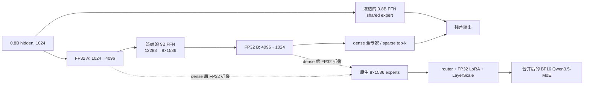

# Twen1

Twen1 将冻结的 Qwen3.5-0.8B 文本模型作为 backbone/shared expert，把冻结的
Qwen3.5-9B FFN 切成 routed experts，只训练跨宽度适配器、router、LayerScale
和 rank-16 expert LoRA。训练结束后 A/B、LoRA 与尺度全部折叠，导出原生
`Qwen3_5MoeForCausalLM` BF16 权重。

本仓库遵守一个硬边界：**所有包含 optimizer step 的训练都必须由用户明确授权**；
项目代码不会自动跨阶段。Base Dense v1、v2 与 v3 均已由用户完成：v1 为 383 steps /
100,151,046 committed input tokens；v2、v3 均为 1,912 steps /
500,009,962 committed input tokens。三轮 final validation 都通过 10% dense gap gate；
最新不可变 checkpoint 为
`runs/base-dense-v3-500m/step-000000001912-milestone-complete`。v1 运行时没有 MTP，
v2/v3 的日志中显式使用 MTP loss `0.1` 并严格加载 15 张原生 `mtp.*` 参数；但事后审查
发现两轮的 RoPE position 错位一 token，因此不能称为完全原生对齐，详见
[v3 报告勘误](docs/reports/base-dense-v3-500m-final-validation/REPORT.zh-CN.md)。
由于没有训练中多 checkpoint validation 时间序列，三轮 final 都不能称为
validation-selected best。

v4 的实现、治理数据、真实 GPU optimizer-step A/B 与中断恢复门均已完成并通过：
`configs/base/dense-v4-16m-smoke.yaml` 从 v3 final model-only fork，使用纯文本
NTP + 原生 MTP、Muon/AdamW、较低 peak LR 和全程 cosine；不会读取 9B teacher
logits。Dashboard 只开放该 v4 profile 启动；它是 16.014M unique-token 的 governed
smoke，不是 250M/500M 正式质量实验。

## 架构与实现状态



- 0.8B：24 层、hidden 1024、FFN 3584。
- 9B：32 层、hidden 4096、FFN 12288。
- 单调、同 layer type 的 CKA 映射选 24 层。
- 主线为 `8×1536/top-2`；`4×3072/top-1` 可做吞吐对照，但不允许作为 v1 原生导出。
- 原始 0.8B/9B 与折叠 expert base 均冻结；FSDP2 会切分这些冻结 Parameter。
- 所有 trainable 参数和 Adam moments 为 FP32，前向由 autocast 使用 BF16。
- shared gate 导出为零，shared `down_proj×2`，精确保留原始 0.8B FFN。
- Base 和 post-trained 使用独立配置、数据、run 与导出目录。
- v1 仅文本/BF16；不含视觉或量化。Qwen3.5 原生单层 MTP 已接入训练与原生导出。

当 `losses.mtp > 0` 时，loader 会从 0.8B checkpoint 严格读取原生的 15 个顶层
`mtp.*` tensor；缺失、多余、shape 或 dtype 不符都会 fail closed。它遵循 Qwen3.5 的
`h_t + embed(x_(t+1)) -> x_(t+2)` 语义，对长度 `L` 的序列只使用 `L-2` 个有效目标。
提交 `c9a08cf` 同时确保 MTP decoder 对这些 shifted states 使用 `t+1` 的 RoPE
position，并用独立位置 oracle 覆盖默认 2D/3D/4D position IDs；v2/v3 均早于这项修复。
MTP 自身参数保持 frozen，也不进入 optimizer；forward 不包 `no_grad`，因此 MTP loss 仍会
沿 main-model hidden state 回传到 trainable A/B。15 个 source tensor 共 20,452,864 个
BF16 参数（约 39.01MiB）；MTP body 本体和分块 vocabulary loss 都支持 activation
checkpoint，减少 saved activation，backward 时重算。`losses.mtp=0` 表示不构建该训练图；
系数是显式、resume-critical 的实验选择。用户已为 Base v2 选择 `losses.mtp=0.1`；它不是
Qwen3.5 官方默认，也不会追溯改变旧 v1 checkpoint。

旧 `base-dense-v1` 的 resolved config、checkpoint 和日志均不含 MTP。当前实现完整不代表旧
final 已经训练过 MTP；若决定启用，必须建立新 run 并显式 `--fork-from` 旧 final。

核心入口是 `python -m twen.cli --help`。示例配置位于 `configs/base/` 和
`configs/posttrained/`。

## 1. 环境与代理

当前锁定环境使用 Python 3.12、PyTorch 2.11/CUDA 13、Transformers 5.14 和
vLLM 0.25。GitHub 固定使用代理，默认地址为 `http://172.23.240.1:8080`，可用
`TWEN_PROXY_URL` 覆盖；PyPI、ModelScope 等服务默认显式直连。Hugging Face 默认先
直连，仅在发生网络连接错误后自动通过代理重试。

```bash
cd /home/tab/data1/Project/AI/Twen1

# 非 GitHub 依赖显式清除环境代理。
scripts/direct_network.sh uv sync --extra dev --extra serve
source .venv/bin/activate

# Qwen3.5 的 Gated DeltaNet 快速路径；脚本只在 GitHub clone 时设置代理，
# 并固定到 locks/cuda-kernels.json 中记录的 commit。
scripts/install_cuda_kernels.sh

python -m twen.cli proxy check
bash scripts/with_cuda_toolchain.sh .venv/bin/python -m twen.cli hardware inspect
```

Base v3 提取与 prepare 使用 PyArrow 23.0.1；`pyproject.toml`、`uv.lock` 与当前
`.venv` 现已统一固定到同一版本。最终验收已通过 `uv lock --check` 与 `uv pip check`，
数据本身还由 extracted/prepared 两级逐文件 SHA 和生成代码摘要锁定。

### CUDA JIT 工具链与生产 FLA backend

PyTorch 2.11 使用 CUDA 13.0 runtime；安装 `serve` 可选依赖后，同一个 venv 中还可能出现
独立升级的 `nvidia-cuda-nvcc`/CCCL wheel。TileLang 若自动选中这些 wheel，可能把
13.2 compiler、13.0 CUDART headers 和 13.3 CCCL 混在一次编译里。所有会触发 CUDA
backward/JIT 的命令都应通过下面的 wrapper 启动；它只选择一套完整的
`/usr/local/cuda-13.2` compiler/headers，不覆盖 PyTorch 自带的 CUDA runtime libraries：

```bash
# 不需要 GPU；实际编译一个 sm_120a cubin，验证 nvcc/CUDART/CCCL include 一致。
.venv/bin/python scripts/check_cuda_toolchain.py \
  --cuda-home /usr/local/cuda-13.2 \
  --compile

# 通用形式。也可用 TWEN_CUDA_HOME 显式覆盖 /usr/local/cuda。
bash scripts/with_cuda_toolchain.sh COMMAND [ARG ...]
```

wrapper 的 RTX 5090 生产默认是 `FLA_TILELANG=0`，即使用已通过完整 24 层、4K
forward/backward 的 Triton 路径。TileLang 0.1.9 在一致的 CUDA 13.2 工具链下可以完成
小形状 JIT，但其 full T=4096 gated-delta backward 在 SM 12.0 上会触发 misaligned-address，
因此不能用于正式训练。下面的命令只诊断 compiler/JIT，**不是**生产正确性验收：

```bash
bash scripts/with_cuda_toolchain.sh \
  .venv/bin/python scripts/smoke_fla_backward.py \
  --fresh-cache \
  --output artifacts/benchmarks/rtx5090-fla-tilelang-backward-smoke.json
```

完整无 optimizer 验收显式记录 Triton、teacher offload、expanded selective checkpoint、
loss/MTP body checkpoint 和 1.5GiB Adam-moment 等价 reserve。当前 canonical bundle 是
`artifacts/benchmarks/rtx5090-base-dense-utilization-report.json`（SHA256
`cf40eac976767681a704676bee960d8c220d700a847b73d62e1f2358ea15ab38`）：B1 ordinary
outer/inner 0/0、alignment outer/inner 8/16、microbatch 1、accumulation 64，95%/5%
harmonic mixture 为 6,263.998 tok/s。完整复现命令与历史 rejected case 见
[`PERFORMANCE_REPORT.md`](PERFORMANCE_REPORT.md)，不要再使用旧 AC4/AC24 sweep 选档。

工具链和 backend 锁见 `locks/cuda-kernels.json`。不要用
`CCCL_DISABLE_CTK_COMPATIBILITY_CHECK` 绕过版本保护，也不要把系统 13.2
`LD_LIBRARY_PATH` 注入 PyTorch 13.0 runtime。

`scripts/with_github_proxy.sh` 仅供 GitHub 的 `git`/`gh`/`curl` 使用；
`scripts/direct_network.sh` 会删除大小写 HTTP(S)/ALL proxy。项目下载器按每个请求目标
（包括重定向后的 host）路由，默认 GitHub 走代理、HF 直连失败再走代理、其他 host
直连。不要把 GitHub wrapper 套在 Hugging Face、PyPI 或 ModelScope 命令外层。

## 2. 固定并下载模型

`lock-model` 可以用一次浮动分支查询 provider 元数据，但产物会解析成不可变 commit
和逐文件 size/SHA256；真正下载只使用该锁。以下为 Base 0.8B 的完整示例：

```bash
mkdir -p locks artifacts/models

python -m twen.cli download lock-model \
  --provider huggingface \
  --model-id Qwen/Qwen3.5-0.8B-Base \
  --revision main \
  --output locks/qwen3.5-0.8b-base.json \
  --network-policy fallback

python -m twen.cli download set \
  --spec locks/qwen3.5-0.8b-base.json \
  --output artifacts/models/qwen3.5-0.8b-base \
  --network-policy fallback
```

`fallback` 是默认策略，仅在 HF 直连发生网络错误后为同一下载进程启用代理；
`--network-policy github-only` 可严格保持 HF 直连，已确认直连不可用时可显式用
`proxy`，`direct` 则禁用全部代理。

按相同方式锁定并下载：

| 路线 | backbone/tokenizer | donor/teacher |
|---|---|---|
| Base | `Qwen/Qwen3.5-0.8B-Base` | `Qwen/Qwen3.5-9B-Base` |
| post-trained | `Qwen/Qwen3.5-0.8B` | `Qwen/Qwen3.5-9B` |

下载使用 `<file>.incomplete`、Range resume 和文件锁；失败后原命令重跑即可。把锁中的
`resolved_revision` 和本地 `download-manifest.json` 的 SHA256 填入配置：

```bash
python - <<'PY'
import hashlib, json
from pathlib import Path

lock = json.loads(Path("locks/qwen3.5-0.8b-base.json").read_text())
manifest = Path("artifacts/models/qwen3.5-0.8b-base/download-manifest.json")
print("revision:", lock["resolved_revision"])
print("manifest_sha256:", hashlib.sha256(manifest.read_bytes()).hexdigest())
PY
```

训练 preflight 会重新核验下载 manifest 以及其中每个模型 shard 的 size/SHA256；权重
被替换、缺失或残留 `.incomplete` 都会 fail closed。

## 3. 数据和 teacher KD

Base v2 500M 的最终 audit/prepared 已完成：641 shards、126,457 sequences、
516,719,389 tokens，prepared manifest SHA256 为
`9290665ac1e09fbd5b9aea1966bed7a51095bab66f460a0124af4532b1805fd9`，并记录
`ready_for_training=true`、`research_only=false`、`pending_audits=[]`。500M top-64 KD
以不注册 service 的普通后台进程和 optimizer-free 模式运行；WSL 关闭后不会自动恢复，必须由用户
显式重新启动相同的 fail-closed 命令。
动态进度查看
`artifacts/data/base-v2-500m-kd-orchestration/status.json`。在最终 KD manifest、编排
`MANIFEST.json`/`COMPLETE` 出现前，不得描述为 KD 已完成。详细运行与恢复见
[`BASE_V2_500M_KD.md`](BASE_V2_500M_KD.md)。

原始语料应先在许可、去重、PII 和 contamination 规则下形成多个 JSONL shard，每行
至少有 `{"text": "..."}`。Base 建议分别组织中英文、其他语言、代码、数学/科学；
post-trained 在输入 shard 层面维持约 70% 指令/KD、30% 通用 replay。
`data prepare` 会记录输入身份并执行 tokenize/pack，但不会替上游做授权、PII、去重或
污染审计；上游必须提供可追溯的数据来源与审核结论。

Base 公开数据配方（recipe id `base-v1-20260717`）已锁在
`locks/base-data-sources.json`，原生 Parquet 文件身份已锁在
`locks/base-data-sources.resolved.json`。后者包含 1,563 个 pinned commit + LFS
SHA256/size 条目。若修改 recipe 或上游 revision，必须重新解析，旧 lock 会因 recipe SHA
不一致而 fail closed。早期提取目录 `data/base-v1` 与 `data/base-v2` 已分别用
`INVALIDATED.json` 明确作废。下列 `data/base-v3` 是已完成 v1 run 使用的历史 100M corpus：

- extracted manifest SHA256：
  `2fb769833bf1507c8ed476e34c2ef6d7c2bb2d94b02807d6b075d350e8e76690`；
- corpus fingerprint：
  `15dac54e0159d20b566a9e8002014aee5b76b298810bde32ed76cc5aec40d325`；
- 120 个 train JSONL、120 个 validation JSONL 和 120 个 attribution ledger；
- 实际配额为 100,007,485 train token 与 20,014,392 validation token。

```bash
python -m twen.cli data resolve-sources \
  --recipe locks/base-data-sources.json \
  --output locks/base-data-sources.resolved.json \
  --network-policy fallback

python -m twen.cli data build-base \
  --recipe locks/base-data-sources.json \
  --resolved-lock locks/base-data-sources.resolved.json \
  --output data/base-v3 \
  --tokenizer artifacts/models/qwen3.5-0.8b-base \
  --tokenizer-manifest-sha256 5e847be98c2d114d2fb85a67ac77f4eef416e11871c1a5580d1bc52663e2e643 \
  --profile dense \
  --network-policy fallback \
  --stop-file data/base-v3/STOP \
  --progress always

python -m twen.cli data inspect-base \
  --manifest data/base-v3/corpus-manifest.json
```

`build-base` 通过 PyArrow + fsspec HTTP Range 按 row group 读取，不要求先落盘 2GB 级
Parquet；每约 1M token 事务提交 JSONL、全部来源 provenance ledger 和精确恢复游标。代码
只接受 lock 中的 MIT/Apache/BSD/ISC/CC0 白名单，并额外记录 repo/path/license。HF 直连
不可用时 `fallback` 自动改走代理。`STOP` 只在 durable chunk 边界生效，移除后用完全相同
的命令恢复。

提取 manifest 会把 source identity、输出 SHA、稳定 train/validation 分流、
按固定 source/file/row 顺序执行的 deterministic first-wins exact dedup、基础 PII reject、
代码许可/secret 扫描标为 complete。first-wins 保证最终两侧没有相同的规范化正文，但不
宣称 validation-first 优先级；cross-source MinHash、项目评测集
13-gram 和完整 contextual PII 审计仍明确标为 pending。因此上游保持
`ready_for_data_prepare=true`、`ready_for_training=false`。本项目允许通过命名明确的 CLI
override 继续研究性 prepare/KD/训练，但该决定不会把三项审计伪装成 complete，也不能把
产物描述为正式审计完成或商业可用。详细来源、许可和 100M/500M token 配额见
`DATASET_SOURCES.md`。

提取完成并冻结 JSONL 后，`data prepare` 可直接认证 corpus manifest、`COMPLETE`、三个
`*-files.txt` 和每个 JSONL 的 size/SHA，再按 role 读取精确 inventory；不再用 shell 手工
展开 120 个 shard。清单缺行、被替换或 corpus 根目录含 `INVALIDATED.json` 都会 fail
closed。当前三项研究治理审计尚未完成，因此下面的显式 override 只允许生成带
`research_only=true` 和完整 pending-audit 列表的 prepared 产物，不会把上游状态改成
`ready_for_training=true`：

```bash
python -m twen.cli data prepare \
  --extracted-manifest data/base-v3/corpus-manifest.json \
  --role train \
  --allow-pending-research-audits \
  --output artifacts/data/base \
  --tokenizer artifacts/models/qwen3.5-0.8b-base \
  --tokenizer-manifest-sha256 5e847be98c2d114d2fb85a67ac77f4eef416e11871c1a5580d1bc52663e2e643 \
  --sequence-length 4096 \
  --progress always

python -m twen.cli data prepare \
  --extracted-manifest data/base-v3/corpus-manifest.json \
  --role validation \
  --allow-pending-research-audits \
  --output artifacts/data/base-validation \
  --tokenizer artifacts/models/qwen3.5-0.8b-base \
  --tokenizer-manifest-sha256 5e847be98c2d114d2fb85a67ac77f4eef416e11871c1a5580d1bc52663e2e643 \
  --sequence-length 4096 \
  --progress always
```

本轮得到的 train prepared manifest SHA256 为
`0607e6d14f8baa503616bdf30166ca9f8149d9465ad865f25ef0e0e84f5cea20`，包含
100,007,485 token；validation manifest SHA256 为
`4d3877bfaf4e01551d41913e11d37db08c6097b513ac94ae4a63b8a640b68e7f`，包含
20,014,392 token。二者都是 schema v2、`research_only=true`，并认证回同一个 Base v3
extracted manifest。训练 preflight 接受它们表示技术 lineage 与显式研究风险接受均已通过，
不表示三个 pending 数据治理审计已经完成。

若改用自备 JSONL，等价的最小调用如下：

```bash
python -m twen.cli data prepare \
  --input data/base/train-000.jsonl \
  --input data/base/train-001.jsonl \
  --output artifacts/data/base \
  --tokenizer artifacts/models/qwen3.5-0.8b-base \
  --tokenizer-manifest-sha256 <0.8B_DOWNLOAD_MANIFEST_SHA256> \
  --sequence-length 4096 \
  --progress always
```

预处理按输入 shard 事务提交并写 `COMPLETE`；重跑只处理未完成 shard。建议原始 JSONL
每个控制在约 0.25–1M token，以兼顾恢复粒度和文件数。
prepared corpus fingerprint 同时绑定每个实际 `tokens.safetensors` 的 SHA256；KD shard
再逐一记录其来源 tensor SHA，不能把同 recipe 但不同 tokenizer/runtime 产物的旧 logits
误当成当前缓存。当前 prepared 与 KD manifest 均为 schema v2，并绑定各自生成器源码摘要；
任何旧 schema v1 prepared/KD 产物都必须重建，不能原地沿用。

teacher top-64 缓存可单卡运行，也可用 `torchrun` 将 prepared shards 静态分给多卡。
这不是训练，不包含 optimizer step；本轮由助手显式执行，不会自动启动后续阶段：

```bash
mkdir -p artifacts/data/base-kd

# 当前单 RTX 5090：一个进程独占这张 GPU。
bash scripts/with_cuda_toolchain.sh .venv/bin/python -m twen.cli data generate-kd \
  --prepared-manifest artifacts/data/base/manifest.json \
  --output artifacts/data/base-kd \
  --teacher artifacts/models/qwen3.5-9b-base \
  --teacher-model-id Qwen/Qwen3.5-9B-Base \
  --teacher-revision 68c46c4b3498877f3ef123c856ecfde50c39f404 \
  --teacher-manifest-sha256 ede9a83f7b8ab73842d79b2459262a8b963e215684177a6685b3dc2e2bb803a1 \
  --tokenizer-manifest-sha256 5e847be98c2d114d2fb85a67ac77f4eef416e11871c1a5580d1bc52663e2e643 \
  --temperature 2.0 \
  --batch-size 2 \
  --logits-chunk-tokens 64 \
  --stop-file artifacts/data/base-kd/STOP \
  --progress always

# 单进程 generate-kd 已写 manifest；再幂等 index 一次，复核完整覆盖并冻结 corpus lock。
# 多 GPU torchrun 模式则必须等所有 worker 完成后执行这一步。
.venv/bin/python -m twen.cli data index-kd \
  --root artifacts/data/base-kd \
  --output artifacts/data/base-kd/manifest.json \
  --prepared-manifest artifacts/data/base/manifest.json \
  --temperature 2.0
```

`index-kd` 的 stdout 会返回最终 `sha256`。必须把它原样写入
`configs/base/dense-oracle.yaml` 的 `data.teacher_kd_manifest_sha256`，并可用
`sha256sum artifacts/data/base-kd/manifest.json` 交叉核对。本轮 Base 完整 KD 已生成并独立
`index-kd` 复核：120/120 shard、24,476 sequences、100,007,485 tokens，manifest SHA256 为
`59c21c910413fd56f947340fa70d0e1eade26173f0a1197e59c8b53fcaa876ae`；配置已写入该真实值。

多 GPU 时使用
`bash scripts/with_cuda_toolchain.sh .venv/bin/torchrun --nproc-per-node=N -m twen.cli`；必须满足
`N <= 可见 GPU 数` 且 `N <= prepared shard 数`，每个 worker 独占一张 GPU。当前单卡机器
固定使用 `N=1`。

正常停止 KD：`touch artifacts/data/base-kd/STOP`。它只在 shard 边界停止，CLI 输出
`{"stopped": true, ...}` 并返回 75；STOP 会保留以确保所有 torchrun worker 都能看到，
删除 STOP 后原命令重跑。每个 KD shard 具有独立 hash/`COMPLETE`，不会重算已完成部分。
训练 cursor 使用“先打乱 shard、再打乱 shard 内样本”的完整确定性排列，避免全局随机索引
导致每条样本都重开 mmap；训练配置 schema v1 的 `data.num_workers` 控制有界的 CPU mmap/pinned-memory
预取深度，单 I/O 线程与当前 GPU microbatch 重叠，不改变样本顺序或恢复语义。

top-64 当前约占 **665 bytes/训练 token**（I64 indices + BF16 logits + tail
statistics + tokens/labels/mask），所以 100M token 约 66.5GB，500M 约 332.5GB，1B 约
665GB；规划磁盘时必须把它作为主项。当前 RTX 5090 32GB 已按 exact KD 路径实测
4K/batch-2/top-64/chunk-64：约 10,425 input tok/s、峰值 17.7869GiB，模型加载约 128 秒，
结果见 `artifacts/benchmarks/rtx5090-qwen35-9b-base-teacher-kd-batch2.json`。batch-4 仅提高
约 0.884% 吞吐却再增加约 1.101GiB 峰值，因此生产默认保留 batch-2；对应原始结果为
`artifacts/benchmarks/rtx5090-qwen35-9b-base-teacher-kd-batch2.json` 与
`artifacts/benchmarks/rtx5090-qwen35-9b-base-teacher-kd-batch4.json`。100M/500M token 的
纯计算下界约 2.66/13.32 小时；实际还要叠加 prepared/KD I/O、落盘和哈希，以运行时 wall
ETA 为准。

本轮完整 100,007,485-token 任务的 tqdm 墙钟为 **3:04:20**，端到端进度吞吐约
**9,042 tok/s**；最终目录为 66,669,120,553 bytes（约 66.67GB / 62.09GiB）。generator
写出的 corpus manifest 与随后独立重跑 `index-kd` 的 SHA 完全相同，结果记录在
`artifacts/benchmarks/rtx5090-base-teacher-kd-full-run.json`。

## 4. 可恢复校准

collect 会按 sequence microbatch 遍历选定的校准 token，但只按全局预算确定性抽样并保存
配对激活。本轮没有使用 validation，也没有扫描完整 100M train；从 train prepared corpus
固定选择了 24 个 shard：英文 8、中文 6、代码 4、数学 4、科学 2，共 19,947,127 token。
各类实际 token 分别为 6,750,936、4,973,188、3,312,171、3,226,077、1,684,755。
下面的 brace expansion 与已写入 `PLAN.json` 的有序输入完全相同：

```bash
base_calibration_shards=(
  artifacts/data/base/shard-{000048..000055}/tokens.safetensors
  artifacts/data/base/shard-{000000..000005}/tokens.safetensors
  artifacts/data/base/shard-{000030..000033}/tokens.safetensors
  artifacts/data/base/shard-{000090..000093}/tokens.safetensors
  artifacts/data/base/shard-000108/tokens.safetensors
  artifacts/data/base/shard-000114/tokens.safetensors
)
base_calibration_inputs=()
for shard in "${base_calibration_shards[@]}"; do
  base_calibration_inputs+=(--input "$shard")
done

bash scripts/with_cuda_toolchain.sh .venv/bin/python -m twen.cli calibrate collect \
  --config configs/base/dense-oracle.yaml \
  "${base_calibration_inputs[@]}" \
  --output artifacts/calibration/base/activations \
  --device cuda \
  --batch-size 1 \
  --max-samples 8192 \
  --sample-seed 3407 \
  --stop-file artifacts/calibration/base/STOP \
  --progress always

python -m twen.cli calibrate layer-map \
  --config configs/base/dense-oracle.yaml \
  --student-activations artifacts/calibration/base/activations \
  --donor-activations artifacts/calibration/base/activations \
  --sample-seed 3407 \
  --stop-file artifacts/calibration/base/STOP \
  --output artifacts/calibration/base/layer_map.json \
  --progress always

python -m twen.cli calibrate partition \
  --config configs/base/dense-oracle.yaml \
  --output artifacts/calibration/base/channel_map.json \
  --stop-file artifacts/calibration/base/STOP \
  --progress always

bash scripts/with_cuda_toolchain.sh .venv/bin/python -m twen.cli calibrate ridge \
  --config configs/base/dense-oracle.yaml \
  --student-activations artifacts/calibration/base/activations \
  --donor-activations artifacts/calibration/base/activations \
  --device cuda \
  --ridge-dtype float32 \
  --ridge-batch-samples 1024 \
  --output artifacts/calibration/base/adapters.safetensors \
  --stop-file artifacts/calibration/base/STOP \
  --progress always
```

重复 `--input` 与 `--prepared-manifest` 互斥；前者适合本轮冻结的 train-only 子集，后者会按
完整 manifest 顺序消费全部 shard。两种模式都会把每个实际 tensor 的 SHA、顺序、模型
manifest/config、track、架构、dtype、采样器和 seed 锁入 `PLAN.json`；更换任一输入必须使用
新输出目录，不能混用旧半成品。`collect` 每 microbatch 原子落 part，layer-map 在每个 CKA
pair 后保存 score-row cursor，ridge 按 `(layer,input shard)` 保存 sufficient statistics，
partition 按层提交；STOP 被消费后返回码 75，原命令即可恢复。

Base/post-trained 必须分别校准。layer map、channel map、adapter sidecar 和 folded
manifest 互相记录父 SHA；preflight 会拒绝跨路线或新旧产物混搭。

校准的 student/donor 不同时驻留。当前 RTX 5090 路线在 CUDA 上用 FP32 ridge statistics
并以 1024 个 activation rows 分批累积；`auto` 在 CUDA 也会选择 FP32，避免消费级 GPU
极慢的 FP64。19,947,127 token collect 通常约数小时，取决于 9B 推理吞吐；8192 样本产物约
2.55GB，ridge 工作统计另预留约 4–10GB。若改用 `--device cpu --ridge-dtype float64`，会以
更长运行时间换取更保守的数值累积和更低显存占用。
prepare/KD/校准的 tqdm 只写 stderr，最终机器可读 JSON 仍独占 stdout；`--progress auto`
仅在 TTY 显示，经 `tee` 时使用 `always`，无人值守时可用 `never`。

## 5. Preflight 与配置

训练配置本身仍是 schema v1，与 prepared/KD schema v2 是不同命名空间，不能把首行改成 2。
旧 `base-dense-v1` 运行时的 immutable 配置保存在
`runs/base-dense-v1/resolved_config.yaml`。当前 `configs/base/dense-oracle.yaml` 虽已填入模型、
train prepared 与完整 teacher KD 的真实 SHA，但源码和 runtime 已增加 MTP、teacher offload、
选择性 checkpoint 等 resume-critical 语义，且文件仍指向旧 `run_id/output_dir`。因此它现在是
补训候选参数记录，**不能**直接 `--resume auto` 或覆盖旧目录。

Base v2 没有手工复制 v1 YAML。500M prepared、top-64 KD 和真实六来源 50M
quality-cooldown bundle 均已完成；fail-closed finalizer 已认证全部
manifest/audit/KD/source/performance/numerical/fork SHA，并发布独立
`configs/base/dense-v2-500m.yaml` 和固定 Web profile。用户已选择 MTP `0.1`，adapter/LoRA
peak LR `2e-4`，router/scale `1e-3`。WSD 固定为 5M warmup、stable 至 450M、最后 50M
cosine decay 到 0.1 倍；详细命令见 [`BASE_V2_500M_PIPELINE.md`](BASE_V2_500M_PIPELINE.md)。
发布动作不创建 optimizer、不初始化 CUDA、不启动训练。

Base v3 使用独立 `configs/base/dense-v3-500m.yaml` 与新 run lineage：adapter/LoRA
peak LR 从 `2e-4` 降到 `1.8e-4`，scale/router 从 `1e-3` 降到 `9e-4`；仍先做 5M
warmup，但从 250M token 起执行覆盖后半程的 cosine decay，并在 450M token 切换同一份
quality-cooldown 数据。v3 已完成，不得把其目录当作新实验重新启动。

Base v4 governed smoke 使用独立
`configs/base/dense-v4-16m-smoke.yaml`：prepared-text 直接读取经两轮治理审计的
16,013,672-token train corpus，NTP/MTP 权重为 `1.0/0.1`，teacher KD、anchor KL 和
hidden alignment 均为零。48 个二维 Adapter 由 Muon 更新，24 个 scale 由 AdamW 更新；
nominal peak LR 为 `1e-4/3e-4`，5M warmup 后全程 cosine 到 `0.1` 倍。pass-001
过滤后 USGPO 只剩 6,873 token，因此 smoke 显式认证 lineage/effective 两组 source
weights，以 unique-token 容量采样，避免按原 2% 权重重复几十遍。完整数据身份、findings
和容量限定见 [`docs/V4_DATA_SOURCES.zh-CN.md`](docs/V4_DATA_SOURCES.zh-CN.md)。

finalizer 成功后，必须对最终新 lineage 重新执行以下只读检查和无 optimizer graph smoke：

```bash
.venv/bin/python -m twen.cli config validate --config configs/base/dense-v2-500m.yaml
bash scripts/with_cuda_toolchain.sh .venv/bin/python -m twen.cli hardware inspect \
  --config configs/base/dense-v2-500m.yaml
.venv/bin/python -m twen.cli preflight --config configs/base/dense-v2-500m.yaml --world-size 1
.venv/bin/python -m twen.cli train \
  --stage dense-oracle \
  --config configs/base/dense-v2-500m.yaml \
  --dry-run

# 在补训前，用目标 world size 执行一个真实 KD microbatch 的完整训练图；不创建 optimizer、
# 不写 checkpoint/run state，也不会执行 optimizer step。OOM 会直接暴露模型/激活图的显存风险。
bash scripts/with_cuda_toolchain.sh .venv/bin/python -m twen.cli train \
  --stage dense-oracle \
  --config configs/base/dense-v2-500m.yaml \
  --graph-smoke
```

`--graph-smoke` 与 `--dry-run` 互斥。它在 coordinated preflight 后使用 KD manifest 的首批记录，
按配置覆盖 anchor、hidden alignment 或 sparse router auxiliary loss，执行一次 forward/backward，
并由 rank 0 输出 preflight config/data fingerprint、loss、耗时、峰值显存、loss/梯度 finite
状态和 `no_optimizer_created: true` 的单行 JSON；它不会写 checkpoint 或训练 state（多 rank
preflight 仍会短暂使用输出目录中的 rendezvous 文件并在结束前删除）。
Base dense 只有在输出同时满足 `ok=true`、`no_optimizer_created=true`、
`no_optimizer_steps=true`、`donor_teacher_shared=true`、`loss_finite=true`、
`grad_finite=true`、`missing_grad_tensors=0`，且 `loss_components` 包含
`ntp`、`teacher_kd`、`anchor_kl` 和 `hidden_alignment` 时才算通过。
如果显式启用 `losses.mtp > 0`，还必须包含 finite 的 `mtp`，并确认 frozen MTP 参数没有
missing/trainable gradient 要求，而 A/B 等 student trainable 参数仍有完整梯度覆盖。
因此它的峰值不包含 Adam moments；完整容量门槛还必须结合带
`--optimizer-state-reserve-gib 1.5` 的无 optimizer 完整图基准。当前 production 是 expanded
B1：ordinary outer/inner 0/0，alignment outer/inner 8/16；两者都实际触碰并全程保留
1.5GiB reserve，但仍明确没有 optimizer 或 optimizer step。旧 ordinary AC4 / alignment AC24
容量表属于 `INVALID_SUPERSEDED` 历史证据。较低的 CLI graph-smoke 峰值不能替代正式容量门，
也不能被描述为 optimizer-step 验收。

旧 run 启动前的真实-lineage graph smoke 结果为 `ok=true`、`donor_teacher_shared=true`、4 项 loss
finite、72/72 gradient finite、0 missing gradient，且明确
`no_optimizer_created=true` / `no_optimizer_steps=true`。forward/backward 分别为
2.002/10.312 秒，峰值 20.099/20.115GiB allocated/reserved；完整 JSON 位于
`artifacts/benchmarks/rtx5090-base-dense-final-graph-smoke.json`。其 effective config
fingerprint 为 `ffa5a6060c20b06b76737d54859cdfa7662d885c6ed0b640c37d20bcb95d9381`。它不含 MTP，
不能用作未来补训新 config 的 lineage smoke；新 config 冻结后必须重跑。

preflight 在 CUDA 初始化前强制：

- `HF_HUB_OFFLINE=1`、`TRANSFORMERS_OFFLINE=1`、local-only；
- 对排序后的 `src/twen/**/*.py` 相对路径与原始字节计算 `source_tree_sha256`，并把它纳入
  critical fingerprint；同一 run 的 `--resume auto` 因而会拒绝任何源码变化。需要改代码时
  必须恢复原源码，或使用新的 run 并通过 `--fork-from` 明确建立分支血缘；
- 训练配置 schema v1 强制 BF16/offline，并要求 tokenizer 与 backbone、teacher 与 donor 的 model/revision/
  manifest lineage 完全一致；
- 模型/数据/KD/tokenizer 的完整身份和 SHA；
- 0.8B/9B 架构、layer type、vocab 与 teacher/KD lineage；
- calibration/folded artifact 父子 lineage；
- `global_batch_tokens` 在目标 world size 下可整除。

在 `torchrun` 下每个节点只有 `LOCAL_RANK=0` 执行模型/KD 的完整哈希扫描；所有 rank
还会比较完整配置 digest，各节点报告必须与 global rank 0 完全一致。一次性 TCP rendezvous
发生在 CUDA 初始化之前，既避免单节点 8 个进程重复读取数百 GB cache，也会在多节点
node-local cache 缺失/损坏时 fail closed。防火墙需允许各 worker 访问 `MASTER_ADDR` 上由
rank 0 临时监听的端口；`TWEN_PREFLIGHT_WAIT_SECONDS` 同时约束连接与响应等待，
`TWEN_PREFLIGHT_PEER_TIMEOUT` 可单独限制 rank 0 等待全体 peer 的时间。

训练不会临时联网。新的 run 第一次启动必须显式 `--resume none`；只有同一新 run 的源码、
config 和 critical fingerprint 完全一致时，之后才可用 `--resume auto`。

5090/32GB 的 v2 runtime 已锁为 expanded B1。训练引擎按 token chunk 调用 tied LM head并归约
CE/KD/anchor KL，不创建完整 `[4096, 248320]` logits；`loss_checkpoint_chunks` 在 backward
重算每块。NTP、teacher KD 与 anchor KL 共用 shifted target mask，hidden alignment 使用
attention mask，并按全 rank 有效 token 总数缩放。

`optimizer.max_tokens` 是按已提交 `attention_mask` 有效输入 token 判断的**完成下界**，不是
严格截断值，也不是 next-token target 数。旧 `base-dense-v1` 的固定 global batch 为 64 个
4096-token sequence；为了保持每个 optimizer step 和恢复边界一致，尾步仍使用完整 batch，
不做可变尾 batch。用 Base prepared manifest、`shuffle_seed=3407` 精确推演并由 final checkpoint
确认：第 382 步后是 24,448 个 sequence、
99,892,797 个有效输入 token；第 383 步再提交 258,249 个有效输入 token，跨过 epoch 边界，
最终为 24,512 个 sequence、100,151,046 个有效输入 token。也就是比 100M 下界多 151,046，
并从下一 epoch 的新确定性 permutation 中消费 36 个已在首 epoch 出现过的 sequence；每个 epoch
内部仍是无重复的完整 permutation。对应有效 next-token target 总数为 100,126,534。报告训练量
时必须使用最终 checkpoint/metrics 的真实 `tokens`，不能把配置中的 100M 写成严格实际值。
v2 的 `optimizer.max_tokens` 已固定为 500M，并使用 5M warmup、stable 至 450M、最后 50M
cosine decay 到 0.1 倍的 WSD；它与上面 v1 的实际 100,151,046-token 历史边界不可混写。

```yaml
runtime:
  bf16: true
  allow_tf32: true
  fused_adamw: true
  activation_checkpointing: true
  activation_checkpoint_layer_count: 0
  hidden_alignment_activation_checkpoint_layer_count: 8
  dense_transfer_execution: expanded
  dense_transfer_token_checkpoint: true
  dense_transfer_checkpoint_layer_count: 0
  hidden_alignment_dense_transfer_checkpoint_layer_count: 16
  teacher_cpu_offload: true
  activation_checkpointing_on_alignment_only: true
  loss_chunk_tokens: 512
  loss_checkpoint_chunks: true
  compile_streaming_loss: true
  expandable_segments: true
  profile: false
```

短 PoC 可通过 CLI 的 `--profile` 临时打开有界 profiler：默认 wait 1、warmup 1、active 3
个 microbatch，每个 rank 的 Chrome/TensorBoard trace 写入
`runs/<run>/profiles/rank-*/`；正式长跑应关闭，避免持续 profiler 开销。

Profiler 已确认第一热点是 frozen donor 的 BF16 GEMM，而不是数据读取或 optimizer moments。
canonical expanded B1 ordinary 0/0 约 6,859 tok/s，alignment 8/16 图内约 3,902 tok/s、含
staging 约 2,365 tok/s，95%/5% harmonic mixture 为 **6,263.998 tok/s**。B2 虽功耗更高，
但慢 9.964%，因此 rejected。旧 AC4/AC24、chunk 128 与修复前 MTP sweep 全部是
`INVALID_SUPERSEDED` 历史证据。用户已选择 v2 MTP `0.1`；旧 benchmark 中同一数值同时承担
开销探针角色。完整数据与功耗/显存账本见 [`PERFORMANCE_REPORT.md`](PERFORMANCE_REPORT.md)。

## 6. Dense oracle：旧 final 与后续补训

旧 run 已完成 383 steps / 100,151,046 tokens，final checkpoint 是：

```text
runs/base-dense-v1/step-000000000383-milestone-complete
```

checkpoint 的 `COMPLETE`、SHA256 与 final validation 已通过；teacher gap closed 为 10.368%，
但没有多 checkpoint selection，所以不能称 validation-selected best；旧 run 也没有 MTP。
不要再用当前源码/config 对 `runs/base-dense-v1` 执行 `--resume auto`，也不要覆盖该目录。

v2 的 MTP `0.1`、四组 peak LR、500M WSD 与 expanded B1 几何已经确认。完整 KD、真实
50M quality-cooldown、finalizer、validate/preflight/dry-run/graph-smoke 均已通过；正式 run
已于 2026-07-24 通过 Dashboard 从 v1 final 初次 fork 启动。下面保留等价 CLI 形式用于审计：

```bash
mkdir -p runs/base-dense-v2-500m
set -o pipefail
bash scripts/with_cuda_toolchain.sh .venv/bin/python -m twen.cli train \
  --stage dense-oracle \
  --config configs/base/dense-v2-500m.yaml \
  --progress always \
  --resume none \
  --fork-from runs/base-dense-v1/step-000000000383-milestone-complete \
  2>&1 | tee -a runs/base-dense-v2-500m/console.log
```

该命令只允许在最终配置发布与全部只读/无 optimizer gate 通过后执行；本次已由用户明确授权并
通过固定 Web profile 启动。`--fork-from` 只继承模型 delta，不恢复旧
optimizer/scheduler/cursor，也不伪装成 exact resume。新 run 第一次成功提交后，才可用同一新
config 和 `--resume auto` 恢复。

控制方式：

- 第一次 Ctrl-C、SIGINT 或 SIGTERM：当前 microbatch 后丢弃未提交梯度，保存 committed
  boundary，再退出。
- `touch runs/<new-base-dense-run>/STOP`：同样 checkpoint-and-exit；恢复不会再次触发。
- `python -m twen.cli checkpoint request --run-dir runs/<new-base-dense-run> --action save`：读取
  `rank0-session.json` 并只向准确的 rank-0 PID 发送 SIGUSR1，保存一次 checkpoint 后重放
  当前 accumulation step 并继续。`--action stop` 则发送 SIGTERM，安全保存后退出。
- 第二次 Ctrl-C：立即退出，不覆盖最后完整 checkpoint。

检查恢复点：

```bash
# 旧 final 的只读审计；新 run 把路径替换为其自己的目录。
python -m twen.cli checkpoint inspect --run-dir runs/base-dense-v1
tail -n 50 runs/base-dense-v1/metrics.jsonl
tail -n 50 runs/base-dense-v1/telemetry.jsonl
tail -n 50 runs/base-dense-v1/events.jsonl
```

rank 0 的进度条按已提交 token 显示百分比、wall ETA、compute/wall tok/s、NTP/KD/anchor/
hidden/MTP/dense/router 等当前实际存在的 loss、grad norm、LR、峰值显存和 sparse top-k。
其中终端 `lr` 和 `metrics.jsonl` 的 `lr/*` 是刚完成的 optimizer step 实际使用值；
`next_lr/*` 是 scheduler 提交 token 后为下一 step 准备的值。
`--progress auto` 只在 TTY 显示；经 `tee` 后请用 `always`。进度按 committed optimizer step
刷新；当前正式 global batch 是 64 个 microbatch，所以不是每个 microbatch 都重绘。
`console.log` 保存合并后的 tqdm/人类可读状态与 stdout JSON，以下三个 fsync JSONL 则供机器
分析和精确恢复，彼此分离：

- `metrics.jsonl`：每个 committed optimizer step 的确定性 loss（启用时包含 `mtp`/
  `mtp_loss` 与 `mtp_target_tokens_this_step`）、该 step 实际使用的 `lr/*`、下一 step 的
  `next_lr/*`、grad norm 和 router 轨迹；
- `telemetry.jsonl`：UTC、compute 与包含 checkpoint/log I/O 的 wall-clock step 秒数、两套
  瞬时/EMA tok/s 与 ETA、allocated/reserved/peak 显存，以及机械盘 token-count 扫描、
  prefetch 等待时间和 `data_wait_fraction`；
- `events.jsonl`：session、硬件/软件、resume 来源、world-size、checkpoint 开始/结束/耗时/路径、
  teacher CPU offload 的 stage/restore 字节与秒数、effective activation-checkpoint 层数、
  `source_tree_sha256`、STOP/异常完整 traceback/完成。`rank0-session.json` 另存准确 PID、
  session 与退出状态。
  时间字段不混入确定性 metrics，因此不中断精确恢复比较。

新 production 候选的周期 checkpoint 每 100 optimizer steps 或 30 分钟（先到者），保留最近
3 个 periodic、1 个 interrupt 和全部 milestone；旧 `base-dense-v1` 的 resolved config 使用
10 分钟，历史记录保持不变。DCP 支持 world-size 变化；必须保持相同
`global_batch_tokens` 且新 world size 可整除。world size 不变的 deterministic 模式用于
精确恢复验收；改变 world size 只保证状态/数据连续，不承诺 bitwise 一致。

### Dense 资源估算与门槛

当前目标机为 1×RTX 5090 32GB、4K sequence、microbatch 1。按实际 safetensors tensor
shape（只计 text body，不把 vision/MTP/lm_head 错算进 teacher）和精确训练状态公式，全
24 层 dense + online 9B teacher 的原真实静态常驻为 25.937GiB。单卡让 donor FFN 与
teacher 的同源 MLP 复用同一冻结 Parameter/storage，并把 teacher-exclusive 8.033GiB
保留为 CPU shadow 后，ordinary step 已知 GPU 静态量为 **11.154GiB**；5% hidden-alignment
step 才临时 stage 到 **19.187GiB**，完整保留 24 层和 `hidden_alignment: 0.1`。完整 student+anchor logits
原需约 3.789GiB；128-token 流式 LM head 后同时只约 121MiB。最终是否可启动仍以目标
配置 4096-token `--graph-smoke` 的实测峰值为准，不能只看静态估算。单个 dense
checkpoint 的新过滤格式预计约 2.251GiB，建议 run 盘预留 15–25GB。

9B teacher、映射 donor FFN、0.8B frozen backbone 和原生 MTP 都是 frozen source state，
不创建 gradient 或 Adam state。Dense optimizer 只管理 48 张 A/B 与 24 个 scale，共 72 个
trainable Parameter tensor：A/B FP32 参数约 0.75GiB、梯度约 0.75GiB、两份 Adam moment
约 1.50GiB（scale 可忽略）。显存大头来自冻结权重、4K student/teacher 激活与 hidden tuple、
分块词表平面/反向重算和 CUDA workspace，而不是给 9B teacher 建了 optimizer state。
训练 DCP 严格只保存这 72 个 trainable tensor；冻结 tied head、channel map 和 15 个 MTP
source tensor 不再重复保存，MTP 从锁定的 0.8B source checkpoint 重载。

通过后再进入 sparse：

- 相对 0.8B→9B 验证 NLL gap 至少缩小 10%；
- donor 初始化显著优于随机 expert 对照；
- shared-only logits 与原 0.8B 一致，切片求和/fold 误差通过；
- 回传 `loss/ntp/teacher_kd/anchor_kl/hidden_alignment/lr/tokens`、验证 NLL 和最新
  checkpoint 路径。

### 随机 expert 对照（用户执行）

复制 donor dense 配置为 `configs/base/dense-random-control.yaml`（post-trained 同理），只改：

```yaml
run_id: base-dense-random-v1
architecture:
  expert_initialization: random-control
  random_expert_seed: 1701
checkpoint:
  output_dir: runs/base-dense-random-v1
```

其余数据、loss、token budget、active layers 和 batch 必须与 donor run 相同。程序会用隔离
CPU RNG 生成确定性的 donor-shape Kaiming frozen FFN；不会改动训练 RNG。由你启动：

```bash
mkdir -p runs/base-dense-random-v1
set -o pipefail
bash scripts/with_cuda_toolchain.sh .venv/bin/python -m twen.cli train \
  --stage dense-oracle \
  --config configs/base/dense-random-control.yaml \
  --progress always \
  --resume none 2>&1 | tee -a runs/base-dense-random-v1/console.log
```

STOP、SIGINT、SIGTERM、SIGUSR1 和 `--resume auto` 与 donor run 完全相同；资源、磁盘和时长
也按 donor dense run 估算。先对 random run 执行下一节 NLL 命令，输出到
`eval/base-dense-random-v1`；再给 donor NLL 命令增加：

```bash
--random-baseline-manifest eval/base-dense-random-v1/manifest.json
```

donor manifest 会给出 `donor_over_random_nll_improvement` 和
`donor_beats_random_control`。进入 sparse 前要求后者为 true，并结合各验证 shard 的差值
判断幅度是否足够。比较器会强制 donor/random 的训练 global step、累计 token、checkpoint
kind/tag 以及评测 batch/device type/dtype 完全一致，并核对 shared-only NLL；
random-control run 不能 fold/export。

### 可恢复 NLL 验收（v1/v2/v3 final 已完成）

三轮均在同一份已认证的 120-shard、20,009,445 predicted-token held-out 集上完成
candidate/shared/teacher 全量评测：

| 版本 | 实际训练 token | candidate NLL | candidate PPL | teacher gap closed | 报告 |
|---|---:|---:|---:|---:|---|
| v1 | 100,151,046 | 2.542525 | 12.7117 | 10.368% | [中文报告](docs/reports/base-dense-v1-final-validation/REPORT.zh-CN.md) |
| v2 | 500,009,962 | 2.377578 | 10.7788 | 41.428% | [中文报告](docs/reports/base-dense-v2-500m-final-validation/REPORT.zh-CN.md) |
| v3 | 500,009,962 | **2.376669** | **10.7690** | **41.599%** | [中文报告](docs/reports/base-dense-v3-500m-final-validation/REPORT.zh-CN.md) |

v3 相对 v2 的 candidate NLL 下降 `0.000910`（`0.0383%`），teacher gap closed
增加 `0.1713` 个百分点：方向严格改善，但幅度很小，说明单独改变 LR schedule 不是主要
瓶颈。v3 的固定 3-prompt greedy [行为快照](docs/reports/base-dense-v3-500m-final-validation/greedy-samples.json)
只用于确认 checkpoint 可加载和确定性续写路径；它不是指令能力或生成质量 benchmark。
以下命令框架仍适用于未来 checkpoint，但配置必须与被评测 checkpoint 的架构/lineage 匹配。
执行时配置必须与被评测 checkpoint 的架构/lineage 匹配；不要用已经加入新 MTP/offload 语义的
候选 config 冒充旧 run resolved config。以下用占位符表示旧 final 或未来补训新 run：

```bash
bash scripts/with_cuda_toolchain.sh .venv/bin/python -m twen.cli evaluate nll \
  --config configs/base/<matching-dense-config>.yaml \
  --checkpoint auto \
  --prepared-manifest artifacts/data/base-validation/manifest.json \
  --prepared-manifest-sha256 4d3877bfaf4e01551d41913e11d37db08c6097b513ac94ae4a63b8a640b68e7f \
  --output eval/<dense-run-id> \
  --batch-size 1 \
  --device cuda \
  --stop-file eval/<dense-run-id>/STOP
```

dense 默认依次评测 candidate、shared-only 0.8B 和 9B teacher；每个 microbatch 原子保存
NLL cursor，每个 shard 写 `COMPLETE`，Ctrl-C 只会重放当前未提交 microbatch，STOP 被消费后
返回 75。恢复就是重跑同一命令。`manifest.json` 会直接给出
`teacher_gap_closed_fraction` 和是否通过 10% 门槛。模型顺序加载、不同时驻留，当前单张
RTX 5090 是目标执行路径；20,014,392 validation token 通常约 1–6 小时，最终以进度 ETA
为准。`--prepared-manifest-sha256` 必须来自冻结数据证据或已认证报告，不能在同一条评测
命令中临时对待验证文件现算后自证。输出只有统计和哈希，通常小于 100MB。

### v4 governed smoke（GPU 门禁通过，已准入）

v4 已改为 Base 纯文本预训练：保留 NTP `1.0` 与 Qwen3.5 原生 MTP `0.1`，
不再读取 9B logits/KD tensors，也不使用 teacher KD、anchor KL 或 hidden alignment；
冻结的 9B donor FFN 仍作为 expert 来源。48 张二维 A/B adapter 候选使用 Muon，24 张
一维 scale 继续使用 AdamW；候选 nominal peak LR 分别为 `1e-4` 与 `3e-4`，配 5M
warmup、全程 cosine decay 和 `0.1` min ratio。

数据侧已经加入按有效 token deficit 校正的确定性 source mixing，并扩充到 12 个
开放教材、论文、许可过滤代码、公共领域与 permissive corpus 来源。raw r3 为
20,081,154 train token；PII/benchmark/near-duplicate 治理后保留 16,013,672 unique
token，复审为 0 findings，prepared lineage 为 `ready_for_training=true`。

这轮 16M 只用于验证纯文本目标、Muon、较低 LR、batch geometry、checkpoint 恢复和
Web 遥测。真实 optimizer-step A/B 最终选择 physical micro-batch 1：14 个稳态 step
的 aggregate wall throughput 为 8,028 tok/s，peak reserved 25.75 GiB，最小观测
headroom 6.09 GiB，GPU utilization p95 98%，功耗 p95 604.19 W。micro-batch 2 只有在
20 层 selective FFN checkpoint 下才能完成，wall throughput 为 7,131 tok/s 且
peak reserved 升到 28.20 GiB；未 checkpoint 的 B2 与 B4 均越过 5090/WSL driver
容量边界。因此没有用“剩余显存”盲目增大 physical batch。

checkpoint 元数据确认真正可训练的只有 48 张 Adapter A/B
（共 `201,326,592` 参数）和 24 个 branch scale；Muon 只有 48 个 momentum，
AdamW 只有 24+24 个 scale moment，没有为冻结 backbone/donor/MTP 建立 optimizer
state。因此约 25.75 GiB 峰值并非“全模型优化器状态”，主要来自冻结模型权重、4K
activation、原生 MTP、分块词表 loss、反向重算和 CUDA workspace。

连续 4-step 与 STOP → resume → SIGUSR1 → complete 分支的 model、Muon/AdamW、
scheduler、RNG、data cursor、metrics 与全 rank runtime 哈希逐字节一致。最终审计位于
`artifacts/configuration/v4-optimizer-ab/summary.json`，结论为 `accepted=true`；
16M smoke 已改为 monitor-only。中文数据治理切换为固定版本的中文 Wikipedia 后，
最终数据身份、语义审阅和 formal baseline 已闭合。用户的精确 Wikipedia 许可确认已由
`locks/base-dense-v4-13m-calibration-admission-pass-002/` 原子记录；被认证的
Dashboard 快照只开放 13M low-LR calibration，并仍要求独立输入
`START base-dense-v4-13m-low-lr-calibration`。250M formal 继续保持 blocked，不能循环
当前 16M 或复用其 checkpoint/数据来冒充正式训练容量。

250M 合同为 225M primary + 25M cooldown、physical B1/GA64、NTP `1.0` +
native frozen MTP `0.1`、Muon Adapter/Lora `3e-5`、AdamW scale `3e-6`、
10M warmup 和全程 cosine。它必须从 v3 final model-only fork；checkpoint
`COMPLETE` SHA256 固定为
`3a21a50e35de74ecd0ff5b8f00aa29ed6c83f746fc2cf97d4da6b0536262b6c7`。
225M/250M 都是完整 optimizer-batch 的切换/停止阈值，因此每个边界的实际 committed
token 最多 overshoot 一个 global batch（严格小于 262,144 token），报告必须使用实际
cursor 数值。13M calibration 有意读取最终 formal primary manifest 来验证同一输入合同，
但它的 checkpoint/optimizer/cursor 不会作为正式 warm start；16M smoke 的 manifest、
checkpoint 和数据 cursor 均不得进入正式 release。
当前正式 config 仍有 `PENDING_*`，closure readiness/capacity 均
`launch_enabled=false`。正式 train/validation union 不相交、中文语义质量与 v3
baseline bundle 已通过；不可变 closure 中的许可门保持 pending 原始状态，独立
calibration admission 已记录许可 ACK，但 13M calibration 尚未启动。

外部 governed controller 已实现 13M/26M/.../250M 暂停点：它会在第一个达到或越过
阈值的完整 optimizer batch 后保存 milestone、暂停并运行认证 validation，同时执行
post-launch hard stop。正式发布仍需把最终 config、数据、baseline、calibration 和
报告身份原子绑定为 release plan；随后只有精确的 `RUN <plan-id>` 用户确认才能启动。
直接调用普通 `twen.cli train` 不属于正式 v4 准入路径。

## 7. Fold 与 sparse 蒸馏

Dense 通过门槛后，FP32 乘法折叠 A/B，最后写 BF16 base experts：

fold、NLL 和导出不含 optimizer step，可由助手在 checkpoint 到位后显式执行；随后的 sparse
训练仍只能由用户启动。

```bash
bash scripts/with_cuda_toolchain.sh .venv/bin/python -m twen.cli fold \
  --config configs/base/<validated-dense-config>.yaml \
  --checkpoint auto \
  --output artifacts/folded/base \
  --device cuda
```

完整 24 层 fold 建议 1×24GB 以上、主存 16GB 以上、输出/工作盘 5GB；通常为数分钟到
约 1 小时。它不包含 optimizer step。

把命令返回的 `model.safetensors` SHA 填入 sparse 配置。不要移动时只移动单个模型文件；
`artifacts/folded/base/manifest.json` 是 sparse preflight 的必需 lineage。
fold 后 sparse router 从全零 logits 开始，并把 dense 分支尺度乘 8；因此课程的首个
top-8 forward（归一化权重均为 1/8）与 Stage B 全专家求和代数等价，不会突然衰减 8 倍。

```bash
mkdir -p runs/base-sparse-v1
set -o pipefail
bash scripts/with_cuda_toolchain.sh .venv/bin/python -m twen.cli train \
  --stage sparse \
  --config configs/base/sparse.yaml \
  --progress always \
  --resume none 2>&1 | tee -a runs/base-sparse-v1/console.log
```

恢复、STOP、SIGUSR1 与 dense 完全相同。前 20% token 自动经历 top-8→top-4→top-2，
之后固定 top-2；10% batch 记录全专家 oracle 并生成最佳 expert pair 监督。

当前路线仍固定单 RTX 5090、单进程；进入 sparse 前必须用最终 folded/KD lineage 再执行一次
单卡 `--graph-smoke`，不能沿用旧多卡容量假设。500M token 的实际时间主要取决于 top-8
课程段和 dense-oracle batch，并以 telemetry 为准。单个 sparse checkpoint 通常约 0.3–0.5GB；
但 500M top-64 KD 缓存约 332.5GB。通过标准是 top-2 保留至少 90% dense-oracle 增益，
同时 router load、z-loss、expert 使用率无塌缩。回传字段再增加：
`top_k/router_z/load_balance/dense_oracle/router_supervision/router_entropy/expert_usage_0..7`。

sparse 训练后换成 sparse config/output，并明确传入不可变的 Stage B donor 评测基线：

```bash
bash scripts/with_cuda_toolchain.sh .venv/bin/python -m twen.cli evaluate nll \
  --config configs/base/sparse.yaml \
  --checkpoint auto \
  --prepared-manifest artifacts/data/base-validation/manifest.json \
  --prepared-manifest-sha256 4d3877bfaf4e01551d41913e11d37db08c6097b513ac94ae4a63b8a640b68e7f \
  --dense-baseline-manifest eval/base-dense-v1/manifest.json \
  --output eval/base-sparse-v1 \
  --batch-size 1 \
  --device cuda \
  --stop-file eval/base-sparse-v1/STOP
```

`dense_oracle_gain_retained_fraction` 的分母严格取 Stage B donor checkpoint 的 candidate
增益，至少 0.90 才通过；不会用 sparse 训练后的 LoRA/scale 冒充旧基线。默认额外运行的
当前 `dense-oracle` role 只是“训练后全专家”诊断项，不参与该门槛。这些均只做 inference，
不包含 backward 或 optimizer step，可由助手在训练 checkpoint 到位后显式执行。baseline
必须正是 fold manifest
记录的 checkpoint/config/COMPLETE，且两次评测的 batch、device type、dtype 和 shared-only
NLL 必须一致。

## 8. 原生导出与推理验收

```bash
python -m twen.cli export \
  --config configs/base/sparse.yaml \
  --checkpoint auto \
  --output exports/twen1-base-bf16 \
  --device cpu
```

CPU 导出建议至少 32GB 主存与 8GB 可用磁盘；它不包含训练或 optimizer step。

导出目录包含 `model.safetensors`、原生 text-only `config.json`、tokenizer/chat template
和 `twen_manifest.json`/`COMPLETE`。manifest 逐文件记录整个 bundle 的 size/SHA256 与 tokenizer source
lineage；输出目录若有当前 source 不会生成的遗留文件会 fail closed。导出在 FP32 合并
LoRA/LayerScale/shared compensation，最后才转 BF16；产物不含 A/B、donor 或 vision。
导出会重新严格加载 0.8B source checkpoint 的 15 个原生 dense `mtp.*` tensor，并把其中
dense MTP FFN 代数等价转换为 native MoE shared-expert 布局；最终 bundle 含 19 个顶层 MTP
tensor，继续共享主模型 embedding/LM head，`twen_manifest.json` 明确记录
`mtp_present=true`、转换方式和 tensor count。它不会把未经训练的 routed MTP expert 伪造成
新能力：routed 部分保持零，dense MTP FFN 由 shared expert 精确保留。

Transformers 实机加载（由助手显式执行）：

```bash
HF_HUB_OFFLINE=1 TRANSFORMERS_OFFLINE=1 \
  bash scripts/with_cuda_toolchain.sh .venv/bin/python - <<'PY'
import torch
from transformers import AutoModelForCausalLM, AutoTokenizer

path = "exports/twen1-base-bf16"
tokenizer = AutoTokenizer.from_pretrained(path, local_files_only=True)
model = AutoModelForCausalLM.from_pretrained(
    path, local_files_only=True, torch_dtype=torch.bfloat16, device_map="cuda"
)
inputs = tokenizer("用一句话解释 MoE。", return_tensors="pt").to(model.device)
print(tokenizer.decode(model.generate(**inputs, do_sample=False, max_new_tokens=32)[0]))
PY
```

正式一致性验收用仓库命令顺序加载 Transformers 与 vLLM，并比较固定长度 greedy token
IDs（两者不会同时驻留）。两端显式使用无 penalty、无 stop/forced-token、固定长度的中性
解码配置，不继承 tokenizer bundle 中可能不同的 generation defaults：

```bash
bash scripts/with_cuda_toolchain.sh .venv/bin/python -m twen.cli evaluate inference-consistency \
  --model exports/twen1-base-bf16 \
  --prompt '用一句话解释 MoE。' \
  --prompt 'Write a Python function for binary search.' \
  --max-new-tokens 32 \
  --tensor-parallel-size 1 \
  --gpu-memory-utilization 0.85 \
  --output eval/twen1-base-bf16-inference.json
```

post-trained 路线增加 `--chat`，以本地 chat template 格式化输入。命令会先验证整个导出
bundle 的 `COMPLETE`、文件集合与逐文件 SHA；返回 `consistent: true` 才通过。建议至少
1×24GB，约数分钟。BF16 Transformers/vLLM 一致性通过后，才另开 FP8/4bit 项目。

## 9. 中断恢复正式验收（所有命令由用户执行）

为 dense 和 sparse 各复制两份短配置：内容完全相同，只允许
`checkpoint.output_dir` 不同；`run_id` 保持相同，设置：

```yaml
runtime:
  deterministic: true
  allow_tf32: false
checkpoint:
  every_steps: 2
  every_minutes: 1
optimizer:
  warmup_tokens: <小于 max_tokens，例如 1 个 global batch>
  max_tokens: <约 20 个 global batch>
```

1. 连续 run 用 `--resume none` 跑到 complete。
2. 第二个 run 在随机 microbatch 第一次 Ctrl-C，随后 `--resume auto` 到 complete。
3. 用生产 model/optimizer/scheduler 模板做只读精确比较：

```bash
python -m twen.cli checkpoint compare \
  --config-a configs/recovery/dense-continuous.yaml --checkpoint-a auto \
  --config-b configs/recovery/dense-interrupted.yaml --checkpoint-b auto
```

返回 `equivalent: true` 才通过；它比较 trainable weights、Adam moments/step、scheduler、
cursor、RNG、loss 轨迹、global step 和 token 数，不执行 optimizer step。

还需在测试 run 上逐项执行：

- 当前单卡先完成相同 world size 的精确恢复；只有未来迁移到多卡时，才额外验证多卡恢复、
  world-size 变化、optimizer DTensor 重分片和数据连续。
- `printf 'broken\n' > runs/<test>/latest` 后 auto 能回退。
- 留下 `.incomplete` 目录、损坏最新 checkpoint 的副本，确认永不选中。
- SIGTERM、STOP、SIGUSR1、连续两次 Ctrl-C。
- 修改 LR、数据或 expert 配置后 auto 必须拒绝；需要改变实验时使用新 run：

```bash
bash scripts/with_cuda_toolchain.sh .venv/bin/python -m twen.cli train \
  --stage dense-oracle \
  --config configs/base/dense-fork.yaml \
  --resume none \
  --fork-from runs/base-dense-v1/step-000000000100-periodic
```

`--fork-from` 只加载模型 delta，不伪装为精确恢复。测试进程退出后用 `nvidia-smi`
确认 GPU context 已释放。

## 10. 代码验证

不会触发训练的检查：

```bash
.venv/bin/ruff check .
.venv/bin/python -m compileall -q src tests scripts
.venv/bin/pytest -q -m "not training and not gpu and not network"
env UV_CACHE_DIR=/tmp/uv-cache uv lock --check
env UV_CACHE_DIR=/tmp/uv-cache uv pip check --python .venv/bin/python
git diff --check

# 只读硬件/快速路径检查以及无 optimizer 的 CUDA 冒烟/微基准。
bash scripts/with_cuda_toolchain.sh .venv/bin/python -m twen.cli hardware inspect
python - <<'PY'
from transformers.utils import is_causal_conv1d_available, is_flash_linear_attention_available
assert is_flash_linear_attention_available() and is_causal_conv1d_available()
PY
bash scripts/with_cuda_toolchain.sh .venv/bin/python scripts/smoke_inference.py \
  --model artifacts/models/qwen3.5-0.8b-base --sequence-length 128
bash scripts/with_cuda_toolchain.sh .venv/bin/python scripts/benchmark_training_kernels.py \
  --output artifacts/benchmarks/training-kernels.json
```

`pyproject.toml` 明确标记 `training`、`gpu`、`network` 测试；不要在无人值守环境中运行
这些 marker。当前单卡 Base 不以双卡验收为硬门槛；只有未来实际部署多卡 FSDP2 时，才必须
额外短验收冻结 donor 分片、online hidden alignment forward/backward、带 Adam moments 的
DCP 恢复，以及 world-size 变化后的 optimizer DTensor 重分片。

## 11. 本地 Web 训练管理

无额外依赖的 Web dashboard 直接读取现有 `metrics.jsonl`、`telemetry.jsonl`、
`events.jsonl`、`rank0-session.json`、data/KD/evaluation 状态与各自的 console tail。任务目录
只显示运行中和已完成任务，运行中的 Base-v2 KD 会自动成为默认监控对象；training 才显示
loss、NTP/MTP/KD/anchor/hidden、吞吐、显存、LR、gradient norm 与 checkpoint/event，evaluation
显示自身 NLL/acceptance。实时 GPU 只绑定当前 active task，已完成任务不会借用其他任务的遥测；
报告文件不再进入 Dashboard。当前按要求监听
`0.0.0.0:8765`，非 loopback bind 强制使用 mode-0600 文件中的 HTTP Basic 凭据；服务
不导入 PyTorch、不占 GPU，也不会自动启动训练。模板
`configs/web/dashboard.json` 保持全关闭；systemd 的 `ExecStartPre` 每次先认证 admission
bundle，再从 bundle 内固定且启动后 SHA 不变的 `dashboard.json` 提供 profile。start
还需要页面二次输入确认，stop 会在核验 rank-zero hostname/PID/cmdline/config 身份后
发送 SIGTERM，让引擎先 checkpoint。

当前 v1/v2/v3 与 v4 16M smoke 均为 completed monitor-only。v4 13M low-LR
calibration 已绑定新的 formal-primary r2 prepared identity，固定 config SHA 为
`15ce9dbf68643b6abbcbc687a698f2994e2200587c442974903b07613a43109d`。
Wikipedia ACK admission fingerprint 为
`d09396bb25269f81e810dab102b97c91184708723ae85e3e3bbd784fccd5ee7c`；
模板 `configs/web/dashboard.json` 继续 fail-closed，systemd 使用 admission bundle 内
经过 MANIFEST/COMPLETE 认证的 `dashboard.json`，其中只有 calibration profile 为
`launch_enabled=true`。许可 ACK 本身没有启动训练，250M formal 仍没有可启动 Web profile。
前台只读验收命令：

```bash
PYTHONPATH=src .venv/bin/python -m twen web serve \
  --dashboard-config locks/base-dense-v4-13m-calibration-admission-pass-002/dashboard.json \
  --host 0.0.0.0 --port 8765 \
  --auth-file .twen/dashboard/http-auth.json
```

长期后台使用 [`deploy/systemd/twen-dashboard.service`](deploy/systemd/twen-dashboard.service)
的 user-systemd 单元，固定 `Restart=always`、`0.0.0.0:8765` 和 mode-0600 HTTP Basic
凭据；unit 通过 CUDA wrapper 启动，使 Web 训练子进程固定 `FLA_TILELANG=0`，避免
SM 12.0 上 full-T=4096 gated-delta backward 误走 misaligned-address 路径。精确安全
模型与 profile 说明见 [`WEB_DASHBOARD.md`](WEB_DASHBOARD.md)。

## 需要回传的信息

每个用户执行阶段结束后，提供以下任一组合即可继续诊断：

- console 最后 50–100 行；
- `metrics.jsonl`、`telemetry.jsonl`、`events.jsonl` 最后 50 行；
- `checkpoint inspect` JSON 和 checkpoint 路径；
- 显存峰值、GPU 型号/数量、实际 tokens/s；
- 校准/KD/fold/export 命令返回的 manifest 与 SHA；
- dense/sparse 验证 NLL、router 使用率及阶段门槛结论。
