# Base Dense v1 final validation report

This bundle evaluates the immutable final checkpoint at step 383
(100,151,046 committed training tokens) on the separately prepared,
authenticated validation corpus.  Evaluation is forward-only (`inference_mode`): no optimizer
state, backward pass, or parameter update is involved.

## Executive result

| role | predicted tokens | mean NLL | perplexity | wall tok/s |
| --- | --- | --- | --- | --- |
| candidate | 20,009,445 | 2.542525 | 12.7117 | 14,663 |
| shared | 20,009,445 | 2.597585 | 13.4313 | 33,413 |
| teacher | 20,009,445 | 2.066529 | 7.8974 | 9,394.2 |

- Teacher gap closed: **0.10368**; configured dense acceptance gate: **PASS**
  (threshold 0.10).
- Every role covered 120 / 120
  shards and 4,947 sequences.  Role token counts
  are equal, so role comparisons use identical labels.
- `candidate` is the trained transfer branch, `shared` disables that branch on the same backbone,
  and `teacher` is the frozen Qwen3.5-9B reference.

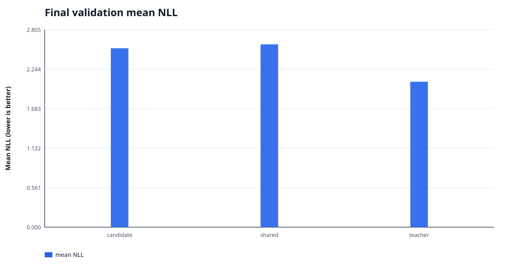

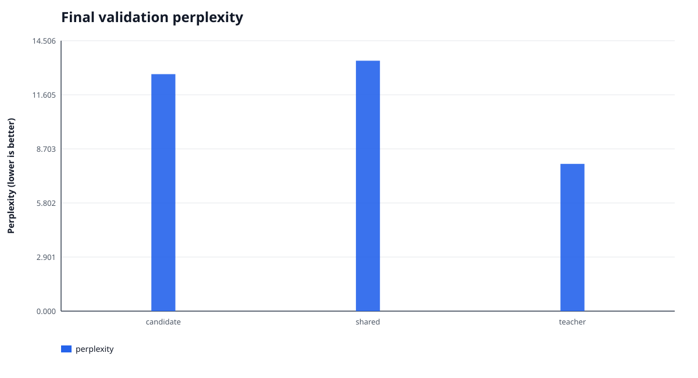

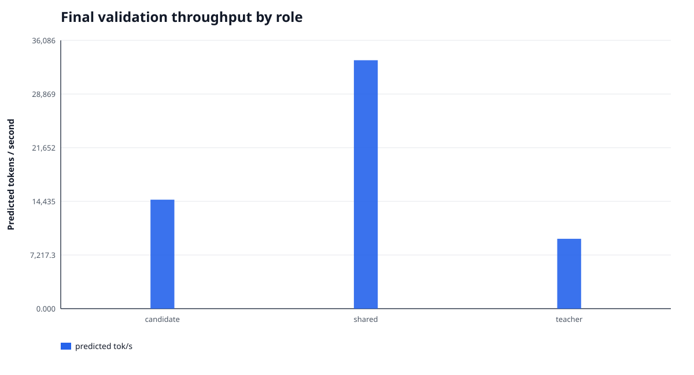

## Training trajectory

- Aggregate compute throughput: **4,438.6 tok/s**;
  optimizer-step wall throughput: **4,290.1 tok/s**;
  full train-start to final-checkpoint throughput: **4,286.0 tok/s**.
- The run lasted **6.491 h** and wrote
  38 checkpoints.  Checkpoint writes consumed
  12.85 min in total
  (mean 20.28 s, max
  24.20 s).
- Data wait was 4.455 s, or
  0.0197% of measured compute-step time.
- Peak GPU memory was 22.388 GiB allocated /
  22.654 GiB reserved.
- Pre-clip gradient norm exceeded 1.000 on
  262 / 383 steps
  (68.41%).
- Hidden-alignment batches: 20 / 383; ordinary batches:
  363 / 383.

Token-weighted first-50 to last-50 changes: NTP 2.46595 → 2.45797
(-0.00798), teacher KD 0.47200 → 0.38491
(-0.08709), and anchor KL 0.02312 → 0.06540
(+0.04229).  These are noisy training-batch metrics, not substitutes for held-out NLL.

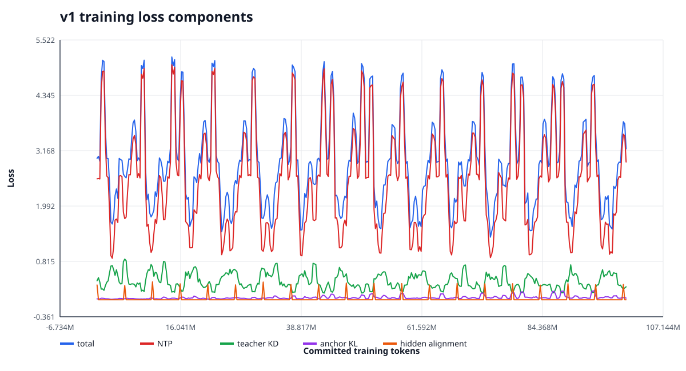

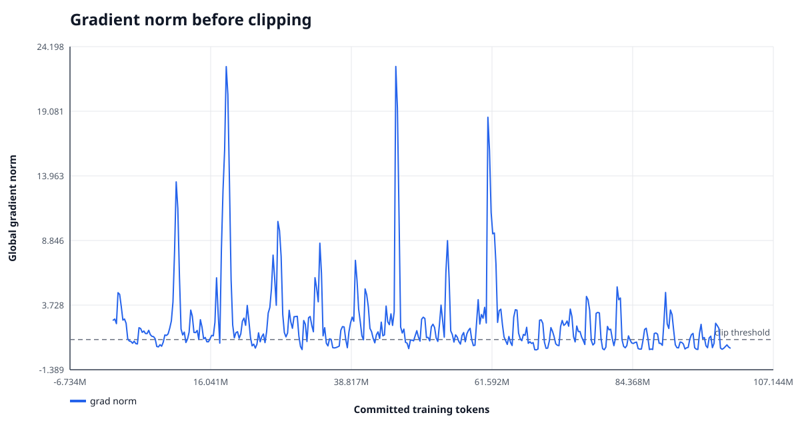

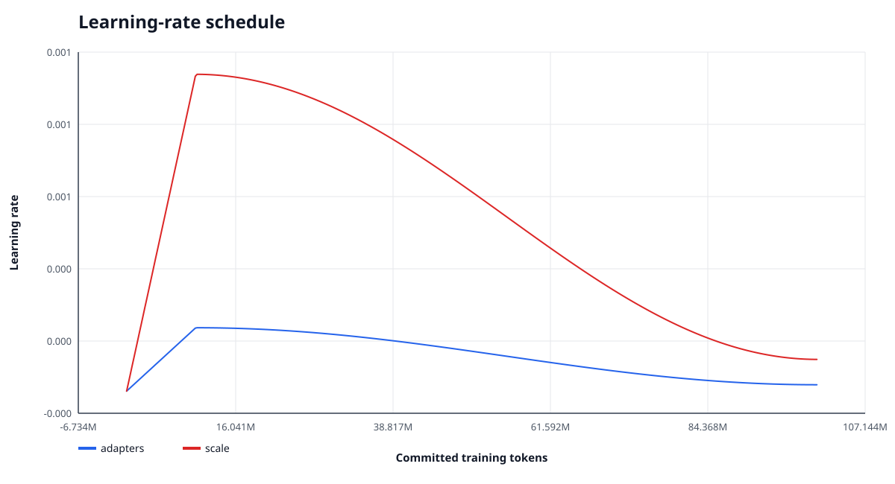

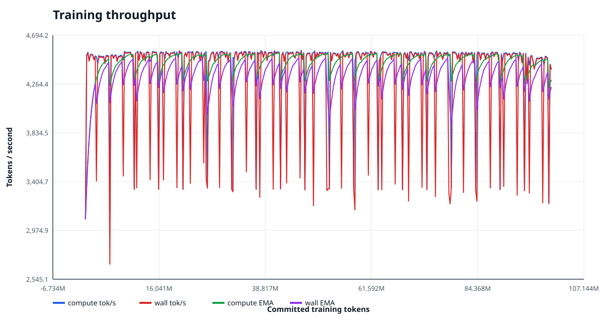

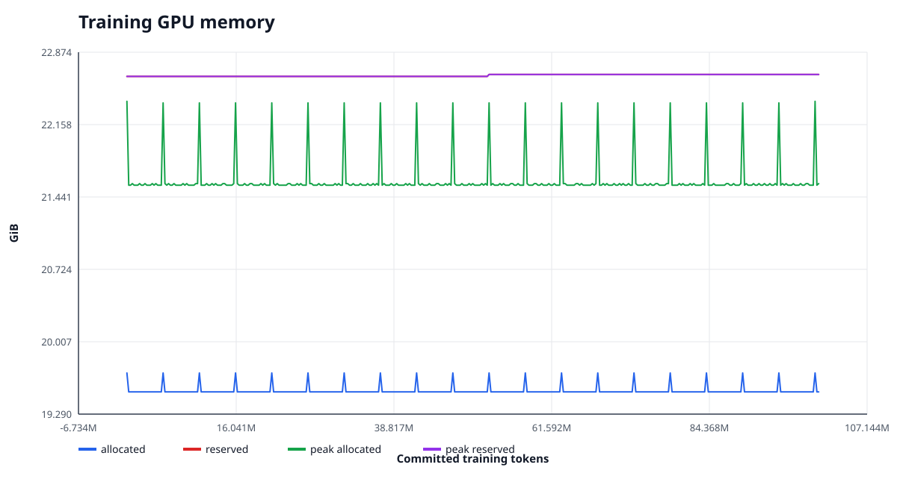

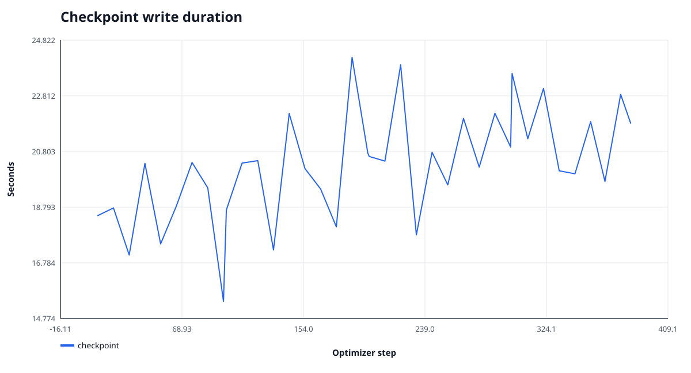


## Validation GPU runtime sample

- 25 one-second samples, all P-states: `{'P1': 25}`.
- Power: 441.51 W mean, 320.77 to 464.83 W range;
  configured limit 600 W.
- GPU utilization: 78.08% mean, 18 to 99% range;
  memory utilization: 25.08% mean,
  10 to 31% range.
- SM clock: 2676.4 MHz mean, 2655 to 2730 MHz;
  temperature: 69.44 °C mean,
  64 to 73 °C.
- Raw sample SHA256: `01420465a766a8ca46d5ca54e7bbd1065c178a983708daa918ccf1b320932ffb`.  This was a read-only `nvidia-smi` sample;
  no CUPTI subscriber or profiler was attached.

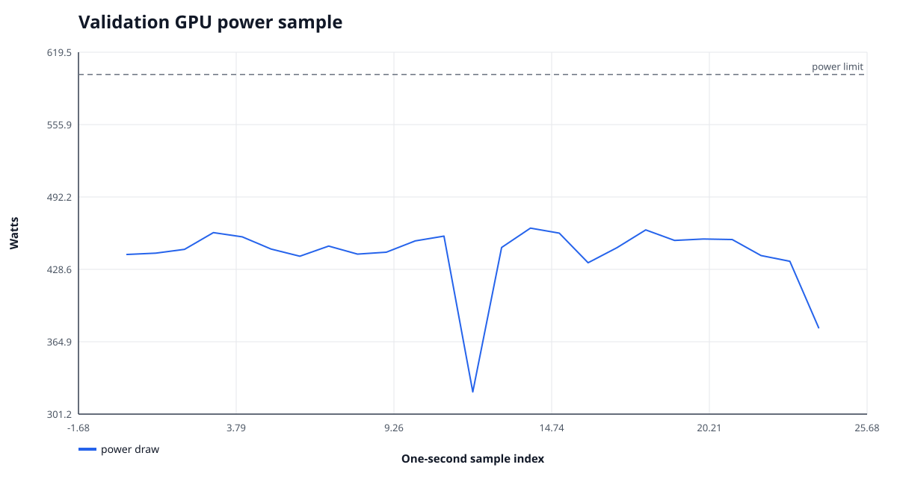

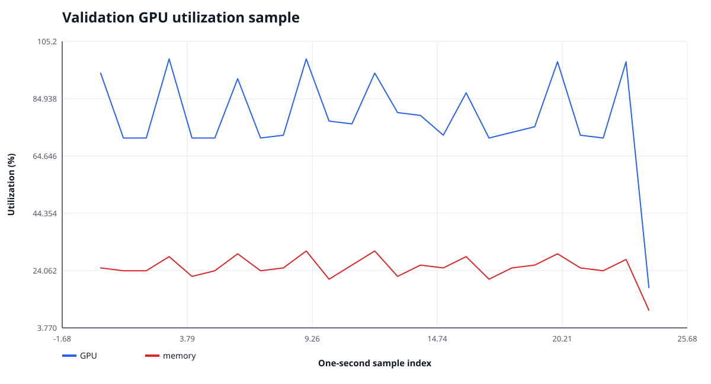


## Validation by data source

| source | shards | input tokens | candidate NLL | shared NLL | teacher NLL | gap closed |
| --- | --- | --- | --- | --- | --- | --- |
| chinese_fineweb2_cmn_hani | 30 | 5,001,101 | 4.20722 | 4.37832 | 3.63614 | 0.2305 |
| code_github_clean_allowlisted | 18 | 3,000,084 | 1.04101 | 1.04375 | 0.73577 | 0.0089 |
| english_fineweb_edu_dedup | 42 | 7,000,153 | 2.61885 | 2.62559 | 2.10321 | 0.0129 |
| math_finemath_4plus | 18 | 3,012,338 | 1.62777 | 1.64901 | 1.25676 | 0.0541 |
| science_cosmopedia_openstax | 6 | 1,000,155 | 1.80531 | 1.87425 | 1.31699 | 0.1237 |
| science_cosmopedia_stanford | 6 | 1,000,561 | 1.68099 | 1.73894 | 1.14185 | 0.0971 |

Source means are weighted by predicted tokens, not averaged across shards.

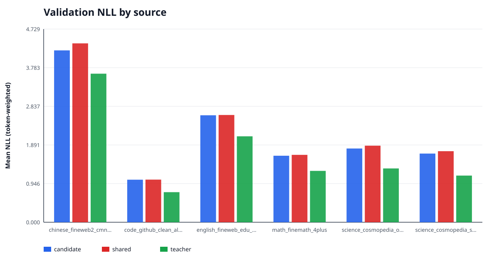

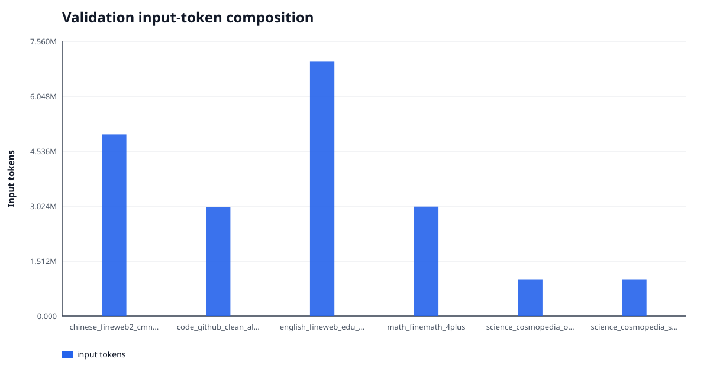

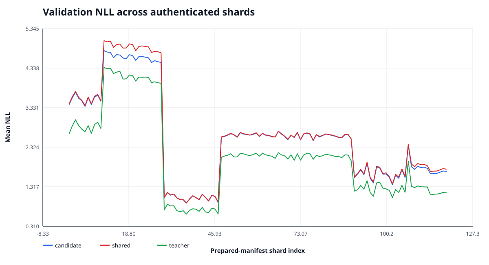

The shard chart preserves prepared-manifest order; `summary.json` contains exact per-shard values,
source IDs, token counts, and candidate-over-shared deltas for downstream analysis.

## Interpretation and limits

- The final held-out role comparison is the quality evidence for this v1 checkpoint.  The training
  loss curve alone cannot establish underfitting because batches and objective mixtures vary by step.
  A low teacher-gap-closed fraction, together with continued held-out gains in a future checkpoint
  sweep, would support increasing data/token budget; this single final evaluation cannot locate the
  optimal stopping point because v1 did not save validation measurements during training.
- v1's resolved loss configuration has MTP weight **0.0** and
  `mtp` is absent in the immutable resolved
  config.  Therefore these results must not be described as an MTP-trained run.
- The schedule used 10,000,000 warmup tokens within a
  100,000,000-token run.  This report records what v1 actually ran; it does
  not retroactively attribute results to a different annealing recipe.
- Data status is **research_only=true** and
  **ready_for_training=false**.  Pending audits:
  `cross_source_near_dedup, full_contextual_pii_scan, project_benchmark_13gram_scan`.  Until those audits are complete, results are research evidence and must not be
  presented as production-ready or contamination-free.

## Reproducibility and integrity

- Final checkpoint: `/media/data1/Project/AI/Twen1/runs/base-dense-v1/step-000000000383-milestone-complete`
- Checkpoint manifest SHA256: `8f1da11708cc2b4c05cadc11106b9f46484a77c472511e8953d43cb82018ae29`; all
  4 inventoried files were re-hashed successfully.
- Evaluation: `/media/data1/Project/AI/Twen1/artifacts/evaluations/base-dense-v1-final-validation`
- Evaluation manifest SHA256: `00bdd9a7211cc278f9eaa4afaceb715241d2af6005a6df8ea525fb683b680d9b`
- Evaluation PLAN SHA256: `cab35495461902531e9c1440b04630bac6cbf65fb5b6cc591aac1801ace5f9b9`
- Validation prepared-manifest SHA256: `4d3877bfaf4e01551d41913e11d37db08c6097b513ac94ae4a63b8a640b68e7f`
- Validation dataset fingerprint: `6839d5aefb3b5b8f960e7da1b54bd40c2882bcb915954e727f2480252d4cdc79`
- Evaluation runtime: torch `2.11.0+cu130`, CUDA `13.0`,
  `NVIDIA GeForce RTX 5090` (`cuda:0`, compute capability
  `12.0`), dtype `bfloat16`,
  `FLA_TILELANG=0`,
  `CUDA_HOME=/usr/local/cuda-13.2`.  `FLA_TILELANG=0` selects the production Triton path
  rather than the experimental TileLang path.
- Checkpoint load mode: `forward_only_lineage_compatible_not_exact_resume`.  Saved/current exact-training
  fingerprints match: `False`;
  saved/current source trees match: `False`.  The saved
  source tree is `4775fc259454c410e610c9349bab816a3622dc97b9d4877cff280cf05028947c` and the evaluation source
  tree is `8197ce12d1d553ec94ed28716388b69b609bd0e2b5626c9c2c275bf823912f17`.  This is authenticated
  forward-only compatibility and **must not** be described as exact-resume compatibility.

Canonical reproduction uses an absolute checkpoint path.  The checkpoint resolver now treats a
bare `step-*` name as relative to `checkpoint.output_dir`, while a relative argument containing a
directory is relative to the current working directory.  This avoids the historical
`runs/<run>/runs/<run>/step-*` double-prefix trap.

```bash
FLA_TILELANG=0 bash scripts/with_cuda_toolchain.sh .venv/bin/python -m twen evaluate nll \
  --config runs/base-dense-v1/resolved_config.yaml \
  --checkpoint /media/data1/Project/AI/Twen1/runs/base-dense-v1/step-000000000383-milestone-complete \
  --prepared-manifest artifacts/data/base-validation/manifest.json \
  --output artifacts/evaluations/base-dense-v1-final-validation \
  --role candidate --role shared --role teacher --batch-size 1 --device cuda:0
```

`MANIFEST.json` authenticates every report payload and figure; `COMPLETE` authenticates that
manifest.  All figures are standalone SVG generated with Python's standard library.
