# base-dense-v2-500m final validation report

This bundle evaluates the immutable final checkpoint at step 1,912
(500,009,962 committed training tokens) on the separately prepared,
authenticated validation corpus.  Evaluation is forward-only (`inference_mode`): no optimizer
state, backward pass, or parameter update is involved.

## Executive result

| role | predicted tokens | mean NLL | perplexity | wall tok/s |
| --- | --- | --- | --- | --- |
| candidate | 20,009,445 | 2.377578 | 10.7788 | 15,050 |
| shared | 20,009,445 | 2.597585 | 13.4313 | 35,090 |
| teacher | 20,009,445 | 2.066529 | 7.8974 | 9,957.8 |

- Teacher gap closed: **0.41428**; configured dense acceptance gate: **PASS**
  (threshold 0.10).
- Every role covered 120 / 120
  shards and 4,947 sequences.  Role token counts
  are equal, so role comparisons use identical labels.
- `candidate` is the trained transfer branch, `shared` disables that branch on the same backbone,
  and `teacher` is the frozen Qwen3.5-9B reference.

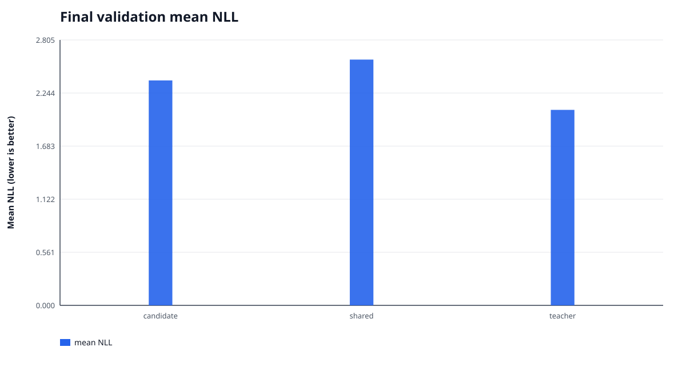

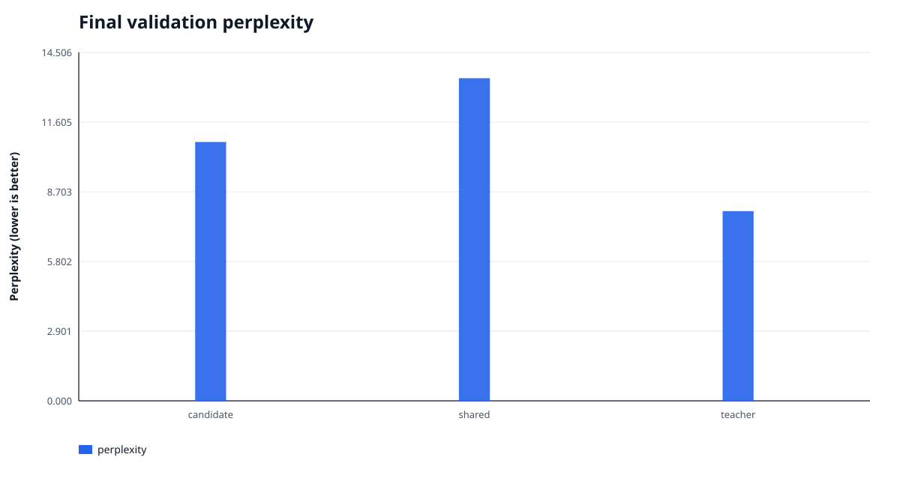

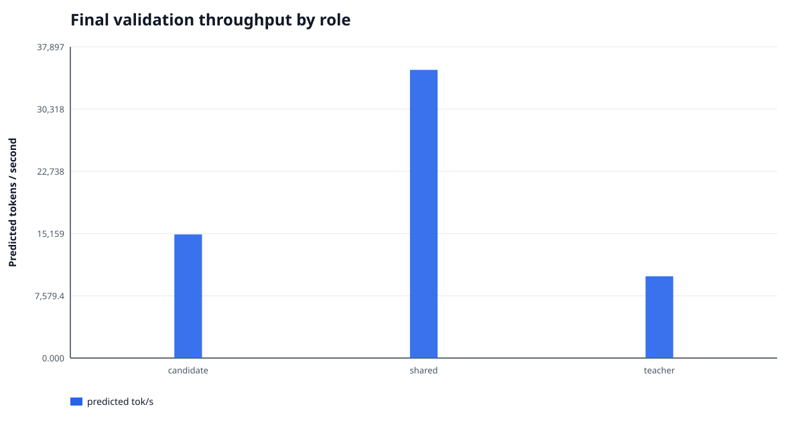


## Authenticated v1 baseline comparison

The baseline is `base-dense-v1` and the current result is `base-dense-v2-500m`.  This
comparison is emitted only after exact matches on validation prepared-manifest SHA256, dataset
fingerprint, sequence/input-token/shard counts, and predicted-token counts for all three roles.
The absolute and relative changes therefore use the same held-out task and labels.

| role | baseline NLL | current NLL | NLL absolute Δ | NLL relative Δ | baseline PPL | current PPL | PPL absolute Δ | PPL relative Δ |
| --- | --- | --- | --- | --- | --- | --- | --- | --- |
| candidate | 2.542525 | 2.377578 | -0.164946 | -6.488% | 12.7117 | 10.7788 | -1.9330 | -15.206% |
| shared | 2.597585 | 2.597585 | +0.000000 | +0.000% | 13.4313 | 13.4313 | +0.0000 | +0.000% |
| teacher | 2.066529 | 2.066529 | +0.000000 | +0.000% | 7.8974 | 7.8974 | +0.0000 | +0.000% |

| metric | baseline | current | absolute Δ | relative Δ |
| --- | --- | --- | --- | --- |
| teacher gap closed | 0.103680 | 0.414281 | +0.310601 | +299.575% |

Negative NLL/perplexity changes are improvements; a positive teacher-gap-closed change is an
improvement.  The baseline `summary.json` is inventoried by its adjacent `MANIFEST.json`, which is
itself authenticated by `COMPLETE`:

- Baseline summary SHA256: `ecf4f7b9a8bef4d4a34fba9bb2e4e9b330f243a1b6a22cb9d9f30d5c4a6949a7`
- Baseline report manifest SHA256: `1e79536e8252031083bd1af20175ace5e3f33848462563a34202f7b584e5b521`
- Baseline checkpoint manifest SHA256: `8f1da11708cc2b4c05cadc11106b9f46484a77c472511e8953d43cb82018ae29`
- Baseline evaluation manifest SHA256: `00bdd9a7211cc278f9eaa4afaceb715241d2af6005a6df8ea525fb683b680d9b`


## Training trajectory

- Aggregate compute throughput: **6,765.4 tok/s**;
  optimizer-step wall throughput: **6,649.3 tok/s**;
  full train-start to final-checkpoint throughput: **5,769.6 tok/s**.
- The run lasted **24.073 h** and wrote
  58 checkpoints.  Checkpoint writes consumed
  19.04 min in total
  (mean 19.69 s, max
  53.94 s).
- Data wait was 175.667 s, or
  0.2377% of measured compute-step time.
- Peak GPU memory was 27.320 GiB allocated /
  27.539 GiB reserved.
- Pre-clip gradient norm exceeded 1.000 on
  678 / 1912 steps
  (35.46%).
- Hidden-alignment batches: 96 / 1912; ordinary batches:
  1816 / 1912.

Token-weighted first-50 to last-50 changes: NTP 2.71679 → 1.89735
(-0.81944), teacher KD 0.33309 → 0.34138
(+0.00829), and anchor KL 0.06087 → 0.20995
(+0.14908).  These are noisy training-batch metrics, not substitutes for held-out NLL.

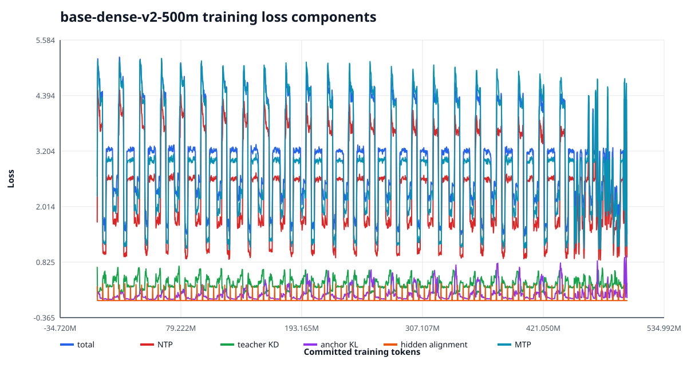

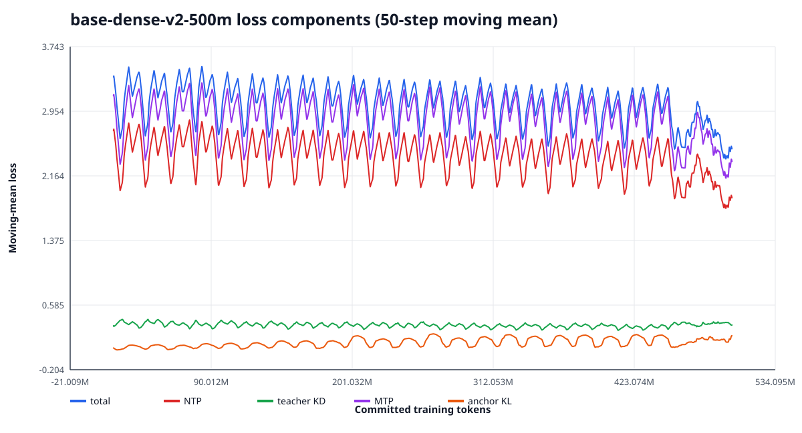


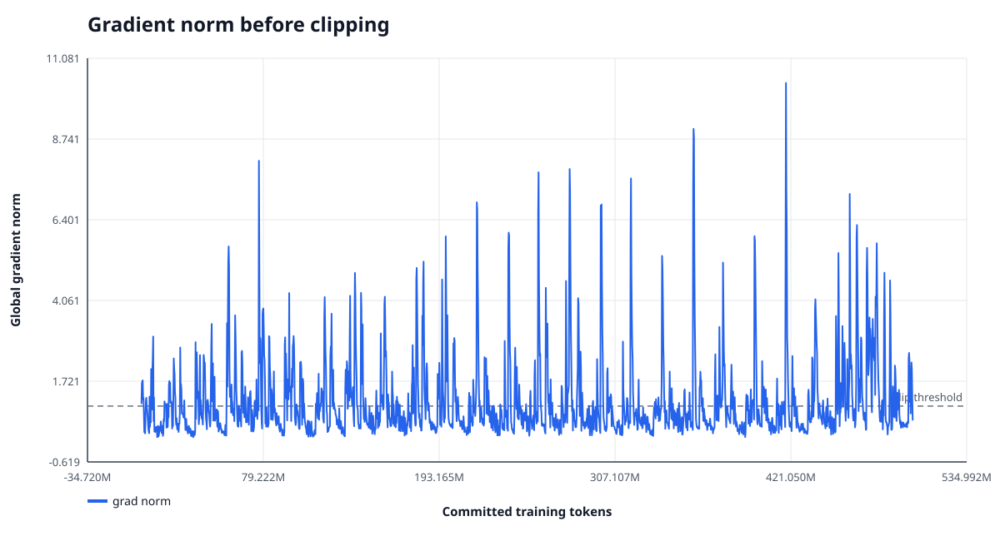

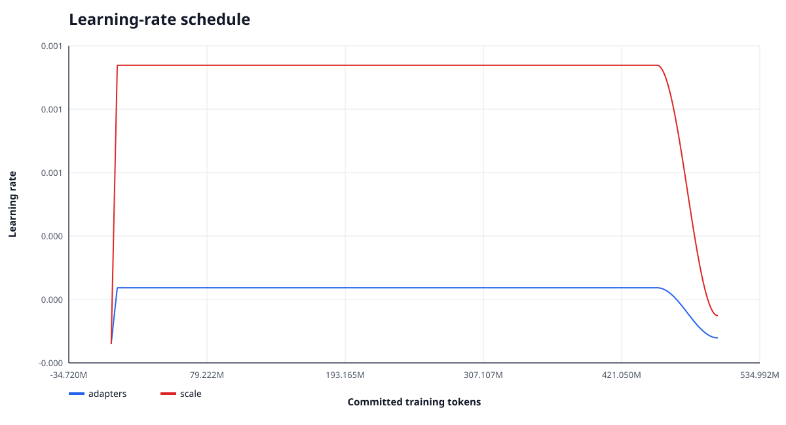

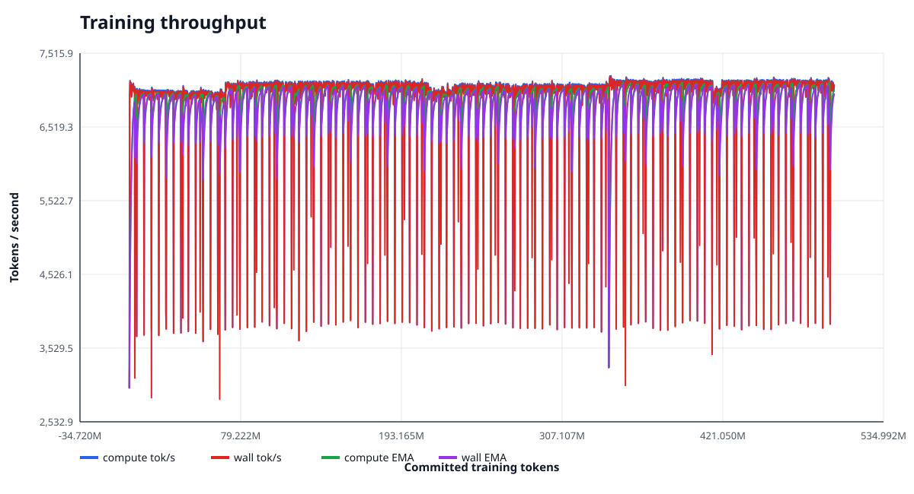

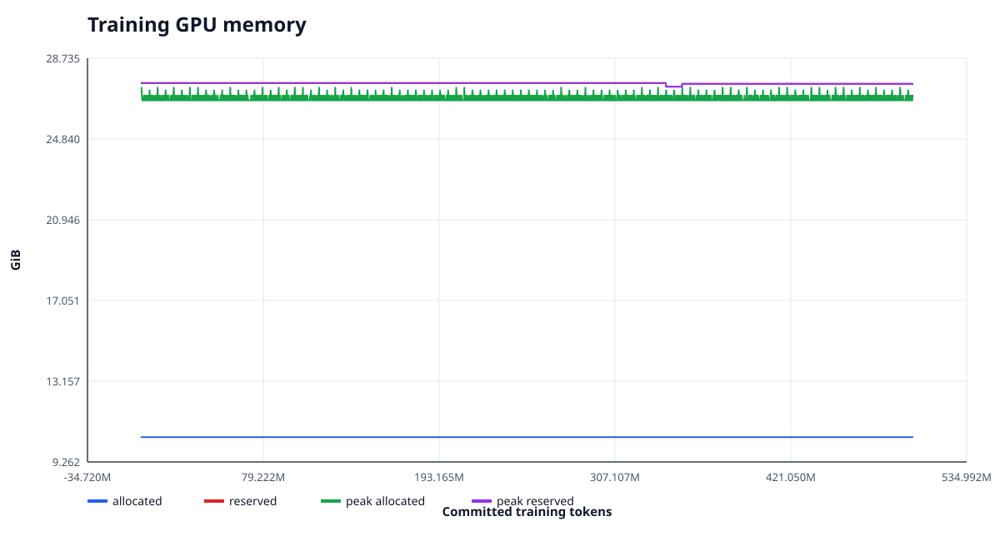

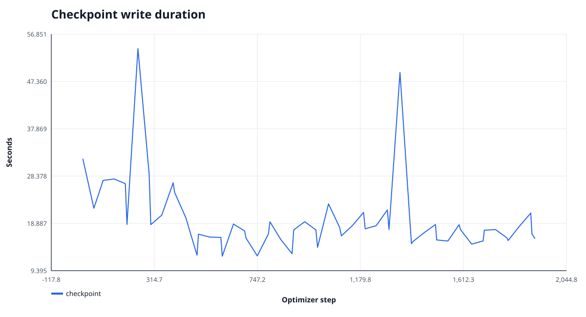


## Validation GPU runtime sample

- 4158 one-second samples, all P-states: `{'P1': 3905, 'P3': 10, 'P5': 3, 'P8': 240}`.
- Power: 441.97 W mean, 26.61 to 576.82 W range;
  configured limit 600 W.
- GPU utilization: 73.69% mean, 0 to 100% range;
  memory utilization: 19.26% mean,
  0 to 25% range.
- SM clock: 2627.2 MHz mean, 292 to 2865 MHz;
  temperature: 62.33 °C mean,
  38 to 73 °C.
- Raw sample SHA256: `588d14ddf1103a8623d61a49fe2a5809356158e3faa7454c1bce0924fccd1ccd`.  This was a read-only `nvidia-smi` sample;
  no CUPTI subscriber or profiler was attached.

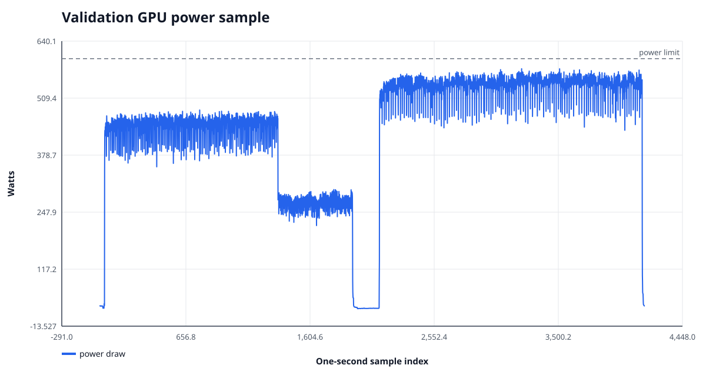

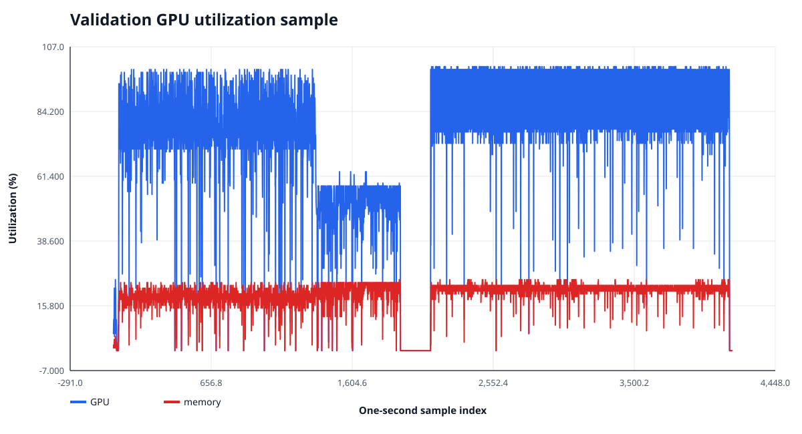


## Source-conditioned training analysis

Deterministic cursor replay matched every logged data phase and reconstructed the source mixture
of all 1,912 optimizer batches.  In the post-warmup primary phase,
pure-source batches accounted for
1,572 /
1,702
(92.36%).  The table below fits
each metric on that phase using source fixed effects plus committed tokens; uncertainty is a
Newey-West HAC interval with lag 50.

| metric | slope / 100M | HAC 95% CI | R² | raw SD | residual SD |
| --- | --- | --- | --- | --- | --- |
| loss | -0.04089 | [-0.04892, -0.03285] | 0.9835 | 0.9630 | 0.1236 |
| ntp | -0.03099 | [-0.03886, -0.02313] | 0.9846 | 0.9464 | 0.1174 |
| teacher_kd | -0.01064 | [-0.01272, -0.00856] | 0.9255 | 0.1244 | 0.0339 |
| mtp | -0.01502 | [-0.02189, -0.00815] | 0.9819 | 1.1125 | 0.1496 |
| anchor_kl | 0.02242 | [0.01680, 0.02804] | 0.5833 | 0.1287 | 0.0831 |

| source | effective steps | total | NTP | KD | MTP |
| --- | --- | --- | --- | --- | --- |
| chinese_fineweb2_cmn_hani | 418.7 | 4.4223 | 3.7434 | 0.2015 | 4.4805 |
| code_github_clean_allowlisted | 260.8 | 1.6705 | 1.0822 | 0.4472 | 1.3207 |
| english_fineweb_edu_dedup | 605.0 | 3.2002 | 2.5975 | 0.2979 | 2.9908 |
| math_finemath_4plus | 250.5 | 2.2629 | 1.6523 | 0.4035 | 1.9335 |
| science_cosmopedia_openstax | 85.8 | 2.5490 | 1.7751 | 0.5252 | 2.3202 |
| science_cosmopedia_stanford | 81.2 | 2.6150 | 1.7405 | 0.6275 | 2.3161 |

For total loss, source composition explains
98.35% of raw variance, while the controlled trend is
-0.04089 per 100M tokens.  Therefore the raw
near-plateau is not evidence of zero learning: source-dependent difficulty and the mixed objectives
hide a statistically negative within-source trend.  This remains training evidence, not a substitute
for held-out NLL.

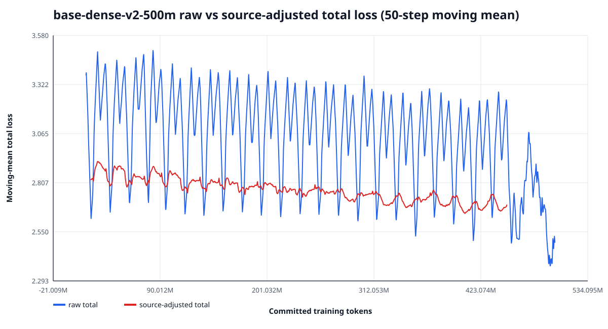

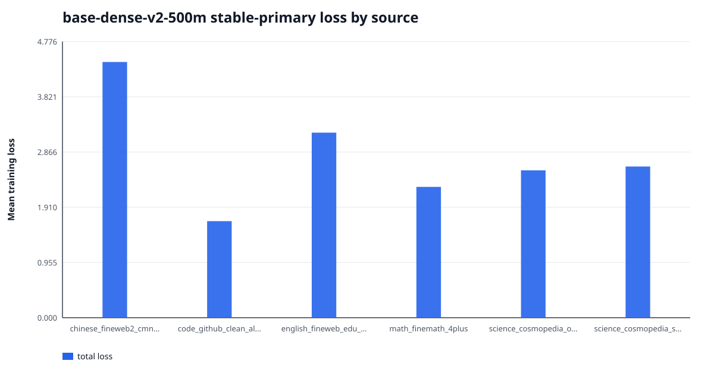


## Validation by data source

| source | shards | input tokens | candidate NLL | shared NLL | teacher NLL | gap closed |
| --- | --- | --- | --- | --- | --- | --- |
| chinese_fineweb2_cmn_hani | 30 | 5,001,101 | 3.66014 | 4.37832 | 3.63614 | 0.9677 |
| code_github_clean_allowlisted | 18 | 3,000,084 | 1.02839 | 1.04375 | 0.73577 | 0.0499 |
| english_fineweb_edu_dedup | 42 | 7,000,153 | 2.60281 | 2.62559 | 2.10321 | 0.0436 |
| math_finemath_4plus | 18 | 3,012,338 | 1.57178 | 1.64901 | 1.25676 | 0.1969 |
| science_cosmopedia_openstax | 6 | 1,000,155 | 1.65269 | 1.87425 | 1.31699 | 0.3976 |
| science_cosmopedia_stanford | 6 | 1,000,561 | 1.58724 | 1.73894 | 1.14185 | 0.2541 |

Source means are weighted by predicted tokens, not averaged across shards.

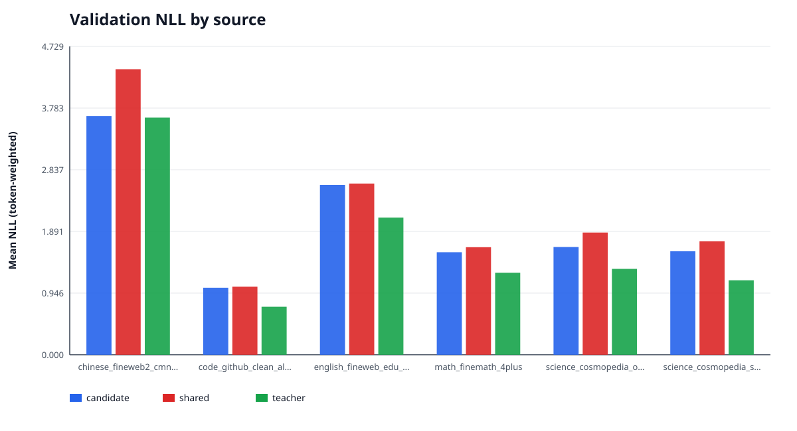


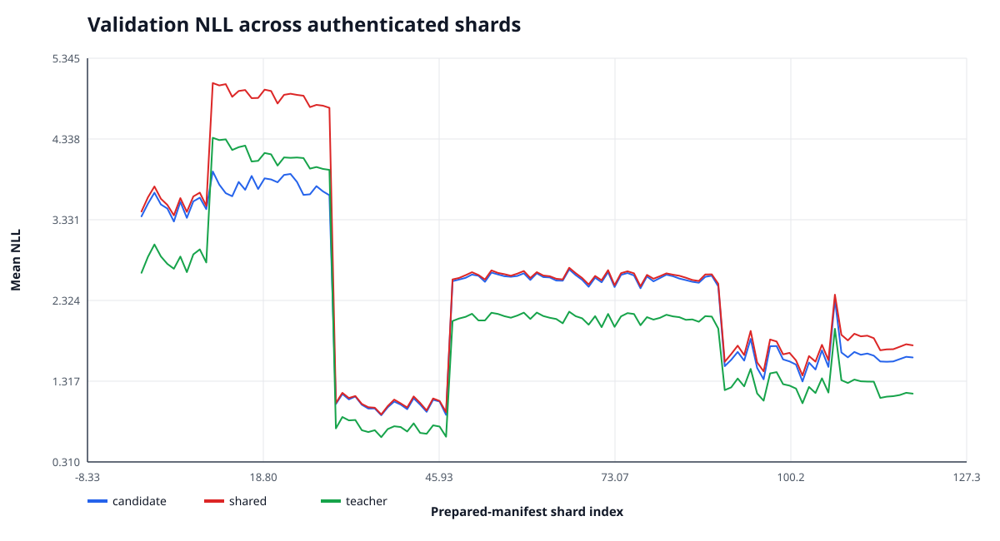

The shard chart preserves prepared-manifest order; `summary.json` contains exact per-shard values,
source IDs, token counts, and candidate-over-shared deltas for downstream analysis.

## Interpretation and limits

- The final held-out role comparison is the quality evidence for this `base-dense-v2-500m` checkpoint.  The training
  loss curve alone cannot establish underfitting because batches and objective mixtures vary by step.
  A low teacher-gap-closed fraction, together with continued held-out gains in a future checkpoint
  sweep, would support increasing data/token budget; this single final evaluation cannot locate the
  optimal stopping point because the run did not perform held-out validation at multiple checkpoints.
- The immutable run enabled the native Qwen3.5 MTP objective at weight **0.1**.  Its source head remained frozen and outside the optimizer, while its loss propagated through the student hidden states.
- The immutable schedule used linear warmup for 5,000,000 tokens, a stable plateau through 450,000,000 tokens, then a 50,000,000-token cosine decay to 0.100× peak LR. The data stream also switches to the authenticated quality-cooldown corpus at 450,000,000 tokens; any loss discontinuity at that exact boundary is confounded with the data change and cannot be attributed to LR alone.
- Data status is **research_only=true** and
  **ready_for_training=false**.  Pending audits:
  `cross_source_near_dedup, full_contextual_pii_scan, project_benchmark_13gram_scan`.  Until those audits are complete, results are research evidence and must not be
  presented as production-ready or contamination-free.

## Reproducibility and integrity

- Final checkpoint: `/media/data1/Project/AI/Twen1/runs/base-dense-v2-500m/step-000000001912-milestone-complete`
- Checkpoint manifest SHA256: `7318c071507dec896521a669d4b682de0359e43a70dcd992d11a8d1e3ad870d9`; all
  4 inventoried files were re-hashed successfully.
- Evaluation: `/media/data1/Project/AI/Twen1/artifacts/evaluations/base-dense-v2-500m-final-validation`
- Evaluation manifest SHA256: `c178d2b92c5ca362cc09ec740988a5555b2382f56d7d528e6a87e58ad39f359e`
- Evaluation PLAN SHA256: `bfc4055716d4b598a42bd5ba858771e34005f12fe9ad59f78c17987c6b5a6c22`
- Validation prepared-manifest SHA256: `4d3877bfaf4e01551d41913e11d37db08c6097b513ac94ae4a63b8a640b68e7f`
- Validation dataset fingerprint: `6839d5aefb3b5b8f960e7da1b54bd40c2882bcb915954e727f2480252d4cdc79`
- Evaluation runtime: torch `2.11.0+cu130`, CUDA `13.0`,
  `NVIDIA GeForce RTX 5090` (`cuda:0`, compute capability
  `12.0`), dtype `bfloat16`,
  `FLA_TILELANG=0`,
  `CUDA_HOME=/usr/local/cuda-13.2`.  `FLA_TILELANG=0` selects the production Triton path
  rather than the experimental TileLang path.
- Checkpoint load mode: `forward_only_lineage_compatible_not_exact_resume`.  Saved/current exact-training
  fingerprints match: `True`;
  saved/current source trees match: `True`.  The saved
  source tree is `a7aff762d504557a32d0cfbeb7bfde6a812f9303333480255fcbdfec0ca0cdbd` and the evaluation source
  tree is `a7aff762d504557a32d0cfbeb7bfde6a812f9303333480255fcbdfec0ca0cdbd`.  This is authenticated
  forward-only compatibility and **must not** be described as exact-resume compatibility.

Canonical reproduction uses an absolute checkpoint path.  The checkpoint resolver now treats a
bare `step-*` name as relative to `checkpoint.output_dir`, while a relative argument containing a
directory is relative to the current working directory.  This avoids the historical
`runs/<run>/runs/<run>/step-*` double-prefix trap.

```bash
FLA_TILELANG=0 bash scripts/with_cuda_toolchain.sh .venv/bin/python -m twen evaluate nll \
  --config /media/data1/Project/AI/Twen1/runs/base-dense-v2-500m/resolved_config.yaml \
  --checkpoint /media/data1/Project/AI/Twen1/runs/base-dense-v2-500m/step-000000001912-milestone-complete \
  --prepared-manifest /media/data1/Project/AI/Twen1/artifacts/data/base-validation/manifest.json \
  --output /media/data1/Project/AI/Twen1/artifacts/evaluations/base-dense-v2-500m-final-validation \
  --role candidate --role shared --role teacher --batch-size 1 --device cuda:0
```

`MANIFEST.json` authenticates every report payload and figure; `COMPLETE` authenticates that
manifest.  All figures are standalone SVG generated with Python's standard library.
