# base-dense-v3-500m final validation report

This bundle evaluates the immutable final checkpoint at step 1,912
(500,009,962 committed training tokens) on the separately prepared,
authenticated validation corpus.  Evaluation is forward-only (`inference_mode`): no optimizer
state, backward pass, or parameter update is involved.

## Executive result

| role | predicted tokens | mean NLL | perplexity | wall tok/s |
| --- | --- | --- | --- | --- |
| candidate | 20,009,445 | 2.376669 | 10.7690 | 15,425 |
| shared | 20,009,445 | 2.597585 | 13.4313 | 35,443 |
| teacher | 20,009,445 | 2.066529 | 7.8974 | 7,453.7 |

- Teacher gap closed: **0.41599**; configured dense acceptance gate: **PASS**
  (threshold 0.10).
- Every role covered 120 / 120
  shards and 4,947 sequences.  Role token counts
  are equal, so role comparisons use identical labels.
- `candidate` is the trained transfer branch, `shared` disables that branch on the same backbone,
  and `teacher` is the frozen Qwen3.5-9B reference.

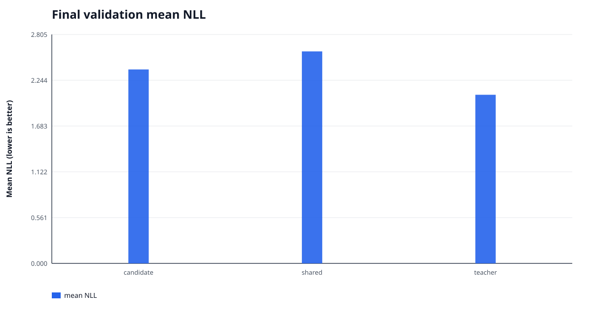

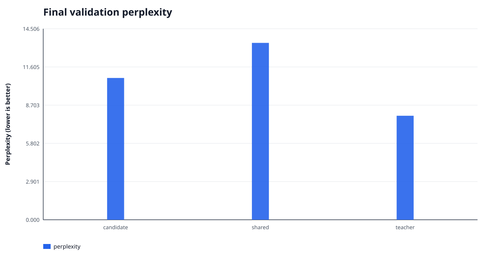

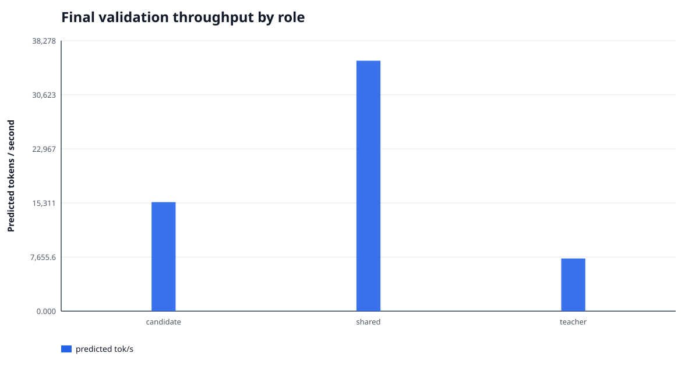


## Authenticated baseline comparison

The baseline is `base-dense-v2-500m` and the current result is `base-dense-v3-500m`.  This
comparison is emitted only after exact matches on validation prepared-manifest SHA256, dataset
fingerprint, sequence/input-token/shard counts, and predicted-token counts for all three roles.
The absolute and relative changes therefore use the same held-out task and labels.

| role | baseline NLL | current NLL | NLL absolute Δ | NLL relative Δ | baseline PPL | current PPL | PPL absolute Δ | PPL relative Δ |
| --- | --- | --- | --- | --- | --- | --- | --- | --- |
| candidate | 2.377578 | 2.376669 | -0.000910 | -0.038% | 10.7788 | 10.7690 | -0.0098 | -0.091% |
| shared | 2.597585 | 2.597585 | +0.000000 | +0.000% | 13.4313 | 13.4313 | +0.0000 | +0.000% |
| teacher | 2.066529 | 2.066529 | +0.000000 | +0.000% | 7.8974 | 7.8974 | +0.0000 | +0.000% |

| metric | baseline | current | absolute Δ | relative Δ |
| --- | --- | --- | --- | --- |
| teacher gap closed | 0.414281 | 0.415994 | +0.001713 | +0.413% |

### Cross-version history on the same held-out set

The table and figures include only versions carried by the authenticated lineage.  Every row uses
the identical prepared validation manifest and predicted-token accounting for all three roles.

| run_id | candidate mean NLL | teacher gap closed |
| --- | --- | --- |
| base-dense-v1 | 2.542525 | 10.368% |
| base-dense-v2-500m | 2.377578 | 41.428% |
| base-dense-v3-500m | 2.376669 | 41.599% |

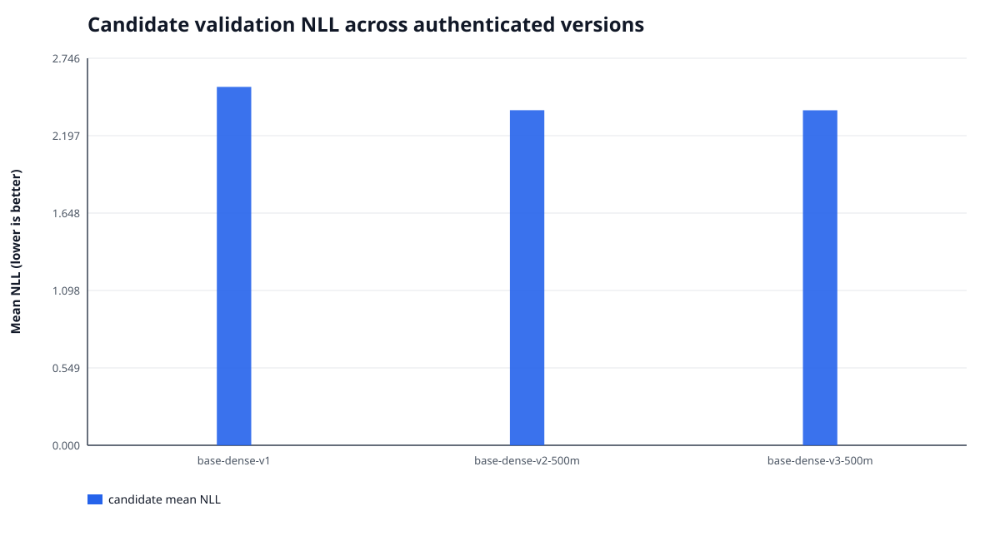

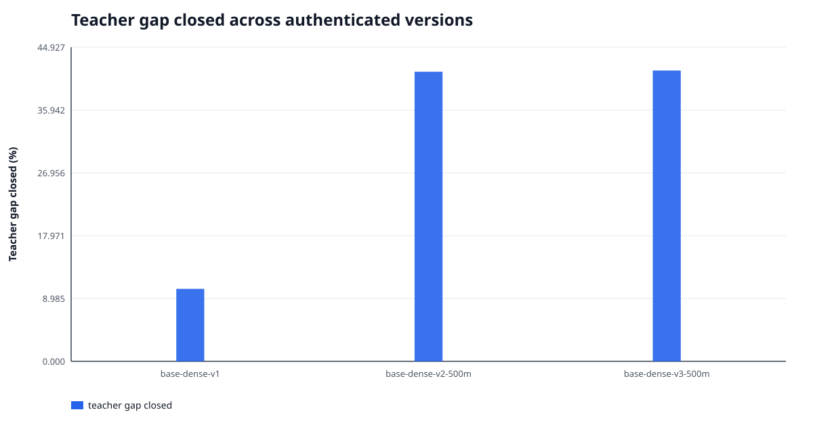

Negative NLL/perplexity changes are improvements; a positive teacher-gap-closed change is an
improvement.  The baseline `summary.json` is inventoried by its adjacent `MANIFEST.json`, which is
itself authenticated by `COMPLETE`:

- Baseline summary SHA256: `3bc9a9246dbe4fd46e431f9b0e7f3b27e9e97d72d6557e450b9fa2542dc140b8`
- Baseline report manifest SHA256: `4798a5dc4ef0b456c2ac979976e44f0058b8c707e2b4a68f94d8bf59cba49dc4`
- Baseline checkpoint manifest SHA256: `7318c071507dec896521a669d4b682de0359e43a70dcd992d11a8d1e3ad870d9`
- Baseline evaluation manifest SHA256: `c178d2b92c5ca362cc09ec740988a5555b2382f56d7d528e6a87e58ad39f359e`


## Training trajectory

- Aggregate compute throughput: **6,820.2 tok/s**;
  optimizer-step wall throughput: **6,715.8 tok/s**;
  full train-start to final-checkpoint throughput: **5,379.0 tok/s**.
- The first-start-to-final elapsed span was
  **25.821 h**; its restart-aware accounting is
  separated below.  The run wrote 58 checkpoints.  Checkpoint writes consumed
  17.05 min in total
  (mean 17.63 s, max
  43.13 s).
- Data wait was 152.079 s, or
  0.2074% of measured compute-step time.
- Peak GPU memory was 27.320 GiB allocated /
  27.559 GiB reserved.
- Pre-clip gradient norm exceeded 1.000 on
  499 / 1912 steps
  (26.10%).
- Hidden-alignment batches: 96 / 1912; ordinary batches:
  1816 / 1912.


### Resume and wall-clock accounting

- Elapsed wall from the first `train_start` through `train_complete` was
  **25.821 h**, or **5,379.0
  tok/s**.  This denominator intentionally includes inter-session pauses, reinitialization,
  and work replayed after rollback.
- Canonical active wall for committed optimizer steps was **20.681 h**, or
  **6,715.8 tok/s**.
- The **5.140 h** difference also contains checkpoint writes, model
  construction/preflight, and other overhead; it must not be read as GPU idle time alone.
- The lifecycle records 3 sessions, 2 resumes,
  1 graceful stops, and 1 sessions without a terminal event.

| event | session | step | tokens | UTC | detail |
| --- | --- | --- | --- | --- | --- |
| session_start | ca1b8eb040194aa19d6882845ba04b2a | n/a | n/a | 2026-07-25T03:39:37.029011+00:00 | n/a |
| initialized | ca1b8eb040194aa19d6882845ba04b2a | 0 | 0 | 2026-07-25T03:45:15.797150+00:00 | fork=step-000000000383-milestone-complete |
| train_start | ca1b8eb040194aa19d6882845ba04b2a | 0 | 0 | 2026-07-25T03:45:15.825070+00:00 | n/a |
| session_start | e14d4c7b82744b77a0acec91b95f0824 | n/a | n/a | 2026-07-25T14:26:04.471664+00:00 | n/a |
| resume | e14d4c7b82744b77a0acec91b95f0824 | 847 | 221,504,027 | 2026-07-25T14:31:55.366697+00:00 | checkpoint=step-000000000847-periodic |
| train_start | e14d4c7b82744b77a0acec91b95f0824 | 847 | 221,504,027 | 2026-07-25T14:31:55.399009+00:00 | n/a |
| graceful_stop | e14d4c7b82744b77a0acec91b95f0824 | 1064 | 278,247,681 | 2026-07-25T16:54:11.593191+00:00 | n/a |
| session_start | aee06a8f9be5456d9d7f9e26ec95b34d | n/a | n/a | 2026-07-25T20:22:51.101559+00:00 | n/a |
| resume | aee06a8f9be5456d9d7f9e26ec95b34d | 1064 | 278,247,681 | 2026-07-25T20:27:47.715453+00:00 | checkpoint=step-000000001064-interrupt-request-000001 |
| train_start | aee06a8f9be5456d9d7f9e26ec95b34d | 1064 | 278,247,681 | 2026-07-25T20:27:47.748750+00:00 | n/a |
| train_complete | aee06a8f9be5456d9d7f9e26ec95b34d | 1912 | 500,009,962 | 2026-07-26T05:34:30.929211+00:00 | checkpoint=step-000000001912-milestone-complete |


Token-weighted first-50 to last-50 changes: NTP 2.71694 → 1.89440
(-0.82255), teacher KD 0.33295 → 0.33543
(+0.00248), and anchor KL 0.06074 → 0.20352
(+0.14278).  These are noisy training-batch metrics, not substitutes for held-out NLL.

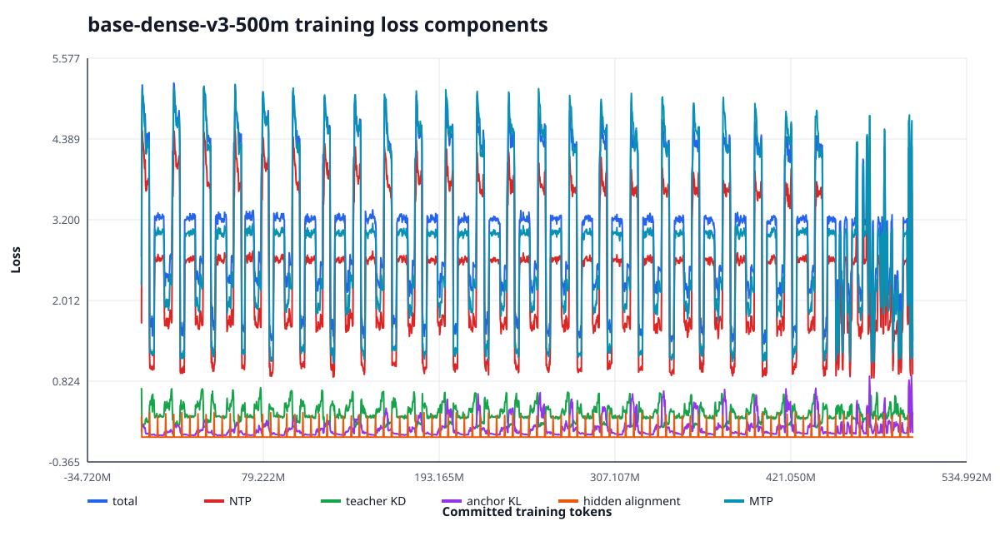

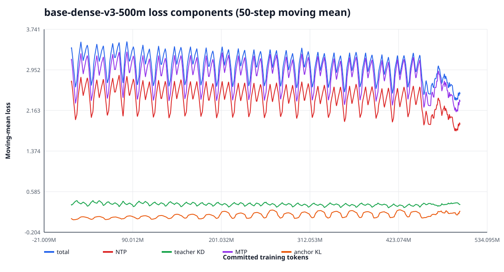


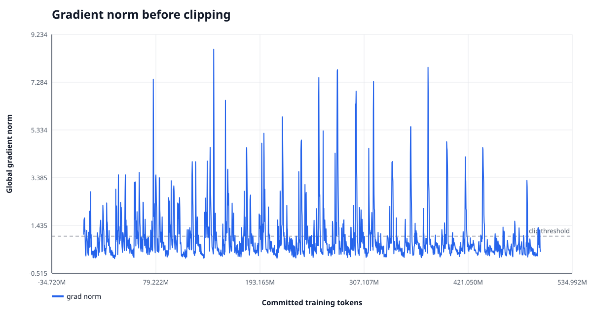

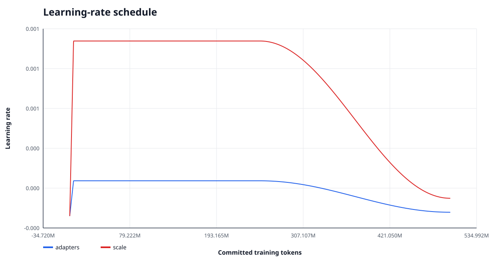

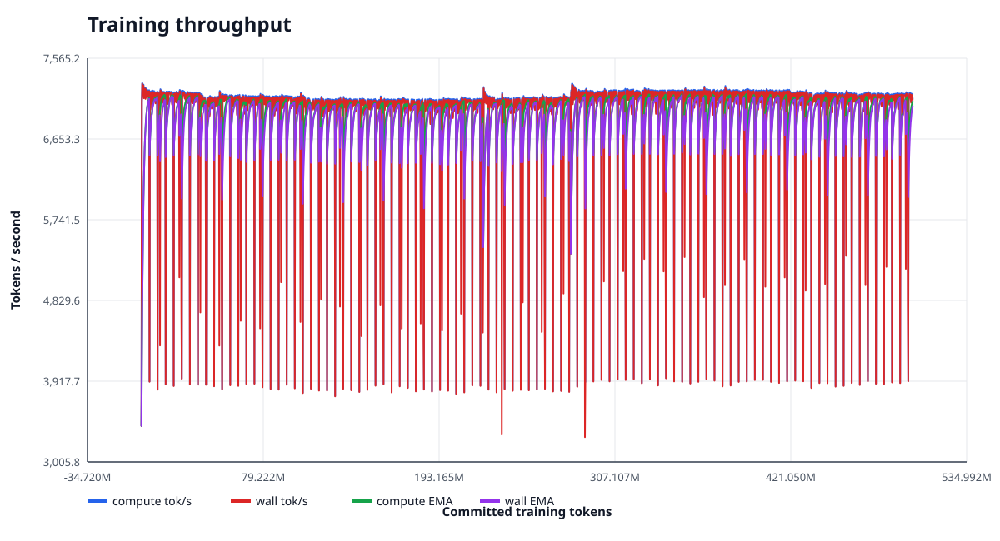

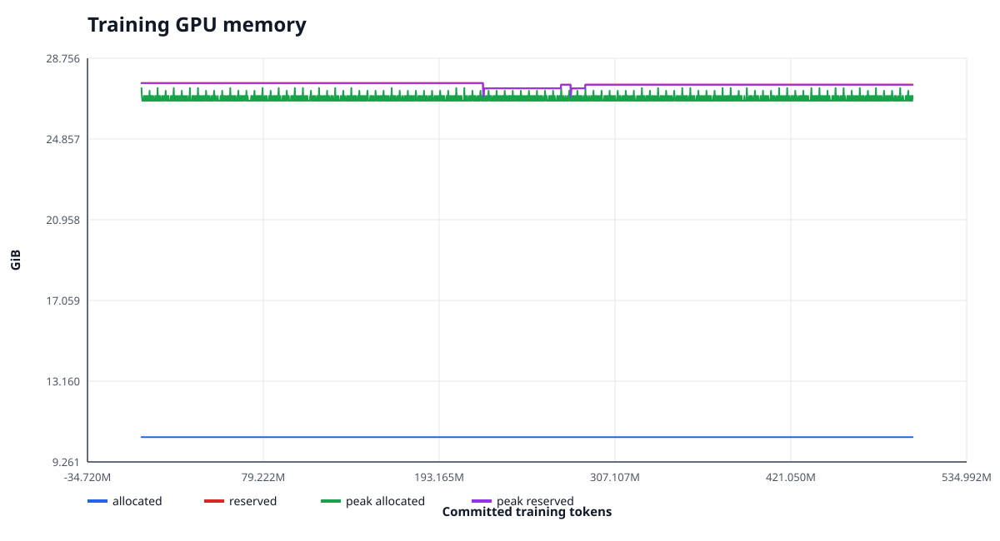

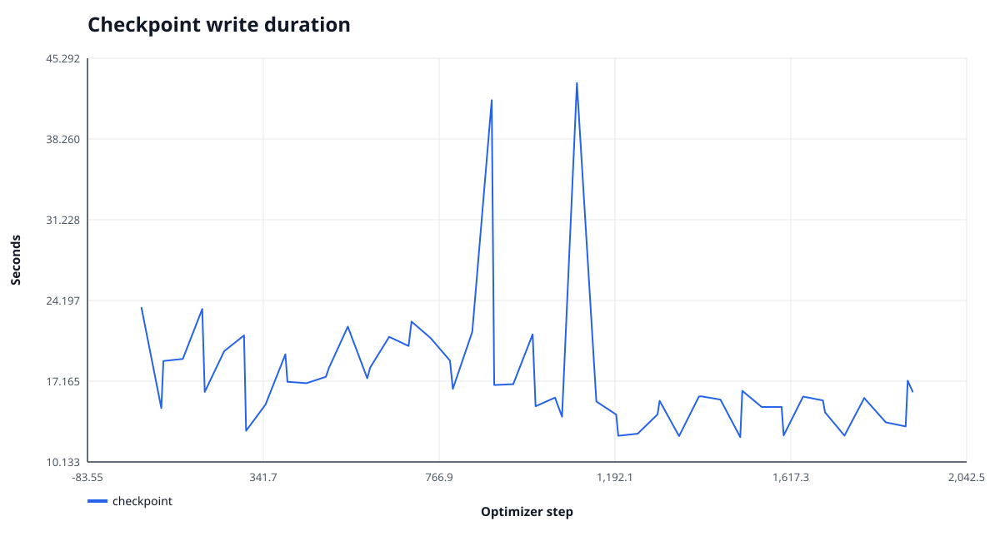


## Validation GPU runtime sample

- 4709 one-second samples, all P-states: `{'P0': 1, 'P1': 4489, 'P3': 15, 'P5': 96, 'P8': 108}`.
- Power: 448.31 W mean, 31.58 to 579.75 W range;
  configured limit 600 W.
- GPU utilization: 77.79% mean, 0 to 100% range;
  memory utilization: 19.29% mean,
  0 to 53% range.
- SM clock: 2865.5 MHz mean, 300 to 3030 MHz;
  temperature: 63.31 °C mean,
  0 to 72 °C.
- Raw sample SHA256: `a26ce774dfd799acec90945b00959faa4fd627340a2b6d72fefd1cd56452e2aa`.  This was a read-only `nvidia-smi` sample;
  no CUPTI subscriber or profiler was attached.

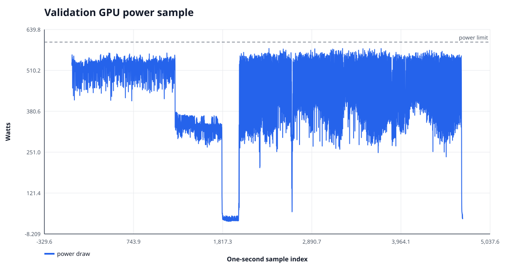

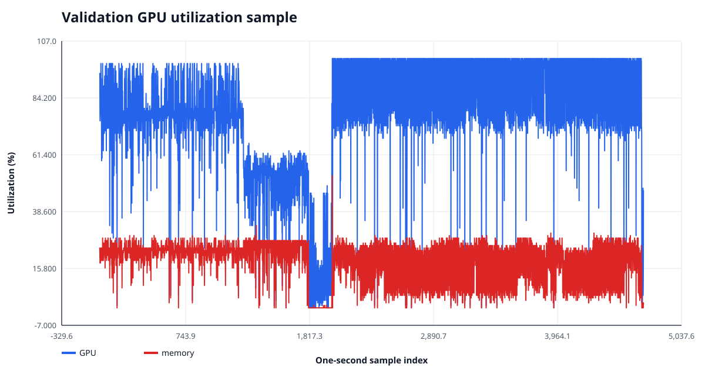


## Source-conditioned training analysis

Deterministic cursor replay matched every logged data phase and reconstructed the source mixture
of all 1,912 optimizer batches.  In the post-warmup primary phase,
pure-source batches accounted for
1,572 /
1,702
(92.36%).
This fixed analysis window includes both the stable and cosine-decay portions of primary data,
but excludes warmup and quality cooldown.  The table below fits
each metric on that phase using source fixed effects plus committed tokens; uncertainty is a
Newey-West HAC interval with lag 50.

| metric | slope / 100M | HAC 95% CI | R² | raw SD | residual SD |
| --- | --- | --- | --- | --- | --- |
| loss | -0.04206 | [-0.05005, -0.03408] | 0.9837 | 0.9664 | 0.1235 |
| ntp | -0.03122 | [-0.03904, -0.02340] | 0.9847 | 0.9490 | 0.1173 |
| teacher_kd | -0.01157 | [-0.01351, -0.00963] | 0.9263 | 0.1238 | 0.0336 |
| mtp | -0.01454 | [-0.02138, -0.00770] | 0.9819 | 1.1144 | 0.1500 |
| anchor_kl | 0.02179 | [0.01637, 0.02722] | 0.5890 | 0.1232 | 0.0790 |

| source | effective steps | total | NTP | KD | MTP |
| --- | --- | --- | --- | --- | --- |
| chinese_fineweb2_cmn_hani | 418.7 | 4.4276 | 3.7498 | 0.2006 | 4.4849 |
| code_github_clean_allowlisted | 260.8 | 1.6645 | 1.0809 | 0.4427 | 1.3195 |
| english_fineweb_edu_dedup | 605.0 | 3.2004 | 2.5979 | 0.2974 | 2.9917 |
| math_finemath_4plus | 250.5 | 2.2627 | 1.6527 | 0.4033 | 1.9336 |
| science_cosmopedia_openstax | 85.8 | 2.5467 | 1.7760 | 0.5225 | 2.3202 |
| science_cosmopedia_stanford | 81.2 | 2.6141 | 1.7404 | 0.6269 | 2.3161 |

For total loss, source composition explains
98.37% of raw variance, while the controlled trend is
-0.04206 per 100M tokens.  Therefore the raw
near-plateau is not evidence of zero learning: source-dependent difficulty and the mixed objectives
hide a statistically negative within-source trend.  This remains training evidence, not a substitute
for held-out NLL.

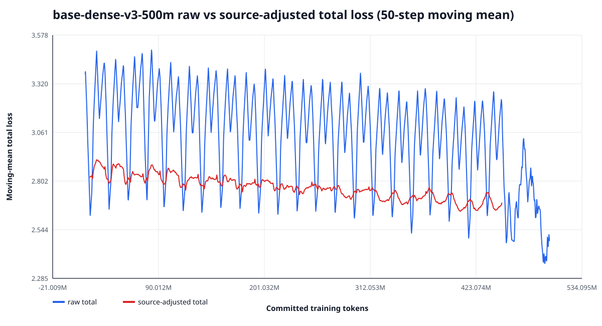

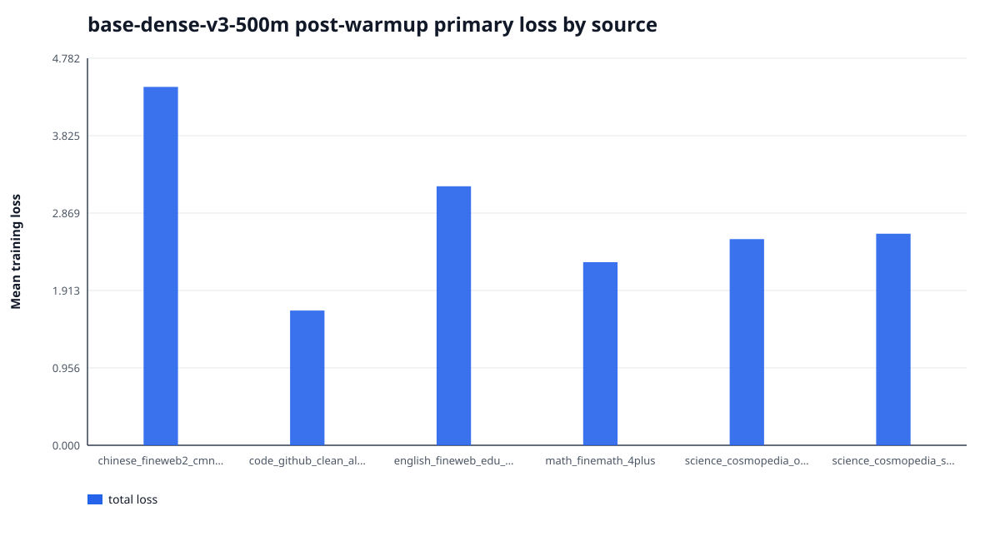


## Validation by data source

| source | shards | input tokens | candidate NLL | shared NLL | teacher NLL | gap closed |
| --- | --- | --- | --- | --- | --- | --- |
| chinese_fineweb2_cmn_hani | 30 | 5,001,101 | 3.65619 | 4.37832 | 3.63614 | 0.9730 |
| code_github_clean_allowlisted | 18 | 3,000,084 | 1.02816 | 1.04375 | 0.73577 | 0.0506 |
| english_fineweb_edu_dedup | 42 | 7,000,153 | 2.60331 | 2.62559 | 2.10321 | 0.0426 |
| math_finemath_4plus | 18 | 3,012,338 | 1.57736 | 1.64901 | 1.25676 | 0.1827 |
| science_cosmopedia_openstax | 6 | 1,000,155 | 1.64885 | 1.87425 | 1.31699 | 0.4045 |
| science_cosmopedia_stanford | 6 | 1,000,561 | 1.57293 | 1.73894 | 1.14185 | 0.2780 |

Source means are weighted by predicted tokens, not averaged across shards.

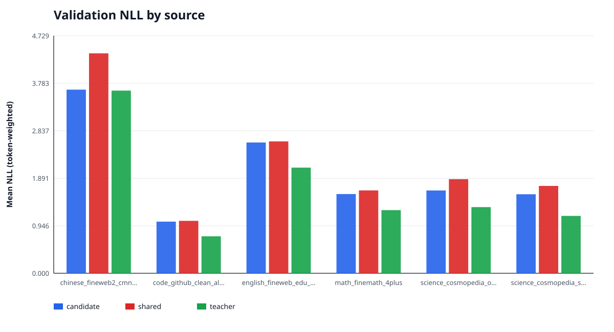


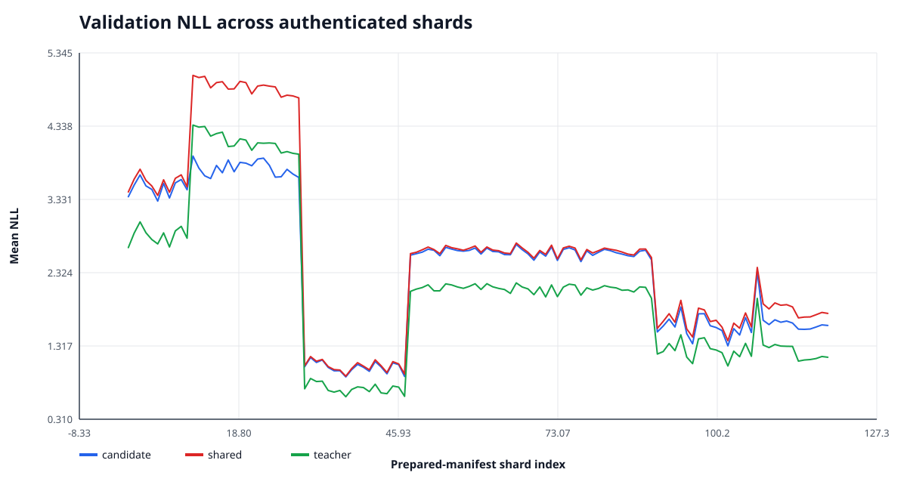

The shard chart preserves prepared-manifest order; `summary.json` contains exact per-shard values,
source IDs, token counts, and candidate-over-shared deltas for downstream analysis.

## Interpretation and limits

- The final held-out role comparison is the quality evidence for this `base-dense-v3-500m` checkpoint.  The training
  loss curve alone cannot establish underfitting because batches and objective mixtures vary by step.
  A low teacher-gap-closed fraction, together with continued held-out gains in a future checkpoint
  sweep, would support increasing data/token budget; this single final evaluation cannot locate the
  optimal stopping point because the run did not perform held-out validation at multiple checkpoints.
- The immutable run enabled the native Qwen3.5 MTP objective at weight **0.1**.  Its source head remained frozen and outside the optimizer, while its loss propagated through the student hidden states.
- The immutable schedule used linear warmup for 5,000,000 tokens, a stable plateau through 250,000,000 tokens, then a 250,000,000-token cosine decay to 0.100× peak LR. The data stream also switches to the authenticated quality-cooldown corpus at 450,000,000 tokens; any loss discontinuity at that exact boundary is confounded with the data change and cannot be attributed to LR alone.
- Data status is **research_only=true** and
  **ready_for_training=false**.  Pending audits:
  `cross_source_near_dedup, full_contextual_pii_scan, project_benchmark_13gram_scan`.  Until those audits are complete, results are research evidence and must not be
  presented as production-ready or contamination-free.

## Reproducibility and integrity

- Final checkpoint: `/media/data1/Project/AI/Twen1/runs/base-dense-v3-500m/step-000000001912-milestone-complete`
- Checkpoint manifest SHA256: `ef43670d7c1cbc8ed3908b258659c7426b4cfe10e14c9b7db54968e2481b0e9a`; all
  4 inventoried files were re-hashed successfully.
- Evaluation: `/media/data1/Project/AI/Twen1/artifacts/evaluations/base-dense-v3-500m-final-validation`
- Evaluation manifest SHA256: `97b9f59d968fef1aa3a9a0234cac542391151645650969283cd449ac0056dd3f`
- Evaluation PLAN SHA256: `e2f903a91d01f5d550582b4bb7733cad333829693e8462d6a0e789ef6e49f2e7`
- Validation prepared-manifest SHA256: `4d3877bfaf4e01551d41913e11d37db08c6097b513ac94ae4a63b8a640b68e7f`
- Validation dataset fingerprint: `6839d5aefb3b5b8f960e7da1b54bd40c2882bcb915954e727f2480252d4cdc79`
- Evaluation runtime: torch `2.11.0+cu130`, CUDA `13.0`,
  `NVIDIA GeForce RTX 5090` (`cuda:0`, compute capability
  `12.0`), dtype `bfloat16`,
  `FLA_TILELANG=0`,
  `CUDA_HOME=/usr/local/cuda-13.2`.  `FLA_TILELANG=0` selects the production Triton path
  rather than the experimental TileLang path.
- Checkpoint load mode: `forward_only_lineage_compatible_not_exact_resume`.  Saved/current exact-training
  fingerprints match: `True`;
  saved/current source trees match: `True`.  The saved
  source tree is `a7aff762d504557a32d0cfbeb7bfde6a812f9303333480255fcbdfec0ca0cdbd` and the evaluation source
  tree is `a7aff762d504557a32d0cfbeb7bfde6a812f9303333480255fcbdfec0ca0cdbd`.  This is authenticated
  forward-only compatibility and **must not** be described as exact-resume compatibility.

Canonical reproduction uses an absolute checkpoint path.  The checkpoint resolver now treats a
bare `step-*` name as relative to `checkpoint.output_dir`, while a relative argument containing a
directory is relative to the current working directory.  This avoids the historical
`runs/<run>/runs/<run>/step-*` double-prefix trap.

```bash
FLA_TILELANG=0 bash scripts/with_cuda_toolchain.sh .venv/bin/python -m twen evaluate nll \
  --config /media/data1/Project/AI/Twen1/runs/base-dense-v3-500m/resolved_config.yaml \
  --checkpoint /media/data1/Project/AI/Twen1/runs/base-dense-v3-500m/step-000000001912-milestone-complete \
  --prepared-manifest /media/data1/Project/AI/Twen1/artifacts/data/base-validation/manifest.json \
  --output /media/data1/Project/AI/Twen1/artifacts/evaluations/base-dense-v3-500m-final-validation \
  --role candidate --role shared --role teacher --batch-size 1 --device cuda:0
```

`MANIFEST.json` authenticates every report payload and figure; `COMPLETE` authenticates that
manifest.  All figures are standalone SVG generated with Python's standard library.
