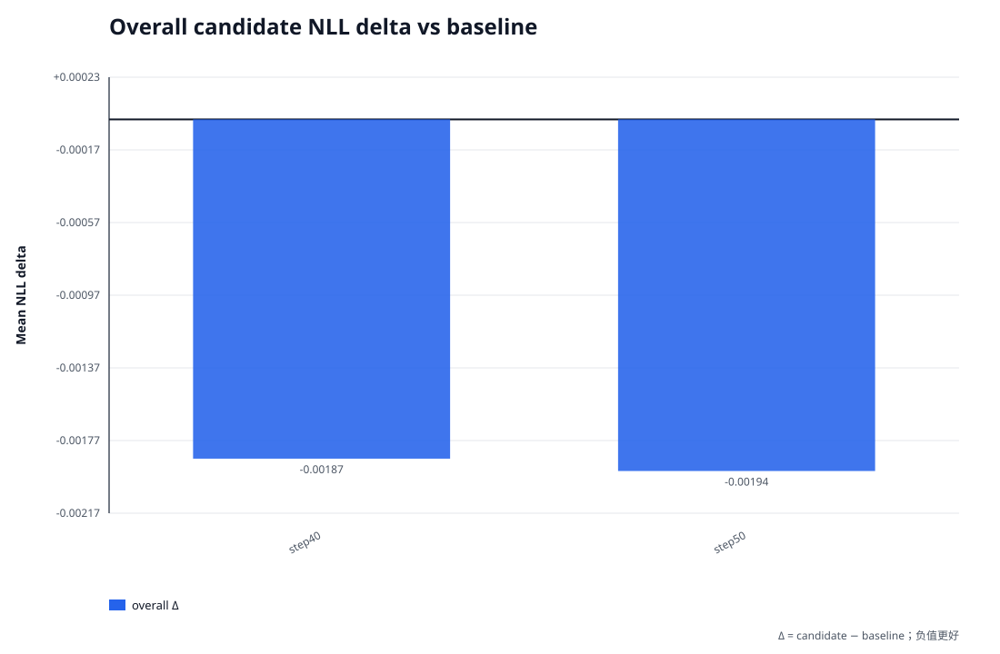
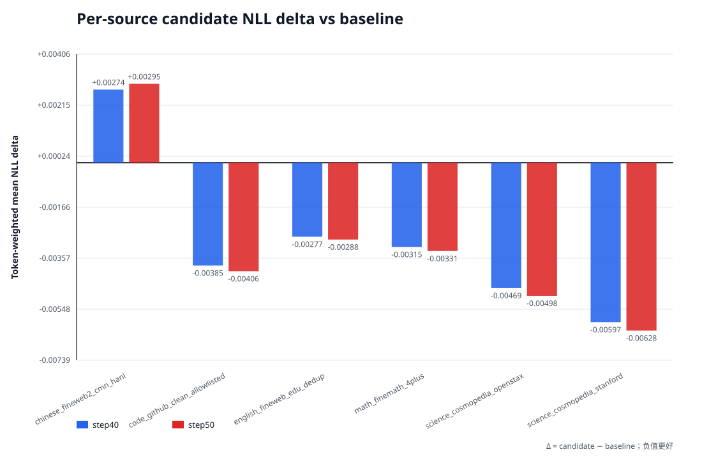

# v4 checkpoint frozen-validation sweep

## 结论

在 2 个已完成且认证通过的 candidate checkpoint 中，按 candidate-role
token-weighted mean NLL 排名，当前最优是 **step50**（step
50，NLL 2.374732，相对
v3 的 Δ 为
-0.001937）。

本文统一使用 `Δ = candidate NLL - baseline NLL`；因此负值表示改善，正值表示退化。

## 严格可比性与认证

- frozen prepared manifest SHA：`4d3877bfaf4e01551d41913e11d37db08c6097b513ac94ae4a63b8a640b68e7f`
- dataset fingerprint：`6839d5aefb3b5b8f960e7da1b54bd40c2882bcb915954e727f2480252d4cdc79`
- candidate role 预测 token：20,009,445
- numerics：device `cuda`，dtype `bfloat16`，batch size `1`
- 每个 evaluation 的顶层 `COMPLETE -> manifest.json -> PLAN.json` 均已校验。
- 每个 role/shard 的 `COMPLETE`、输出 hash/size、canonical fingerprint、prepared shard
  覆盖与聚合计数均已校验。
- 除总 token 一致外，还逐 shard 校验 candidate-role token 与 sequence 数完全一致。

## Overall NLL

Baseline `v3`：NLL 2.376669，
perplexity 10.768969。

| Candidate | Step | Committed tokens | Mean NLL | Δ vs baseline | Relative Δ | 判定 |
|---|---:|---:|---:|---:|---:|---|
| step40 | 40 | 10,444,478 | 2.374800 | -0.001869 | -0.0786% | 优于 baseline |
| step50 | 50 | 13,051,413 | 2.374732 | -0.001937 | -0.0815% | 优于 baseline |

## 按 source 的 token-weighted NLL

source 聚合以 `nll_sum / predicted_tokens` 计算，不对 shard mean 做简单平均。

| Source | Baseline NLL | step40 NLL / Δ | step50 NLL / Δ |
|---|---:|---:|---:|
| chinese_fineweb2_cmn_hani | 3.656194 | 3.658932 / +0.002737 | 3.659148 / +0.002954 |
| code_github_clean_allowlisted | 1.028160 | 1.024311 / -0.003849 | 1.024099 / -0.004061 |
| english_fineweb_edu_dedup | 2.603308 | 2.600538 / -0.002770 | 2.600432 / -0.002876 |
| math_finemath_4plus | 1.577363 | 1.574210 / -0.003153 | 1.574057 / -0.003306 |
| science_cosmopedia_openstax | 1.648853 | 1.644160 / -0.004693 | 1.643871 / -0.004982 |
| science_cosmopedia_stanford | 1.572927 | 1.566960 / -0.005967 | 1.566644 / -0.006283 |

## 证据身份

| Label | manifest SHA256 | PLAN SHA256 | COMPLETE file SHA256 |
|---|---|---|---|
| v3 | `97b9f59d968fef1aa3a9a0234cac542391151645650969283cd449ac0056dd3f` | `e2f903a91d01f5d550582b4bb7733cad333829693e8462d6a0e789ef6e49f2e7` | `6d55deb1be53149338189ccc34fdebd180452145ccaedb645db3edd812407cad` |
| step40 | `2f4ebbf57a122d4f059b586e961a0883e7636b73dbebd2cf16c673e3346409ea` | `e38c6fef69cc12eeaa12c92c80ee70ea942b1747f10049a018ed46f82584ccdc` | `129ffd1bab5e2a9fd3f27088e25da18635df25fef4709eb53830e2fa72eaf67a` |
| step50 | `52b10f62b0b389fc7f862db1348ed846d892b5287740e5a38a9db98c83b1455a` | `7adb9636740db5de2c5d5ddda6f9099e2a65be9924a3909c8f6b1380dd661429` | `dbb484f95ef0abec60fb03d83fba6e2ea4295ac68fb692aac2b76cc878ca5f5f` |

## 评测 harness 身份

下列字段来自 fingerprint 已验证的 immutable `PLAN.json`。`saved source tree` 是
checkpoint 训练时保存的源码身份，`evaluation source tree` 是执行该次只读前向评测的
源码身份；二者不同会被如实记录，但不会被误写为 exact match。

| Label | Config / preflight fingerprint | Archived config SHA256 | Saved source tree | Evaluation source tree | Exact training fingerprint |
|---|---|---|---|---|---|
| v3 | `b7c448678a3705d50f5951041ef28f9a13176e1a77352c711b11c88d1d42c0dd` | `c44934dab4639befcc95aa1b505649a48d45c0c48b6a14ffcd0ec29bd1243de9` | `a7aff762d504557a32d0cfbeb7bfde6a812f9303333480255fcbdfec0ca0cdbd` | `a7aff762d504557a32d0cfbeb7bfde6a812f9303333480255fcbdfec0ca0cdbd` | `true` |
| step40 | `51ebf66dbc83fa25751a5ee38fe60d9cb3967a9a79d74d47615ca40bbad50f95` | `0bd33cfb2e9e0210fcb718c58c8978f31b13c90a2b25f2c939cd36fdcd383430` | `13331462fc032fafc0701826a59d1a5c673f83683efb7bb861efad4b02f348fd` | `13331462fc032fafc0701826a59d1a5c673f83683efb7bb861efad4b02f348fd` | `true` |
| step50 | `51ebf66dbc83fa25751a5ee38fe60d9cb3967a9a79d74d47615ca40bbad50f95` | `0bd33cfb2e9e0210fcb718c58c8978f31b13c90a2b25f2c939cd36fdcd383430` | `13331462fc032fafc0701826a59d1a5c673f83683efb7bb861efad4b02f348fd` | `13331462fc032fafc0701826a59d1a5c673f83683efb7bb861efad4b02f348fd` | `true` |

## 解释边界

该 sweep 只支持同一 frozen validation corpus 上的 checkpoint NLL 排名与按 source
比较。它不能单独证明训练数据没有回绕或污染、学习率/优化器设置正确、生成质量良好，
也不能把差异因果归因到某一个训练改动；这些结论需要独立训练与数据审计证据。

`summary.json` 保存精确数值和完整输入身份；`MANIFEST.json` 认证报告与图表，
`COMPLETE` 再认证 `MANIFEST.json`。
