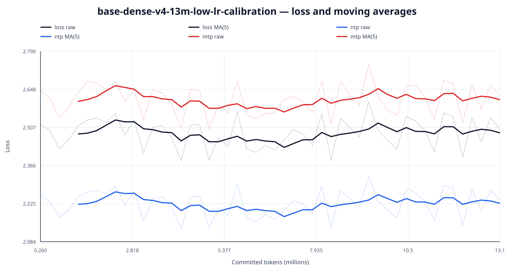
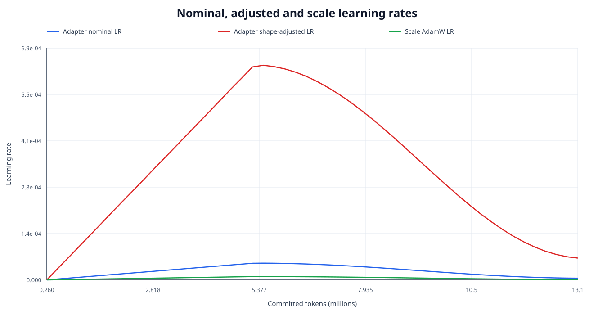
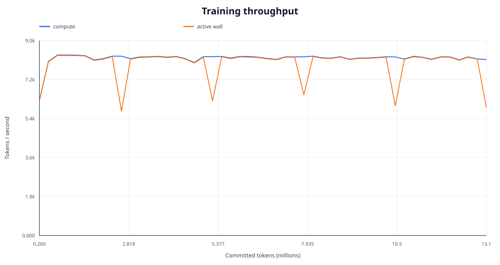
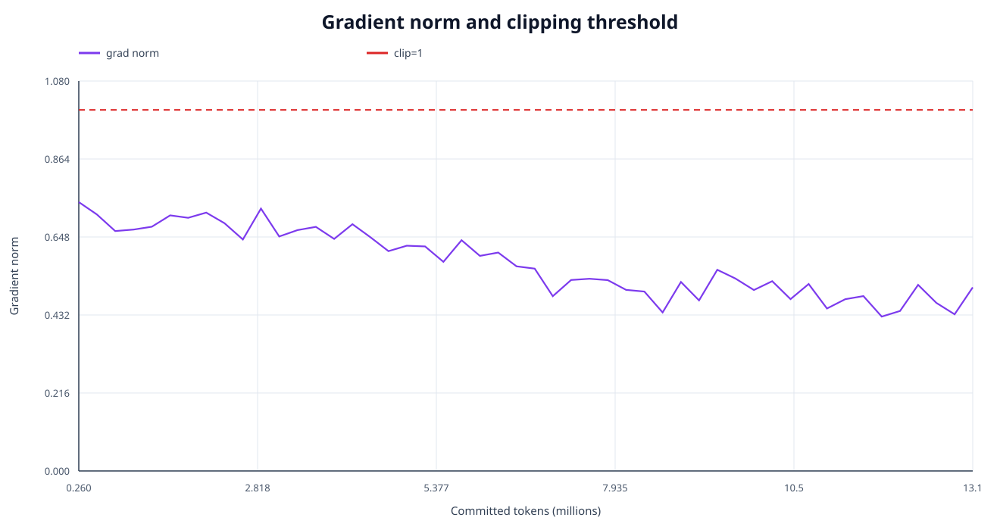
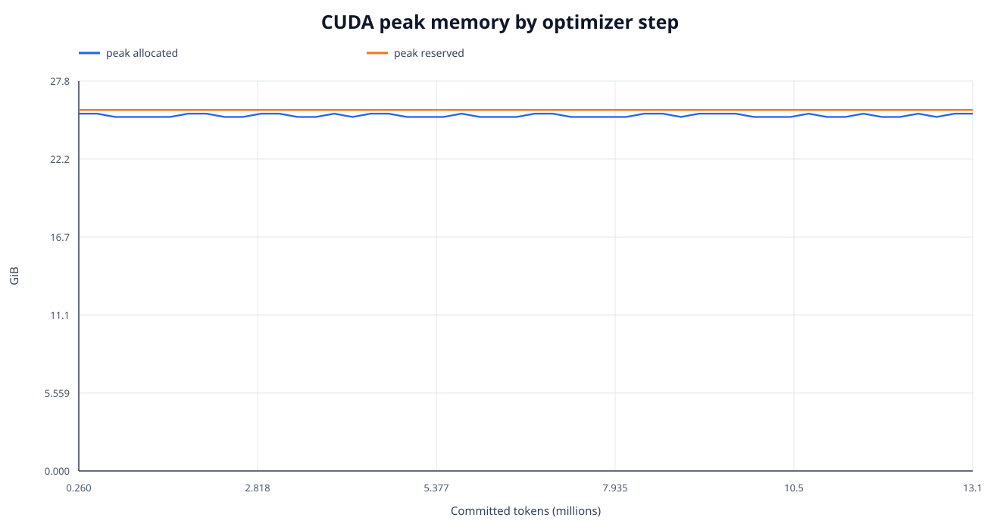
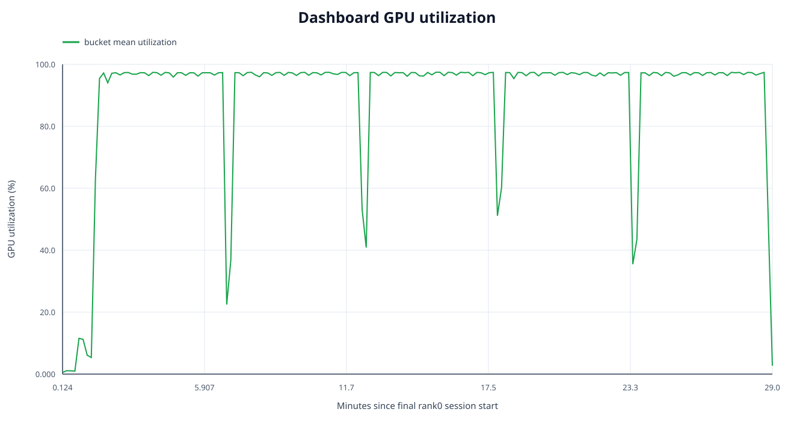
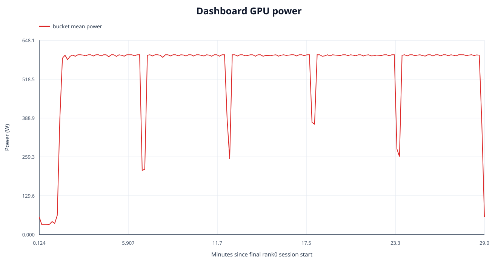
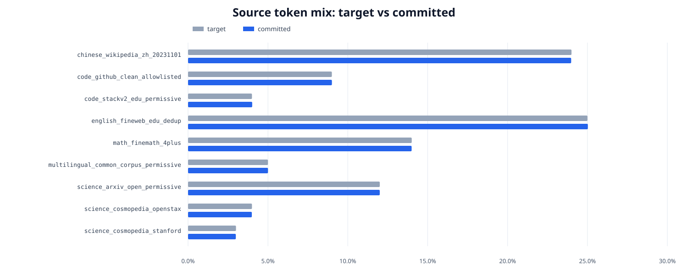

# Dense 训练终态分析

- run: `base-dense-v4-13m-low-lr-calibration`
- 终态: step `50` / `13,051,413` tokens
- checkpoint: `step-000000000050-milestone-complete`
- 完整机器可读统计: `analysis.json`

## 终态与输入认证

metrics/telemetry step 连续、token 严格递增、逐行匹配; 最终 milestone checkpoint 的 manifest、COMPLETE、metadata 及全部 payload SHA256 已复算通过。
本 run 的 active loss 只有 `ntp, mtp`, 逐步公式 `loss = 1*ntp + 0.1*mtp` 在 `50` 行上的 最大绝对误差为 `0`; 零权重的 teacher KD、anchor KL 和 hidden alignment 不再被错误要求出现在 metrics 中。

## 阶段

| 阶段 | 点数 | step | token | applied LR |
|---|---:|---:|---:|---:|
| warmup | 19 | 1-19 | 260,086-4.953M | 0.000e+00→4.691e-05 |
| primary stable | 1 | 21-21 | 5.477M-5.477M | 4.992e-05→4.992e-05 |
| primary cosine decay | 30 | 20-50 | 5.215M-13.051M | 4.953e-05→5.075e-06 |

## 首尾 10 step 对比

| 指标 | 首窗口均值 | 尾窗口均值 | 变化 |
|---|---:|---:|---:|
| loss | 2.505646 | 2.498730 | -0.28% |
| ntp | 2.242661 | 2.236522 | -0.27% |
| mtp | 2.629849 | 2.622075 | -0.30% |
| grad_norm | 0.691603 | 0.472115 | -31.74% |

## Source-adjusted 学习趋势

正式回归窗口固定为 warmup 后的全部 primary batch, 包含 stable 与 cosine decay, 排除 warmup 和 quality cooldown; 因此不同 decay 长度的 run 使用同一数据阶段口径。

raw loss slope 为 `0.63687/100M tokens`; source composition 单独解释窗口内 raw loss 方差的 `57.81%`。控制 source 后, loss slope 为 `0.60535/100M tokens`, HAC95 CI `[0.39333, 0.81738]`。

这里每个 optimizer batch 都按接近固定的 token 比例混合 9 个来源, 因此 batch loss 不能拆成可信的逐来源 NLL; 报告只给混合比例和共同趋势, 不把极小的比例抖动外推成逐来源 loss。

| Source | 目标占比 | 实际占比 | 偏差(bp) | committed tokens |
|---|---:|---:|---:|---:|
| chinese_wikipedia_zh_20231101 | 24.00% | 23.98% | -2.04 | 3,129,681 |
| code_github_clean_allowlisted | 9.00% | 9.00% | +0.34 | 1,175,070 |
| code_stackv2_edu_permissive | 4.00% | 4.01% | +1.49 | 523,999 |
| english_fineweb_edu_dedup | 25.00% | 25.02% | +2.44 | 3,266,040 |
| math_finemath_4plus | 14.00% | 13.99% | -0.59 | 1,826,434 |
| multilingual_common_corpus_permissive | 5.00% | 5.00% | +0.29 | 652,943 |
| science_arxiv_open_permissive | 12.00% | 12.00% | -0.08 | 1,566,064 |
| science_cosmopedia_openstax | 4.00% | 3.99% | -0.81 | 520,995 |
| science_cosmopedia_stanford | 3.00% | 2.99% | -1.04 | 390,187 |

## 数据容量与回绕

- 配置预算 / 实际提交: `13,000,000` / `13,051,413` tokens, 末 batch overshoot `51,413` tokens。
- prepared unique capacity: `256,244,536` tokens / `62,810` sequences; 相对配置预算只多 `243,244,536` tokens。
- source cursor wrap: `False`; 重复 `0` sequences / `0` tokens (`0.00%` of committed tokens)。
- 数据容量门通过: 本次预算内未发生 source wrap; 其他训练预算仍须由各自冻结的 capacity attestation 独立授权。

## 优化器与学习率

- Adapter optimizer: `Muon`; adjust LR: `match_rms_adamw`。
- nominal Adapter peak: `4.99197e-05`; shape-adjusted peak: `0.000638972`; adjustment factor: `12.800x`。
- scale AdamW peak: `9.98394e-06`。
- 因此 `1e-4` 只是 Muon nominal LR, 不能直接当成 AdamW `1e-4` 来判断更新幅度。

## 性能与显存

- ordinary compute: `8122.7 tok/s`
- ordinary active-wall: `7827.1 tok/s`
- peak allocated/reserved: `25.467` / `25.734 GiB`
- reserved headroom: `6.108 GiB`

## Dashboard GPU telemetry

- 范围: 最后一次 rank0 session `4771f039802b42fd80cf3d3c8e95381c`
- bucket/sample: `174` / `17,222` available
- power weighted mean / bucket-mean p95 / max: `553.33` / `600.04` / `610.30 W`
- GPU utilization weighted mean / max: `89.29%` / `100%`
- VRAM weighted mean / max: `27345.7` / `28666 MiB`
- temperature weighted mean / max: `70.39` / `75 °C`
- sample coverage: `98.17%`; leading/internal/trailing gap: `2.48` / `17.53` / `7.08 s`
- internal gap 包含 aggregate window 之间的正常 collector spacing。
- first/last window: `2026-07-27T15:21:34.122518+00:00` / `2026-07-27T15:50:38.924085+00:00`
- immutable raw archive: `raw/dashboard-gpu-telemetry-last-session.jsonl` (`174` buckets, SHA256 `da8195a70f5b9a62b9ab5aa6fcdb9290aaf1a37353433d046ed07f82c78ae14f`)

Dashboard telemetry is filtered to the last rank0 session and does not represent earlier resumed sessions or the entire run.

## 图表

### Loss、NTP 与 MTP (含移动平均)

### Nominal / shape-adjusted learning rate

### 吞吐

### Gradient norm

### CUDA 显存

### GPU utilization 与 power

### Source token mix

## v4 calibration 结论与 250M gate

- 数值门通过: 全部 required metrics finite, loss 公式精确, 超过 grad clip `1.0` 的 step 数为 `0`。
- 首尾窗口 loss 变化 `-0.28%`, NTP 变化 `-0.27%`; 只有 `50` 个 optimizer steps, 这是 calibration 训练证据; 是否放行 250M 仍由 step 40/50 frozen held-out validation 与独立 drift gate 决定。
- 性能门通过: active-wall `7827.1` tok/s, reserved headroom `6.108` GiB。
- 数据 admission 通过: prepared manifest 覆盖本次预算, 且未发生 source wrap; 正式 250M 仍必须使用其独立闭合的 primary/cooldown capacity evidence。
- 纯文本 objective 已是 `1.0*NTP + 0.1*MTP`, 没有 teacher logits KD、anchor KL 或 hidden alignment。

全部机器可读统计及输入 SHA256 见 JSON; 本目录的 `MANIFEST.json` 记录报告与图表哈希, `COMPLETE` 认证 manifest。
