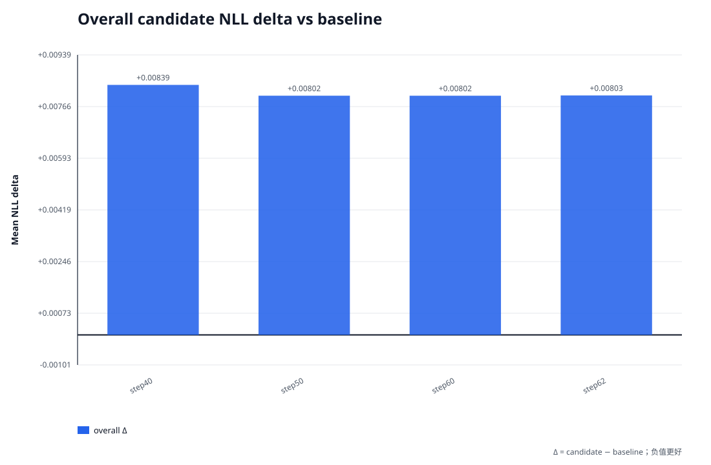
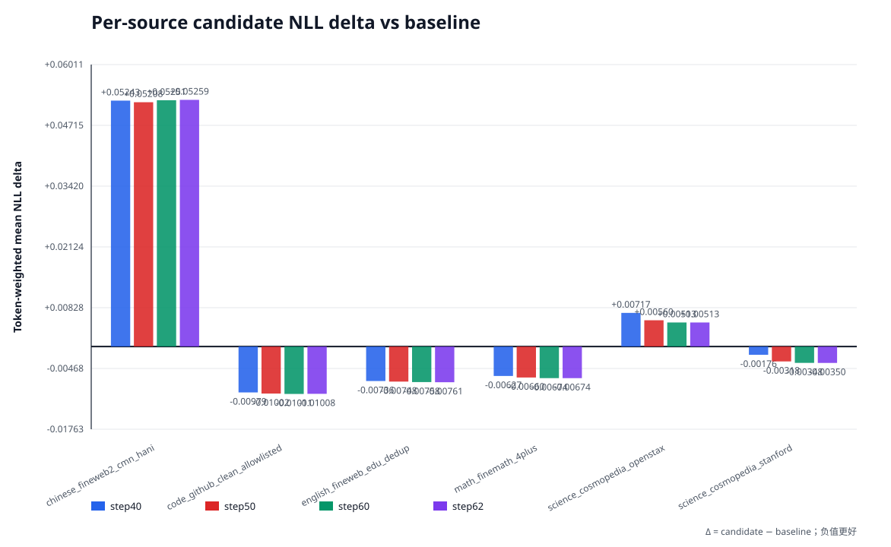

# v4 checkpoint frozen-validation sweep

## 结论

在 4 个已完成且认证通过的 candidate checkpoint 中，按 candidate-role
token-weighted mean NLL 排名，当前最优是 **step60**（step
60，NLL 2.384692，相对
v3-final 的 Δ 为
+0.008023）。

本文统一使用 `Δ = candidate NLL - baseline NLL`；因此负值表示改善，正值表示退化。

## 严格可比性与认证

- frozen prepared manifest SHA：`4d3877bfaf4e01551d41913e11d37db08c6097b513ac94ae4a63b8a640b68e7f`
- dataset fingerprint：`6839d5aefb3b5b8f960e7da1b54bd40c2882bcb915954e727f2480252d4cdc79`
- candidate role 预测 token：20,009,445
- numerics：device `cuda`，dtype `bfloat16`，batch size `1`
- 每个 evaluation 的顶层 `COMPLETE -> manifest.json -> PLAN.json` 均已校验。
- 每个 role/shard 的 `COMPLETE`、输出 hash/size、canonical fingerprint、prepared shard
  覆盖与聚合计数均已校验。
- 除总 token 一致外，还逐 shard 校验 candidate-role token 与 sequence 数完全一致。

## Overall NLL

Baseline `v3-final`：NLL 2.376669，
perplexity 10.768969。

| Candidate | Step | Committed tokens | Mean NLL | Δ vs baseline | Relative Δ | 判定 |
|---|---:|---:|---:|---:|---:|---|
| step40 | 40 | 10,458,936 | 2.385055 | +0.008387 | +0.3529% | 未优于 baseline |
| step50 | 50 | 13,061,670 | 2.384693 | +0.008024 | +0.3376% | 未优于 baseline |
| step60 | 60 | 15,673,704 | 2.384692 | +0.008023 | +0.3376% | 未优于 baseline |
| step62 | 62 | 16,197,992 | 2.384702 | +0.008033 | +0.3380% | 未优于 baseline |

## 按 source 的 token-weighted NLL

source 聚合以 `nll_sum / predicted_tokens` 计算，不对 shard mean 做简单平均。

| Source | Baseline NLL | step40 NLL / Δ | step50 NLL / Δ | step60 NLL / Δ | step62 NLL / Δ |
|---|---:|---:|---:|---:|---:|
| chinese_fineweb2_cmn_hani | 3.656194 | 3.708620 / +0.052426 | 3.708277 / +0.052082 | 3.708707 / +0.052513 | 3.708781 / +0.052586 |
| code_github_clean_allowlisted | 1.028160 | 1.018374 / -0.009786 | 1.018136 / -0.010024 | 1.018050 / -0.010110 | 1.018077 / -0.010083 |
| english_fineweb_edu_dedup | 2.603308 | 2.595953 / -0.007355 | 2.595831 / -0.007477 | 2.595729 / -0.007579 | 2.595696 / -0.007612 |
| math_finemath_4plus | 1.577363 | 1.571088 / -0.006275 | 1.570762 / -0.006601 | 1.570625 / -0.006738 | 1.570624 / -0.006739 |
| science_cosmopedia_openstax | 1.648853 | 1.656024 / +0.007171 | 1.654453 / +0.005600 | 1.653982 / +0.005129 | 1.653981 / +0.005128 |
| science_cosmopedia_stanford | 1.572927 | 1.571169 / -0.001759 | 1.569751 / -0.003176 | 1.569443 / -0.003485 | 1.569432 / -0.003495 |

## 证据身份

| Label | manifest SHA256 | PLAN SHA256 | COMPLETE file SHA256 |
|---|---|---|---|
| v3-final | `97b9f59d968fef1aa3a9a0234cac542391151645650969283cd449ac0056dd3f` | `e2f903a91d01f5d550582b4bb7733cad333829693e8462d6a0e789ef6e49f2e7` | `6d55deb1be53149338189ccc34fdebd180452145ccaedb645db3edd812407cad` |
| step40 | `d46181f95a4920477a6649492028014b9ab9e7443d1935af38274cad03374599` | `61b39b2328efe3395620dd67e6038ee83011c99088aed344cd69e4888c392dbf` | `6229bf783f291249b0b576b5e71b7893012d09f010640561d67b74e092ed9c18` |
| step50 | `3c3d80f778ad78a28a0c4e1db66fc992fff7cd35c61562f71a9912aab3de8098` | `76c6cea3615283469054136657be803e061aa4d2ce5624266dc4d32468989fb4` | `c84f00d79e1b392d038ad8d2e0d8d23d32439049a83637e038b956eb50fa676f` |
| step60 | `3af7d6e13d55c25eed9f33796fb1b0c89205f0ec3326944894f3190503b6ea2f` | `4a65ad0e0d79eae69db59ddee9fc55d90ca92a195c39f0dd8145795491a60921` | `e45b5ee5ec80ec264342978eebbc493873c79fece06366e74f37657894de1f61` |
| step62 | `151e235194e08099731f075bad51fef5966b25cc4d663a511c81d76de3d874c1` | `9a97888ac8dd45550a2ee615352a0fb711df2491726ad5bddf645d7ab3c19011` | `82acd0e486aa70441e8fafb75eb80b10a5dbbb692cbdfcf372d384f2d0d74e5c` |

## 评测 harness 身份

下列字段来自 fingerprint 已验证的 immutable `PLAN.json`。`saved source tree` 是
checkpoint 训练时保存的源码身份，`evaluation source tree` 是执行该次只读前向评测的
源码身份；二者不同会被如实记录，但不会被误写为 exact match。

| Label | Config / preflight fingerprint | Archived config SHA256 | Saved source tree | Evaluation source tree | Exact training fingerprint |
|---|---|---|---|---|---|
| v3-final | `b7c448678a3705d50f5951041ef28f9a13176e1a77352c711b11c88d1d42c0dd` | `c44934dab4639befcc95aa1b505649a48d45c0c48b6a14ffcd0ec29bd1243de9` | `a7aff762d504557a32d0cfbeb7bfde6a812f9303333480255fcbdfec0ca0cdbd` | `a7aff762d504557a32d0cfbeb7bfde6a812f9303333480255fcbdfec0ca0cdbd` | `true` |
| step40 | `f876dbfac19b610d8772675c51d13bf5eeee02746a1b6d7007907668fe4b1c13` | `899c9b62c808a86a3a082e83fa0669b253c0f1327b45f74a23abe5ebc3e4e5e2` | `6dcadc9aac347a840bc258184bc7b7682548ad094bf894d32561767e83440161` | `6fb329884b2b89e0ba8b2e363badef673f6e94e8f90a9b0b40517a7af0069445` | `false` |
| step50 | `54ef59fcfad0f827453b8598bfe7efe000fdc4802ce1eac1d8aea47b6f886814` | `899c9b62c808a86a3a082e83fa0669b253c0f1327b45f74a23abe5ebc3e4e5e2` | `6dcadc9aac347a840bc258184bc7b7682548ad094bf894d32561767e83440161` | `0c58820eaf96b734927c60deaed15ccbd1ebb7fbf3a6f407e31aadacd31b09ac` | `false` |
| step60 | `e93e56d83c997150c542855da8128d4772e087cf7c6d82f1035547dd4ddea381` | `899c9b62c808a86a3a082e83fa0669b253c0f1327b45f74a23abe5ebc3e4e5e2` | `6dcadc9aac347a840bc258184bc7b7682548ad094bf894d32561767e83440161` | `6dcadc9aac347a840bc258184bc7b7682548ad094bf894d32561767e83440161` | `true` |
| step62 | `e93e56d83c997150c542855da8128d4772e087cf7c6d82f1035547dd4ddea381` | `899c9b62c808a86a3a082e83fa0669b253c0f1327b45f74a23abe5ebc3e4e5e2` | `6dcadc9aac347a840bc258184bc7b7682548ad094bf894d32561767e83440161` | `6dcadc9aac347a840bc258184bc7b7682548ad094bf894d32561767e83440161` | `true` |

## 解释边界

该 sweep 只支持同一 frozen validation corpus 上的 checkpoint NLL 排名与按 source
比较。它不能单独证明训练数据没有回绕或污染、学习率/优化器设置正确、生成质量良好，
也不能把差异因果归因到某一个训练改动；这些结论需要独立训练与数据审计证据。

`summary.json` 保存精确数值和完整输入身份；`MANIFEST.json` 认证报告与图表，
`COMPLETE` 再认证 `MANIFEST.json`。
