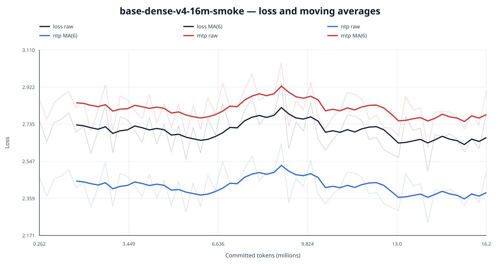
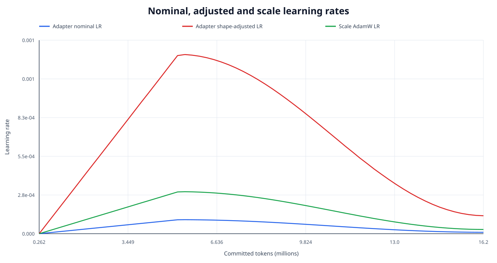
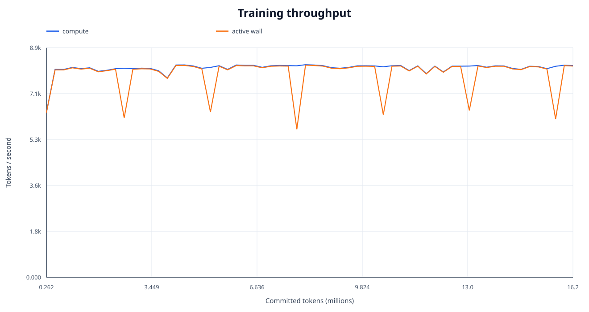
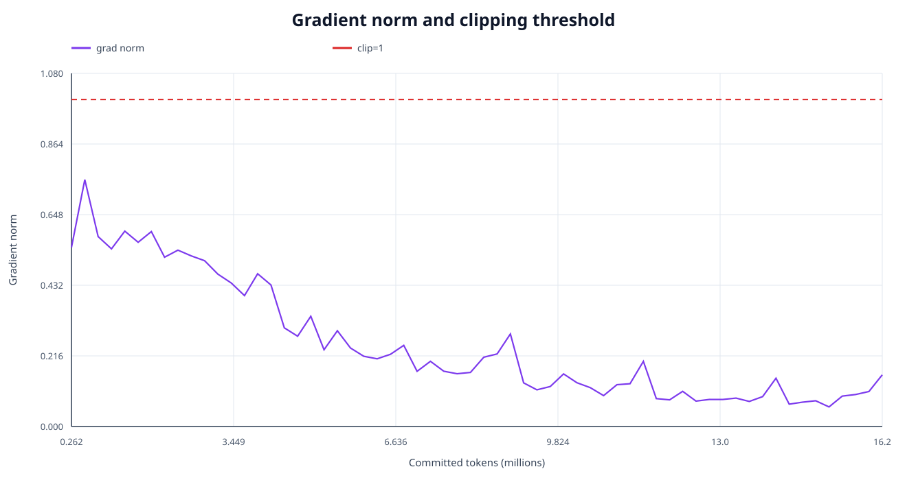
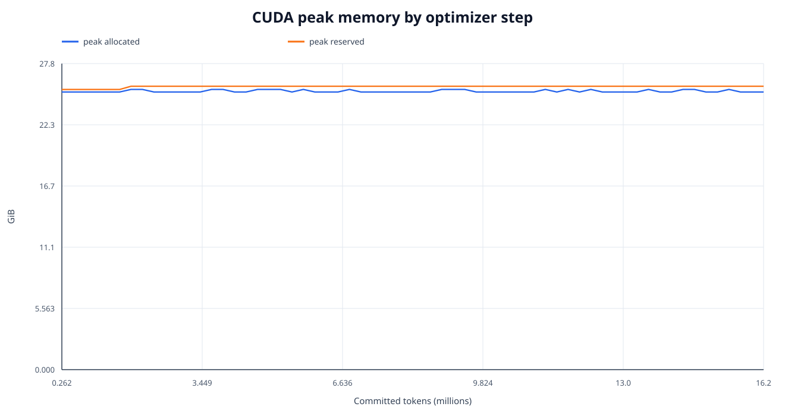
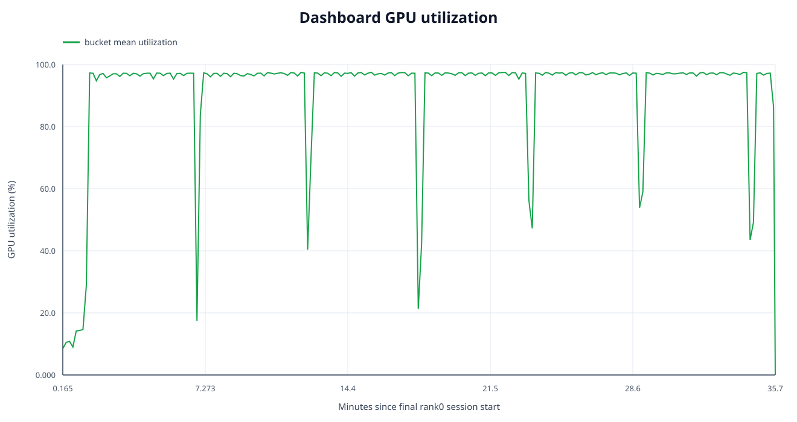
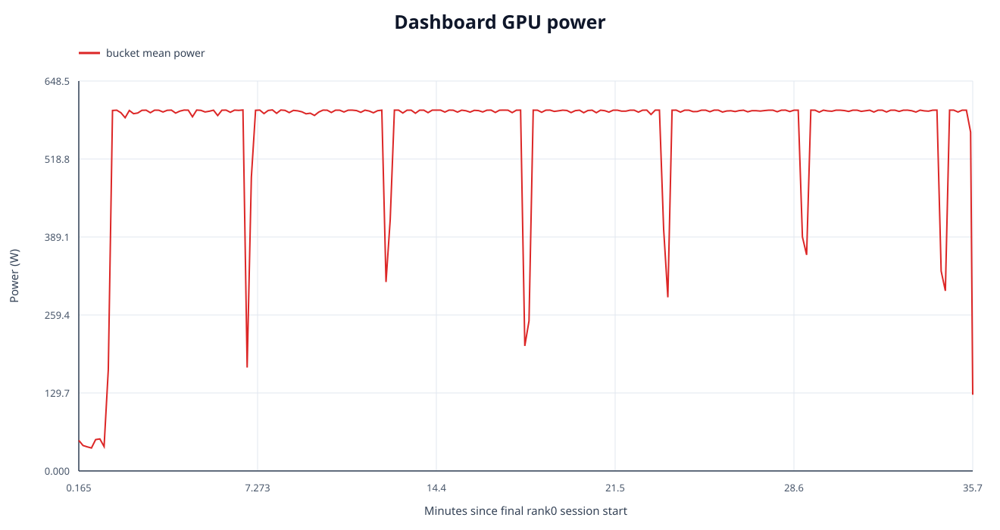
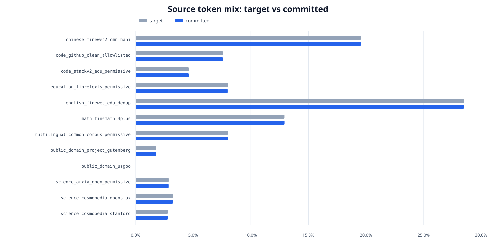

# Dense 训练终态分析

- run: `base-dense-v4-16m-smoke`
- 终态: step `62` / `16,197,992` tokens
- checkpoint: `step-000000000062-milestone-complete`
- 完整机器可读统计: `analysis.json`

## 终态与输入认证

metrics/telemetry step 连续、token 严格递增、逐行匹配; 最终 milestone checkpoint 的 manifest、COMPLETE、metadata 及全部 payload SHA256 已复算通过。
本 run 的 active loss 只有 `ntp, mtp`, 逐步公式 `loss = 1*ntp + 0.1*mtp` 在 `62` 行上的 最大绝对误差为 `0`; 零权重的 teacher KD、anchor KL 和 hidden alignment 不再被错误要求出现在 metrics 中。

## 阶段

| 阶段 | 点数 | step | token | applied LR |
|---|---:|---:|---:|---:|
| warmup | 19 | 1-19 | 262,144-4.966M | 0.000e+00→9.414e-05 |
| primary stable | 1 | 21-21 | 5.488M-5.488M | 9.991e-05→9.991e-05 |
| primary cosine decay | 42 | 20-62 | 5.226M-16.198M | 9.932e-05→1.001e-05 |

## 首尾 10 step 对比

| 指标 | 首窗口均值 | 尾窗口均值 | 变化 |
|---|---:|---:|---:|
| loss | 2.722982 | 2.656411 | -2.44% |
| ntp | 2.439577 | 2.379132 | -2.48% |
| mtp | 2.834057 | 2.772793 | -2.16% |
| grad_norm | 0.576288 | 0.097660 | -83.05% |

## Source-adjusted 学习趋势

正式回归窗口固定为 warmup 后的全部 primary batch, 包含 stable 与 cosine decay, 排除 warmup 和 quality cooldown; 因此不同 decay 长度的 run 使用同一数据阶段口径。

raw loss slope 为 `-0.81964/100M tokens`; source composition 单独解释窗口内 raw loss 方差的 `25.83%`。控制 source 后, loss slope 为 `-1.00558/100M tokens`, HAC95 CI `[-1.54602, -0.46514]`。

这里每个 optimizer batch 都按接近固定的 token 比例混合 12 个来源, 因此 batch loss 不能拆成可信的逐来源 NLL; 报告只给混合比例和共同趋势, 不把极小的比例抖动外推成逐来源 loss。

| Source | 目标占比 | 实际占比 | 偏差(bp) | committed tokens |
|---|---:|---:|---:|---:|
| chinese_fineweb2_cmn_hani | 19.58% | 19.58% | +0.15 | 3,171,808 |
| code_github_clean_allowlisted | 7.58% | 7.57% | -0.99 | 1,226,210 |
| code_stackv2_edu_permissive | 4.63% | 4.63% | -0.20 | 749,639 |
| education_libretexts_permissive | 8.02% | 8.01% | -1.26 | 1,297,035 |
| english_fineweb_edu_dedup | 28.49% | 28.50% | +0.92 | 4,616,294 |
| math_finemath_4plus | 12.93% | 12.94% | +0.59 | 2,095,364 |
| multilingual_common_corpus_permissive | 8.04% | 8.05% | +0.57 | 1,303,248 |
| public_domain_project_gutenberg | 1.80% | 1.81% | +0.65 | 292,614 |
| public_domain_usgpo | 0.04% | 0.04% | +0.24 | 6,873 |
| science_arxiv_open_permissive | 2.87% | 2.87% | -0.44 | 464,176 |
| science_cosmopedia_openstax | 3.22% | 3.23% | +0.89 | 523,013 |
| science_cosmopedia_stanford | 2.80% | 2.79% | -1.13 | 451,718 |

## 数据容量与回绕

- 配置预算 / 实际提交: `16,000,000` / `16,197,992` tokens, 末 batch overshoot `197,992` tokens。
- prepared unique capacity: `16,013,672` tokens / `3,923` sequences; 相对配置预算只多 `13,672` tokens。
- source cursor wrap: `True`; 重复 `45` sequences / `184,320` tokens (`1.14%` of committed tokens)。
- 这不影响 smoke 的数值/性能门, 但该 manifest 不能作为正式长训数据。正式 profile 必须在启动前硬拒绝任何容量不足或第二 epoch。

## 优化器与学习率

- Adapter optimizer: `Muon`; adjust LR: `match_rms_adamw`。
- nominal Adapter peak: `9.9906e-05`; shape-adjusted peak: `0.0012788`; adjustment factor: `12.800x`。
- scale AdamW peak: `0.000299718`。
- 因此 `1e-4` 只是 Muon nominal LR, 不能直接当成 AdamW `1e-4` 来判断更新幅度。

## 性能与显存

- ordinary compute: `8091.3 tok/s`
- ordinary active-wall: `7836.7 tok/s`
- peak allocated/reserved: `25.467` / `25.754 GiB`
- reserved headroom: `6.088 GiB`

冻结参数确实不创建 optimizer state；显存不能只按 optimizer 账本估算。
本模型的 Adapter 不是 rank-16 LoRA，而是 48 张完整的
`4096×1024`/转置 FP32 A/B，共 `201,326,592` 个元素：参数、gradient 与
Muon momentum 各约 `0.75 GiB`。其余峰值来自 frozen model weights、4K
反向传播 activation、原生 MTP/词表 loss 分块和 CUDA workspace。

`6.088 GiB` reserved headroom 也不代表 physical batch 可以安全翻倍：
实测 B2 无 checkpoint 在首个 forward 达到约 `32,067 MiB` 的驱动边界；
B2+AC20 虽可运行，但 peak reserved `28.20 GiB`、吞吐 `7,131 tok/s`，
比采用的 B1 慢约 `12.6%`。因此正式候选保留 physical batch 1，以
64 次 gradient accumulation 构成 `262,144-token` global batch。

## Dashboard GPU telemetry

- 范围: 最后一次 rank0 session `5e8814ec34b449688033477a0ac9dff9`
- bucket/sample: `214` / `21,087` available
- power weighted mean / bucket-mean p95 / max: `562.92` / `600.06` / `610.32 W`
- GPU utilization weighted mean / max: `91.08%` / `100%`
- VRAM weighted mean / max: `26603.2` / `27520 MiB`
- temperature weighted mean / max: `70.59` / `76 °C`
- sample coverage: `97.91%`; leading/internal/trailing gap: `4.91` / `21.60` / `11.39 s`
- internal gap 包含 aggregate window 之间的正常 collector spacing。
- first/last window: `2026-07-26T15:57:32.849728+00:00` / `2026-07-26T16:33:10.285101+00:00`

Dashboard telemetry is filtered to the last rank0 session and does not represent earlier resumed sessions or the entire run.

## 图表

### Loss、NTP 与 MTP (含移动平均)

### Nominal / shape-adjusted learning rate

### 吞吐

### Gradient norm

### CUDA 显存

### GPU utilization 与 power

### Source token mix

## v4 smoke 结论与 250M gate

- 数值门通过: 全部 required metrics finite, loss 公式精确, 超过 grad clip `1.0` 的 step 数为 `0`。
- 首尾窗口 loss 变化 `-2.44%`, NTP 变化 `-2.48%`; 只有 `62` 个 optimizer steps, 这是方向性 smoke 证据, 不能替代 frozen held-out validation。
- 性能门通过: active-wall `7836.7` tok/s, reserved headroom `6.088` GiB。
- 数据 admission 未通过: 本次发生 source wrap; 在扩充并锁定足量 unique prepared text、修复末 batch 预算策略之前, 不应从该 manifest 启动 250M。
- 纯文本 objective 已是 `1.0*NTP + 0.1*MTP`, 没有 teacher logits KD、anchor KL 或 hidden alignment。

全部机器可读统计及输入 SHA256 见 JSON; 本目录的 `MANIFEST.json` 记录报告与图表哈希, `COMPLETE` 认证 manifest。
