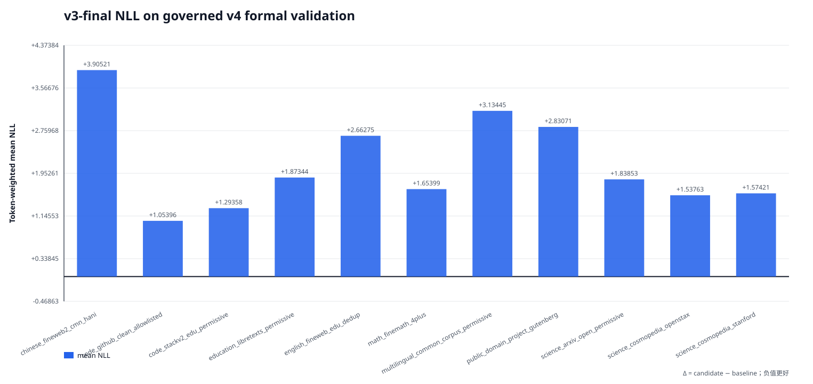
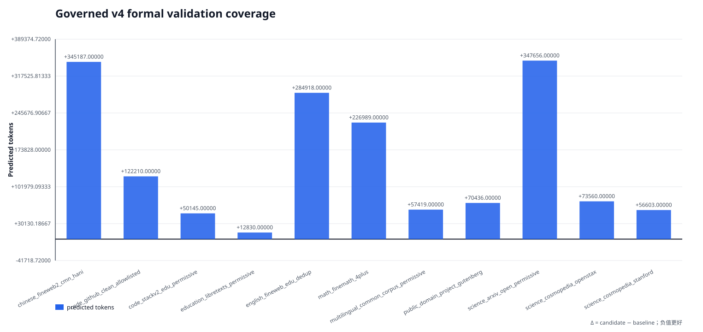

# v4 250M 正式 frozen-validation：v3 final 基线

结论：来源级 frozen-validation 门已通过。primary/cooldown prepared validation 都来自
`role=validation` 的治理后不可变语料；validation union 与两阶段 train union 在 stable ID、
normalized exact 和 MinHash near-duplicate（阈值 0.8）三层均无重叠，validation 内部也无
重复。两次评测绑定同一个 v3 final checkpoint。该报告只建立正式训练前的 NLL 基线，
不启动、也不授权训练。

## 总览

| phase | 来源数 | shard | predicted tokens | mean NLL |
|---|---:|---:|---:|---:|
| primary | 9 | 30 | 1,263,063 | 2.439940 |
| cooldown | 8 | 19 | 384,890 | 2.179304 |

合并口径：1,647,953 predicted tokens，
mean NLL `2.379067`，PPL `10.7948`。

## 正式来源级 v3 baseline

| source | phase | predicted tokens | mean NLL | PPL |
|---|---|---:|---:|---:|
| chinese_fineweb2_cmn_hani | primary, cooldown | 345,187 | 3.905211 | 49.6606 |
| code_github_clean_allowlisted | primary, cooldown | 122,210 | 1.053962 | 2.8690 |
| code_stackv2_edu_permissive | primary | 50,145 | 1.293581 | 3.6458 |
| education_libretexts_permissive | cooldown | 12,830 | 1.873443 | 6.5107 |
| english_fineweb_edu_dedup | primary | 284,918 | 2.662755 | 14.3357 |
| math_finemath_4plus | primary, cooldown | 226,989 | 1.653991 | 5.2278 |
| multilingual_common_corpus_permissive | primary | 57,419 | 3.134447 | 22.9759 |
| public_domain_project_gutenberg | cooldown | 70,436 | 2.830713 | 16.9576 |
| science_arxiv_open_permissive | primary, cooldown | 347,656 | 1.838531 | 6.2873 |
| science_cosmopedia_openstax | primary, cooldown | 73,560 | 1.537634 | 4.6536 |
| science_cosmopedia_stanford | primary, cooldown | 56,603 | 1.574208 | 4.8269 |

新增来源 ArXiv、StackV2、CommonCorpus、LibreTexts、Gutenberg 均有独立统计；既有中文、
英文、数学、GitHub code、OpenStax、Stanford 六来源也继续保留。

## 既有六来源的语料迁移对照

| source | 旧 frozen NLL | 正式 frozen NLL | 正式−旧 |
|---|---:|---:|---:|
| chinese_fineweb2_cmn_hani | 3.656194 | 3.905211 | +0.249017 |
| code_github_clean_allowlisted | 1.028160 | 1.053962 | +0.025802 |
| english_fineweb_edu_dedup | 2.603308 | 2.662755 | +0.059447 |
| math_finemath_4plus | 1.577363 | 1.653991 | +0.076628 |
| science_cosmopedia_openstax | 1.648853 | 1.537634 | -0.111219 |
| science_cosmopedia_stanford | 1.572927 | 1.574208 | +0.001280 |

这里是同一 v3 checkpoint 在不同 held-out 语料上的 corpus-shift 诊断，不能解释成模型
提升或退化。后续 v4 checkpoint 必须复用本报告两份完全相同的 prepared manifest，才可把
NLL 差异解释为 checkpoint 差异。

## 门禁边界

- prepared manifest、dataset fingerprint、source map、audit attestation 和每个 evaluation
  shard 的 COMPLETE/输出 SHA 均已重新认证；
- primary+cooldown validation union 与两阶段 train union 的 stable-ID、normalized-exact、
  MinHash near-duplicate（estimated Jaccard ≥ 0.8）隔离证明已通过，validation 内部同样通过；
- primary 与 cooldown 都完整覆盖其 recipe 来源，五个新增来源全部存在；
- 两次 evaluation 的 v3 checkpoint state 及保存时 lineage 与旧六来源基线一致；
- 本工具不运行 forward、不修改输入、不启动训练；`gate.authorizes_training=false`。
