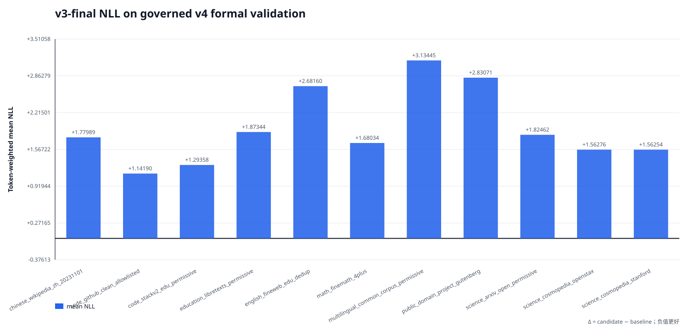
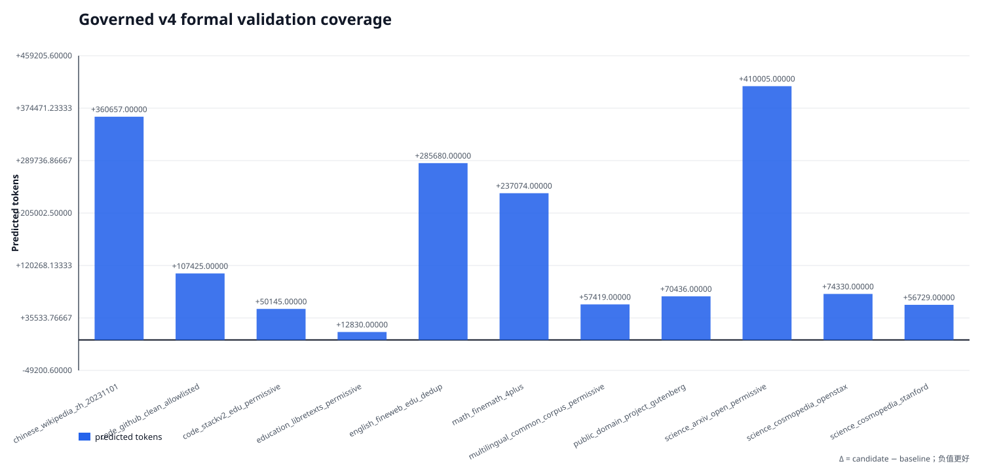

# v4 250M 正式 frozen-validation：v3 final 基线

结论：来源级 frozen-validation 门已通过。primary/cooldown prepared validation 都来自
`role=validation` 的治理后不可变语料；validation union 与两阶段 train union 在 stable ID、
normalized exact 和 MinHash near-duplicate（阈值 0.8）三层均无重叠，validation 内部也无
重复。两次评测绑定同一个 v3 final checkpoint。该报告只建立正式训练前的 NLL 基线，
不启动、也不授权训练。

## 总览

| phase | 来源数 | shard | predicted tokens | mean NLL |
|---|---:|---:|---:|---:|
| primary | 9 | 25 | 1,317,537 | 1.884165 |
| cooldown | 8 | 17 | 405,193 | 2.141586 |

合并口径：1,722,730 predicted tokens，
mean NLL `1.944712`，PPL `6.9916`。

## 正式来源级 v3 baseline

| source | phase | predicted tokens | mean NLL | PPL |
|---|---|---:|---:|---:|
| chinese_wikipedia_zh_20231101 | primary, cooldown | 360,657 | 1.779890 | 5.9292 |
| code_github_clean_allowlisted | primary, cooldown | 107,425 | 1.141895 | 3.1327 |
| code_stackv2_edu_permissive | primary | 50,145 | 1.293581 | 3.6458 |
| education_libretexts_permissive | cooldown | 12,830 | 1.873443 | 6.5107 |
| english_fineweb_edu_dedup | primary | 285,680 | 2.681600 | 14.6085 |
| math_finemath_4plus | primary, cooldown | 237,074 | 1.680341 | 5.3674 |
| multilingual_common_corpus_permissive | primary | 57,419 | 3.134447 | 22.9759 |
| public_domain_project_gutenberg | cooldown | 70,436 | 2.830713 | 16.9576 |
| science_arxiv_open_permissive | primary, cooldown | 410,005 | 1.824624 | 6.2005 |
| science_cosmopedia_openstax | primary, cooldown | 74,330 | 1.562764 | 4.7720 |
| science_cosmopedia_stanford | primary, cooldown | 56,729 | 1.562540 | 4.7709 |

新增来源 Wikipedia、ArXiv、StackV2、CommonCorpus、LibreTexts、Gutenberg
均有独立统计；旧六来源中的英文、数学、GitHub code、OpenStax、Stanford 五来源继续保留。

## 与旧基线共享的五个来源

| source | 旧 frozen NLL | 正式 frozen NLL | 正式−旧 |
|---|---:|---:|---:|
| code_github_clean_allowlisted | 1.028160 | 1.141895 | +0.113735 |
| english_fineweb_edu_dedup | 2.603308 | 2.681600 | +0.078292 |
| math_finemath_4plus | 1.577363 | 1.680341 | +0.102978 |
| science_cosmopedia_openstax | 1.648853 | 1.562764 | -0.086089 |
| science_cosmopedia_stanford | 1.572927 | 1.562540 | -0.010387 |

这里是同一 v3 checkpoint 在不同 held-out 语料上的 corpus-shift 诊断，不能解释成模型
提升或退化。后续 v4 checkpoint 必须复用本报告两份完全相同的 prepared manifest，才可把
NLL 差异解释为 checkpoint 差异。

## 中文来源替换

| 旧来源 | 正式来源 | 旧 frozen NLL | 正式 frozen NLL | delta |
|---|---|---:|---:|---|
| chinese_fineweb2_cmn_hani | chinese_wikipedia_zh_20231101 | 3.656194 | 1.779890 | 不可比较 |

FineWeb2 中文与 Wikipedia 是不同来源、不同 held-out 语料；上表仅披露替换及各自绝对
NLL，不计算、也不暗示可比较的模型质量 delta。

## 门禁边界

- prepared manifest、dataset fingerprint、source map、audit attestation 和每个 evaluation
  shard 的 COMPLETE/输出 SHA 均已重新认证；
- primary+cooldown validation union 与两阶段 train union 的 stable-ID、normalized-exact、
  MinHash near-duplicate（estimated Jaccard ≥ 0.8）隔离证明已通过，validation 内部同样通过；
- primary 与 cooldown 都完整覆盖其 recipe 来源，六个新增来源全部存在；
- 两次 evaluation 的 v3 checkpoint state 及保存时 lineage 与旧六来源基线一致；
- 本工具不运行 forward、不修改输入、不启动训练；`gate.authorizes_training=false`。
